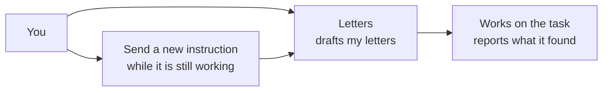

# Robokura

**Personal assistants that run on your own computer.**

Named assistants with a title and a description, each running on an agent on your
machine. Open one, state a task in ordinary language, and watch it work.

Everything runs on your machine. No account, no server, no telemetry.

## What you get

- **One press makes an assistant.** It arrives with a name you can change and
  opens straight away. There is no form to fill in first.
- **Name it and say what it is for.** A pane on the right holds the open
  assistant's name, title and description. That is the only place any of them is
  written.
- **A thread each.** Every assistant has one thread with you. You state a task in
  ordinary language, it gathers what it can reach, and it reports back.
- **Find one by name.** The search narrows the list. The conversation you were
  reading stays where it is.
- **Delete one when it is not wanted.** It tells you what goes with it, then
  removes the assistant, its thread and every message in it. There is no undo.
- **Work in the open.** The reply arrives as it is produced rather than at the
  end, so you can see where it has got to.
- **Interrupt anything.** Send a new instruction while it is working and it
  changes direction. What it already did is not undone.
- **Everything is kept.** Close the application and your assistants and their
  threads are where you left them.

## What this version does not do

Stated plainly, because the list is longer than the feature list above.

- **No isolation.** The agent runs with your own access. Nothing is contained.
- **No approvals.** An agent can act without asking you first.
- **No files.** An agent cannot read or write anything you own.
- **One assistant per thread.** Group threads, where several assistants hold one
  thread between them, are not built yet.
- **No assistants passing work to each other.** One answers you.
- **No memory file.** An assistant carries its purpose and its thread, and
  nothing else between turns.
- **No reply threads, drafts, or voice.**

## Name

Robokura is ロボ, the short form of robot, plus 蔵, a storehouse. A storehouse
you own.

## License

MIT. See [LICENSE](LICENSE).
