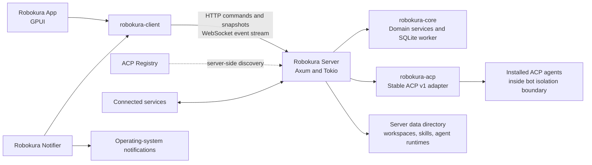
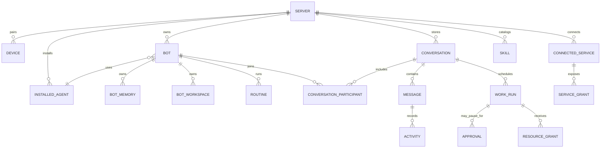
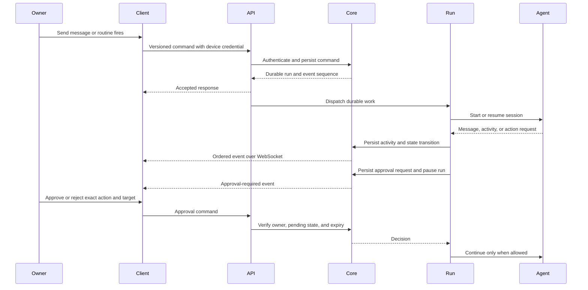

# Robokura System Architecture

## Purpose and status

This document translates the agreed product model and technical choices into
component responsibilities, data ownership, and runtime flows. It is a planning
document, not an implementation specification. The first release covers the
core bot workflow defined in the product plan. Group chats, bot-to-bot
conversations and handoffs, routines, connected services, skills, long-term
memory, browser control, backups, and exports follow that release.

Where the product plan leaves behavior undecided, this document marks the
boundary as open instead of silently treating a proposal as a commitment.

## Architecture principles

- A Robokura Server is the source of truth for one owner's bots, conversations,
  agent installations, resources, and background work.
- The desktop app and notifier are clients. They issue commands and render
  server state; they do not own bot state or ACP sessions.
- Local and remote connections use the same versioned API. Local mode uses a
  loopback server; remote mode uses authenticated encrypted transport.
- Persist accepted commands and meaningful state changes before publishing
  events. Reconnecting clients recover from server state and the event cursor.
- Keep product policy and durable identities independent from ACP, UI, and
  transport-specific types.
- Capability grants are explicit and scoped. Group conversation membership
  alone never grants access to another bot's files or workspace.
- Host enforcement is authoritative for sandbox boundaries. If required
  isolation cannot be enforced, the server does not launch the bot.
- Keep one Robokura sandbox policy across server hosts, with an OS-specific
  enforcement backend and capability check on each host. MXC is the leading
  candidate for evaluation, not a selected dependency. Its host-specific
  capabilities and runtime requirements must pass validation first.

## Runtime topology

The app, notifier, and server are separate processes. Each long-running process
owns at most one Tokio runtime. The server composes the API, domain services,
event delivery, routines, and ACP sessions. Its SQLite connection belongs to a
dedicated database worker thread.

The server never delegates authority to the app for enforcement. The app can
present approval requests and collect a decision, but the server records and
enforces that decision before allowing a gated action.

## Component responsibilities

| Component | Owns or coordinates | Must not own |
| --- | --- | --- |
| `robokura-app` | Windows, tray UX, server profiles, local server start/attach/shutdown, user commands | Authoritative bot records, ACP sessions, server filesystem access |
| `robokura-notifier` | Selected server subscriptions, missed-notification refresh, native notification display | Product records, bot execution, server lifecycle decisions for remote hosts |
| `robokura-client` | Authentication per saved connection, HTTP calls, WebSocket connection/replay, typed API access | Runtime creation, domain rules, ACP protocol |
| `robokura-api` | Versioned JSON request/response/event contracts | Domain behavior, database models |
| `robokura-server` | Process lifecycle, HTTP/WebSocket serving, auth boundary, service composition, background scheduling | Desktop UI and client-side secrets |
| `robokura-core` | Product rules, durable records, authorization decisions, persistence operations | GPUI, HTTP, WebSocket, ACP SDK types |
| `robokura-acp` | Agent discovery/install adapter, ACP handshake, per-bot/per-conversation sessions, protocol translation | Product ownership rules, direct UI interaction |

`robokura-core` includes SQLite access in the initial design. Do not add a
separate storage crate unless implementation reveals a concrete boundary.

## Domain model and ownership

All durable product data belongs to one Server. IDs are server-scoped unless a
future multi-server import/export design requires globally portable IDs.

The diagram shows conceptual records, not settled SQL tables. Important rules:

- **Server:** one owner in the initial product. Owns its database, server-side
  data directory, installed agents, authentication policy, and execution state.
- **Device:** one app installation paired to a server with a revocable token.
  The client stores the token in the OS credential store; the server stores
  only a verifier. The notifier runs under the same OS user and reuses that
  store.
- **Installed agent:** a server-side installation pinned to a registry version
  and distribution. It has server-wide configuration and authentication. A
  bot may select it and override supported session options. One default agent
  is maintained for new bots and reassignment when an agent is removed.
- **Bot:** durable identity, purpose, instructions, selected agent, supported
  overrides, memory, workspace, routines, and status. The bot can participate
  in multiple conversations, each with a distinct ACP session.
- **Conversation:** one of three kinds: owner-to-bot, bot-to-bot, or user-owned
  group chat. It has a durable ordered history and participant records. A
  removed bot may remain a historical participant but cannot receive new work.
- **Message and activity:** user/bot messages are separate from structured
  activity such as tool calls, permission requests, status changes, and errors.
  This preserves a faithful transcript without flattening tool activity into
  prose. A bot message may be updated while streaming; its completion state is
  `streaming`, `complete`, or `interrupted`. The state and accumulated content
  live on one ordered item, while updates emit coalesced events.
- **Work run:** one bounded unit of execution, created by an owner message, a
  routine trigger, or a bot handoff. A group-chat message creates a coordinating
  run and each participating bot gets its own child run. A handoff also creates
  a child run. It records lifecycle, participating bots, and pending work.
  Permissions do not transfer to a child run or receiving bot. Runs move
  through queued, running, waiting-for-owner, and stopping states, then end as
  completed, canceled, or failed. Restart recovery continues the same run
  when safe.
- **Approval:** a server-owned pending decision tied to a specific action,
  target, run, and expiry. The action cannot proceed until an authorized owner
  decision is recorded. Timeout ends the gated routine run without approval.
- **Resource grant:** a revocable capability scoped to a bot, selected resource,
  access modes, and one work run. File grants include read and write access,
  can be revoked at any time, and expire when the run completes, is canceled,
  or fails. Revocation immediately starts run termination; the grant remains in
  `revocation_pending` until the contained process tree has exited, then becomes
  `revoked`. Changes already written are not rolled back.
- **Connected service:** owner-connected integration with server-side
  credentials and bot-level availability. Keep credentials in a dedicated
  server-side store behind a service broker; agents call the broker and never
  receive raw tokens. Exclude credentials from backups and exports. Ordinary
  changes through the connection are allowed; sending messages or permanently
  deleting data still require approval. A connection is in use while enabled
  for any bot, referenced by a routine, or held by an active operation. Show
  those dependencies and require the owner to remove them and finish or stop
  active operations before disconnecting. Apply the same in-use protection to
  agents and all other connected resources.
- **Memory:** bot-specific durable facts, separate from transcripts. Bots may
  save useful memories automatically; the owner can inspect, edit, or delete
  them. Group messages and routine output do not become long-term memory by
  default.
- **Skill:** reusable instruction/reference folder in the server library.
  Skills have no executable scripts and grant no permissions by themselves.
- **Routine:** a bot-owned trigger and task definition, with schedule or
  explicitly configured event sources. Each run uses the bot's existing
  capabilities and approval policy.

### Initial domain model draft

This draft names the durable concepts and their fields without committing to
SQL types, table layout, or API serialization. Use lowercase canonical UUIDv7
strings for Robokura-generated durable IDs and client-generated `command_id`
values. They are identifiers, not authorization secrets. Keep ACP-provided
session and message IDs opaque; never parse them as Robokura IDs. Persist
timestamps in UTC. Keep large content and filesystem data outside SQLite when
noted below.

| Record | Core fields | Lifecycle and relationships |
| --- | --- | --- |
| Server metadata | `server_id`, `created_at`, `product_version`, `last_event_sequence`, latest capability report and revision | One metadata record per server database. Schema version belongs to migration metadata, not an owner-editable field. Capability report is refreshed at startup and on relevant changes; it is descriptive, not authorization authority. |
| Device | `device_id`, `name`, `token_verifier`, `created_at`, `last_seen_at`, `revoked_at` | A paired app installation. Revocation is immediate and terminal; keep a minimal record so the server can reject old credentials. Token plaintext exists only at pairing and in the client's OS credential store. |
| Installed agent | `agent_id`, `registry_entry_id`, `display_name`, `version`, `distribution`, `install_state`, `default_config`, `capabilities`, `is_default`, `credential_ref`, timestamps, `last_error` | Server-owned installation. `credential_ref` points to host-managed secret storage; secret values never enter SQLite. State progresses through available/installing/installed-unauthenticated/ready/updating/failed. Exactly one ready agent is the default when bots can be created. |
| Bot | `bot_id`, `name`, `purpose`, `instructions`, `agent_id`, `agent_overrides`, `state`, timestamps | Durable owner-created identity. State is active or archived; permanent deletion is a command that settles work and applies retention rules, not a restorable state. Has exactly one private owner conversation and a generated workspace root outside SQLite. Memory, routines, and selected skills are later-feature relations. |
| Conversation | `conversation_id`, `kind`, `title`, `created_at`, `updated_at` | Kind is private-owner, bot-to-bot, or group. Initial release creates only private-owner conversations. Enforce one private-owner conversation per bot. Participants are represented separately so deleted bots can remain historical participants in retained conversations. User deletion removes the group and its history after active work is stopped. |
| Conversation participant | `conversation_id`, `participant_kind`, `participant_id`, `joined_at`, `left_at`, `display_name_snapshot` | Links an owner or bot to a conversation. Snapshot the display name for transcript history. A removed bot participant is historical and cannot receive work. Group/bot-to-bot membership is later-feature behavior. |
| Message | `message_id`, `conversation_id`, `sequence`, `sender_kind`, `sender_id`, `run_id`, `content`, `created_at`, `completion_state` | Ordered conversation entry. `sender_kind` distinguishes owner, bot, and server. Content is a versioned list of text/file-reference blocks; attached or generated file bytes live in the server data directory. Assistant completion state distinguishes complete from interrupted output. |
| Activity | `activity_id`, `conversation_id`, `run_id`, `sequence`, `kind`, `payload`, `created_at` | Ordered structured event such as tool activity, progress, approval request, state change, or error. Payload is versioned. Activity supplements messages and must not be flattened into transcript prose. |
| Work run | `run_id`, `conversation_id`, `bot_id`, `parent_run_id`, `trigger_kind`, `input_message_id`, `state`, `started_at`, `finished_at`, `failure_code`, `failure_detail` | Bounded unit of bot work. Core trigger is an owner message; routine and handoff triggers are later-feature behavior. States: queued, running, waiting-for-owner, stopping, recovery-required, completed, canceled, failed. Restart recovery retains the run identity. `parent_run_id` supports later coordination/handoffs. |
| Sandbox attempt | `attempt_id`, `run_id`, `backend_id`, `backend_version`, `policy_hash`, `process_identity`, `state`, start/end/cleanup timestamps, `failure_code` | One concrete process-tree launch for a run. A run may have another attempt only after every earlier attempt is confirmed exited. An uncertain cleanup blocks relaunch. |
| Approval | `approval_id`, `run_id`, `action_kind`, `target_summary`, `request_payload`, `state`, `created_at`, `expires_at`, `decided_at`, `deciding_device_id` | One exact gated action. States: pending, approved, rejected, expired, canceled. Only pending approvals can be decided; approval is scoped to the recorded action and target. |
| Resource grant | `grant_id`, `run_id`, `bot_id`, `resource_kind`, `resource_locator`, `access_modes`, `state`, `created_at`, `expires_at`, `revoked_at` | Temporary capability, initially for an owner-selected file or directory with read/write modes. State is active, revocation_pending, revoked, or expired. It is run-scoped and cannot be inherited by another run or bot. Persist a server-resolved resource identity, not an unchecked client path. |
| Notification | `notification_id`, `category`, `title`, `body`, `resource_ref`, `source_event_id`, `created_at`, `cleared_at` | Server-owned notification history for the owner. Cleared items remain until explicitly removed; native delivery state is client-side. |
| Command receipt | `device_id`, `command_id`, `payload_hash`, `result_refs`, `created_at` | Deduplicates a retried mutation and returns its original outcome and resource identifiers. Reuse with a different payload hash is rejected. Retain for the paired device's lifetime; do not store request bodies, message text, credentials, or full resource representations. Pairing token exchange is excluded. |
| Event cursor | `server_sequence`, `event_id`, `kind`, `record_id`, `payload`, `created_at` | Monotonically ordered server event stream for reconnect/replay. Snapshots carry a sequence boundary. Compact replay retention is 30 days; durable domain records remain the source of truth. |

Relationships: a bot references one installed agent; each bot has one private
conversation; conversations own ordered messages and activities, with one
shared monotonically increasing sequence across both record kinds; each work run
belongs to one conversation and bot, and may have a parent run; approvals and
resource grants belong to one run. Agent credentials and bot workspace roots
are references to server-hosted resources, never embedded content.

The exact agent configuration representation and error-code catalog remain
open for the API and persistence design. Filesystem roots and grants store
server-resolved paths plus versioned filesystem identity metadata; short-lived
device-bound browse selections are ephemeral and consumed by message submission.
Robokura file assets use generated IDs with opaque server storage keys.
Command-receipt retention/privacy policy is decided below; concrete DDL remains
part of the schema work. Treat this as the starting model, not as a frozen
schema.

### Conversation retention and deletion

- A bot has exactly one private owner conversation.
- Bot-to-bot conversations are retained while at least one participating bot
  still exists. Deleted bots remain historical participants; they cannot take
  part in new turns. Delete the conversation once all participant bots are
  permanently deleted.
- Group chats belong to the owner and remain after participant bots are
  deleted. The owner can delete a group chat and its history independently.
- Archiving a bot hides it while keeping its data restorable. Permanent bot
  deletion stops active work and removes its identity, instructions, memory,
  settings, and private owner conversation, subject to the bot-to-bot retention
  rule above.
- Removing an agent does not delete bots or their histories. First settle active
  sessions and reassign dependent bots to the default agent. An agent or other
  connected resource cannot be disconnected while in use.

## Data and persistence boundaries

SQLite is the source of truth for server records, work state, compact ordered
events, and notification history. A single worker thread owns the SQLite
connection, migrations, and transactions. Large files, workspaces, browser
profiles, agent installations, and skill folders live in the server data
directory, referenced by database records where appropriate. Service
credentials live in a separate host-managed encrypted store, not in SQLite or
ordinary backups. Desktop hosts use the OS credential store. For Linux VPS
deployment, evaluate systemd encrypted service credentials using a host key and
TPM protection where available. The server decrypts them for runtime use; if a
secure store is unavailable, refuse service connection rather than falling
back to plaintext. Restore requires the owner to reconnect services.

Persist messages, structured activity, and unfinished work as they happen.
Keep compact replay events for thirty days and coalesce streamed output. Keep
notification history until the owner clears it. Agent-provider credentials stay
on the server and are excluded from ordinary export and portable backups.

The app stores connection profiles and presentation preferences locally. It
does not create a second authoritative copy of server-owned bot data.

## Request, execution, and approval flow

Server command handling should be idempotent where retries could duplicate
messages, approvals, routine runs, or external side effects. API request IDs and
deduplication policy need to be specified with the endpoint design.

Before an action runs, the server evaluates Robokura policy and host-enforced
capabilities. ACP permission prompts are surfaced to the owner when relevant,
but they do not replace OS sandbox restrictions. High-impact actions such as
sending/publishing, purchasing, permanent deletion, or changing production
systems pause for explicit approval with the exact action and target. Routines
obey the same gate and never treat a timeout as approval.

## Conversation orchestration

- The server serializes writes to each conversation history and assigns an
  ordered sequence. Work across unrelated conversations can proceed
  concurrently.
- Robokura keeps one logical conversation per bot and owner. Use a stable ACP
  session across work runs when the agent advertises and supports loading that
  session; otherwise use a fresh ACP session for each run and supply the
  appropriate context from Robokura's durable conversation history. The
  adapter resolves the bot's installed agent, configuration defaults,
  bot-specific overrides, memory, selected skills, and capability policy when
  opening or restoring a session.
- Start a fresh sandboxed ACP process for each work run and end it when the run
  completes, is canceled, or fails. Preserve the bot workspace and logical
  conversation across runs. Load/resume the conversation's ACP session in the
  new process when the agent supports it; otherwise create a fresh ACP session
  with the durable conversation context. This process boundary makes each
  run's file grants expire with the process.
- A user-created group chat has one shared transcript, but each selected bot
  has its own workspace, memory, connected-service policy, and ACP session.
  An unmentioned message invites all participating bots to decide whether to
  respond; they may abstain without posting. An explicit mention invites only
  the named bot or bots. Count bot turns and handoffs against a configurable
  per-run budget starting at eight. Pause at the limit for the owner to continue
  or end the run.
- Bots can hand work to another bot asynchronously. The handoff is visible in
  the coordinating conversation. The recipient works in its own session and
  can reply later.
- A group chat shares only its conversation by default. File/resource sharing
  requires an explicit grant to selected bot(s), scoped to a work run.

### Release sequencing

Deliver the core bot workflow defined in `PRODUCT_PLAN.md` first. Add group
chats and bot-to-bot conversations and handoffs, routines, connected services,
skills, long-term memory, browser control, backups, and exports afterward.

## Server, agent, and client lifecycles

### Local server

On app launch, health-check the configured loopback address. Attach to a
compatible ready server if one is present; otherwise start the packaged server
binary as a separate process and wait for readiness. The server bind prevents
duplicates. An incompatible listener or authentication failure is reported,
not bypassed with a second server. Track whether the app started or attached to
the server. Closing the app hides it to tray and leaves the server running;
the tray can explicitly request graceful shutdown.

For the first local pairing, the app receives a one-time bootstrap secret over
a private parent/child control channel when it starts the server. The app
exchanges that secret for its device token and stores the token in the OS
credential store. The secret is not passed through command-line arguments,
environment variables, or server logs. Do not expose a pairing-code creation
route without authentication.
If a local server was started outside the app and has no paired device, require
the owner to use the same explicit server-side pairing-code flow as a remote
server.

### Remote server

Remote servers have an independent lifecycle. Direct pairing is primary: the
owner runs a server-side CLI command over SSH or a local console to create a
one-time pairing code, then enters it in the app with the server address. The
code contains 256 random bits, is single-use, expires after ten minutes, is
rate-limited, and is accepted only over HTTPS with normal certificate
validation. Store only a verifier for the temporary code. The app exchanges it
in a request body, registers a named device, and receives its unique token
once; the server stores only that token's verifier. The owner can revoke that
device immediately. The owner supplies network reachability and valid TLS.
Optionally tunnel over SSH using
the owner's existing SSH agent and host configuration; retain HTTPS and
certificate validation end-to-end inside the tunnel. Robokura stores no SSH
password or private key. A remote connection can never present the tray's
local-server shutdown action. The server remains available when the client
disconnects. The app sends the code only in the pairing-exchange HTTPS request
body, never in an API URL or routine access log.

### Agents

Agent state progresses through available, installing, installed but
unauthenticated, ready, updating, or failed. Discovery and install execute in
the server platform context. Prefer a pinned standalone binary, then `npx`,
then `uvx`; managed Node.js/npm and uv/Python runtimes live under the server data
directory. Verify registry SHA-256 where provided. If absent, show source and
version and require explicit owner confirmation. Integrity failures stop
installation without fallback.

Keep installation, authentication, configuration, assignment, update, and
removal as separate actions. Agent authentication stays on the server host;
terminal login can be relayed through the app. A remote-incompatible agent is
marked unsupported. Updates wait for active sessions or require the owner to
stop them. Removal first reassigns dependent bots to the default agent.

### Restart and recovery

Persist the active work run and state before starting side effects. On restart,
load/resume the ACP session when supported. Otherwise create a fresh session
with the original request, relevant history, and saved activity; clearly tell
the agent that it was interrupted and have it inspect current state before
repeating actions. If safe continuation cannot be established, leave the run
paused for the owner. Never relabel interrupted work as completed.

### Notifications

One notifier process runs under the user's login and may outlive the app window
or app process. It subscribes to selected servers and exits only when none
remain. It delivers approvals, attention requests, and completion notifications
through native OS notifications; it does not notify on every progress update.
After reconnect, it fetches current server state, surfaces outstanding
approvals/attention, and summarizes completed work. Notification history stays
on the server until cleared.

## API and event recovery

Use versioned JSON with explicit Serde transport types in `robokura-api`.
Commands and snapshots use HTTP; a WebSocket carries live ordered events. The
app first fetches current state, then resumes events from its last event ID.
Persist ordered events for thirty days. Replay retained events after a
reconnect; if the cursor is too old, return a current snapshot with its event
sequence boundary and resume from there. SQLite remains authoritative if the
event stream is unavailable.

Every mutating request carries a client-generated command ID. In one database
transaction, persist its state transition, ordered event record, and compact
command receipt. A retry with the same ID and payload returns the original
outcome and resource identifiers; the same ID with a different payload is
rejected. Receipts last for the paired device's lifetime and store no request
body or full resource representation. Exclude one-time pairing token exchange
from durable receipts. For external side effects, pass an idempotency key to
the provider when supported. If the connection fails and the outcome cannot
be established for a provider without idempotency support, mark it uncertain
and ask the owner to resolve it instead of retrying blindly.

Events express meaningful domain transitions such as the initial event types
listed below. Those names are a draft; final payload fields and any
per-resource ordering guarantees remain to be specified.

Use ordinary resource operations for creating and editing records, and explicit
action operations for guarded transitions. The initial resource families are
server/device, registry/installed agent, bot, conversation/message/activity,
work run, approval, routine, memory, skill, connected service, and notification.
Examples of explicit actions include agent install/update/removal, bot
archive/restore, run cancel/continue, approval decision, service connect or
disconnect, and local server shutdown. Do not let clients patch lifecycle
states directly.

Every event has a server sequence, event ID, event type, resource reference,
timestamp, and typed payload. Initial event families cover agent and bot state,
conversation/message/activity changes, run transitions, approval requests and
decisions, routine runs, connected-service changes, and notifications. A state
snapshot includes the sequence boundary from which the client can resume.

### Core HTTP operation inventory

All paths below are draft routes under `/api/v1`. Require a paired-device
credential except for health and the one-time pairing exchange. Use JSON bodies
and return a stable error envelope. Ordinary fields may be updated through
resource operations; lifecycle changes use named action routes.

| Method and path | Purpose |
| --- | --- |
| `GET /health` | Check only that the server API process is healthy and compatible for connection. It does not imply that bot execution is available. Exposes no owner data. |
| `POST /pairings/exchange` | Exchange a pairing code supplied in the HTTPS request body for a named device and its one-time token. Keeping the code out of the URL avoids routine URL logging. This endpoint requires the pairing code, not an existing device credential. |
| `GET /server` | Read server identity/version, API readiness, and a fresh, owner-visible execution capability report. API readiness and bot execution availability are independent. |
| `GET /registry/agents?query=…&platform=…` | Search available ACP Registry entries for this server platform. |
| `GET /agents` | List installed agents and installation/authentication status. |
| `POST /registry/agents/{registry_entry_id}/install` | Install a selected registry version and distribution. |
| `GET /agents/{agent_id}` | Read agent details, exposed configuration options, capabilities, and status. |
| `PUT /agents/{agent_id}/configuration` | Save installation-wide agent configuration defaults. |
| `POST /agents/{agent_id}/authentication-sessions` | Begin ACP authentication and return the interaction mode/state. |
| `GET /agents/{agent_id}/authentication-sessions/{session_id}` | Read current authentication interaction state and next prompt. |
| `POST /agents/{agent_id}/authentication-sessions/{session_id}/input` | Submit a structured response only when the selected agent-auth flow explicitly requests one. |
| `GET /agents/{agent_id}/authentication-sessions/{session_id}/terminal` | Upgrade to an authenticated WebSocket carrying only PTY input/output and resize/exit control for this specific terminal-auth session. |
| `GET /bots` / `POST /bots` | List bots / create a bot and its private owner conversation atomically. |
| `GET /bots/{bot_id}` / `PATCH /bots/{bot_id}` | Read or edit bot profile and supported agent overrides. |
| `POST /bots/{bot_id}/archive` / `POST /bots/{bot_id}/restore` | Hide or restore a bot without deleting its history. |
| `GET /conversations` / `GET /conversations/{conversation_id}` | List conversations / read transcript, participant history, and structured activity. |
| `POST /conversations/{conversation_id}/messages` | Append an owner message, create its work run, attach confirmed resource selections as run-scoped grants, and durably queue the run atomically. |
| `GET /filesystem/roots` / `POST /filesystem/roots` | List server-side browse roots / add an owner-configured path on that server as a browse root. Browse roots grant no bot capability. |
| `POST /filesystem/roots/{root_id}/disable` | Disable a browse root after checking it has no active grants underneath. |
| `GET /filesystem/roots/{root_id}/entries?cursor=…` | Page the first level beneath a configured server-side browse root. |
| `GET /filesystem/selections/{selection_id}/entries?cursor=…` | Page a selected directory's children. Returned entry selection IDs are short-lived, device-bound references, not credentials. |
| `GET /runs/{run_id}` / `POST /runs/{run_id}/cancel` | Inspect a run / request cancellation. Cancellation returns `202 stopping`; final cancellation follows confirmed process-tree exit. If cleanup cannot be proved after restart, the run becomes `recovery_required` and cannot relaunch. |
| `GET /approvals` / `POST /approvals/{approval_id}/decision` | List pending approvals / approve or reject the exact pending action. |
| `POST /resource-grants/{grant_id}/revoke` | Stop the associated run and its complete contained process tree, then confirm the run-scoped grant is revoked. The command does not report completion while any process can still use the path. |
| `POST /uploads` / `PUT /uploads/{upload_id}/content` / `POST /uploads/{upload_id}/complete` | Create an upload intent, stream bytes to server-side staging, verify the declared length and SHA-256, then finalize an immutable server file reference. |
| `GET /files/{file_id}` | Download a file attached to an authorized conversation or otherwise available to the paired owner. Streams bytes with a sanitized download name and integrity metadata. |
| `GET /devices` / `POST /devices/{device_id}/revoke` | List paired devices / revoke a device credential. |
| `GET /sync?after_sequence=N` | Return retained events after a cursor, or a bounded summary snapshot with its sequence boundary when replay is no longer possible. |
| `GET /events?after_sequence=N` | Upgrade to the ordered WebSocket event stream and replay from the supplied cursor before sending live events; require a fresh sync if the cursor predates retention. |

Group-chat creation, bot-to-bot conversations/handoffs, routines, memories,
skills, connected services, and backup/export endpoints are later features and
are intentionally not part of this core route set. Agent update/removal,
default-agent changes, permanent bot deletion, local shutdown, and notification
management need explicit action/operation design before they are added.
Pairing-code creation is a server-side CLI or local process-control action, not
an unauthenticated public API route.

For terminal authentication, the WebSocket accepts binary frames as raw PTY
input/output and small JSON text frames for resize, end-of-input, exit, and
error control. It is scoped to one short-lived authentication session, uses
the paired-device credential, and is never a general shell endpoint. Do not
persist terminal bytes or include them in command receipts. Closing the socket
or restarting the server terminates the authentication attempt; the owner can
start it again. Agents that require a server desktop or an unrelayable browser
callback remain unsupported for remote authentication.

This authentication PTY is distinct from ACP `terminal/*`, where an agent
requests terminals from the ACP client during a bot run. In both cases, the
server creates the PTY inside the agent's applicable host boundary; the app
only relays the authentication PTY for the owner.

### Command and response conventions

Every paired-device JSON command includes a fresh `command_id` generated by
the client. The server scopes deduplication to the authenticated device. The
binary upload-content PUT is the sole regular mutation exception: its
`upload_id`, declared length, and SHA-256 digest make retries safe without
storing command receipts for raw file bytes. Pairing exchange and ephemeral
agent-auth input are also excluded because they carry one-time credentials.
A successful message submission returns `202 Accepted` with the message and run
identifiers and accepted event sequence; completion arrives through events. A
retried command returns the original status, outcome, and resource identifiers,
not the original request or full resource body. Reusing the ID with changed
content returns a conflict error.

Compute the receipt hash for durable commands over the HTTP method, normalized
API path, and RFC 8785 JSON Canonicalization Scheme representation of the validated request
body, including the `command_id`. Hash the UTF-8 bytes of
`robokura-command-v1\n{METHOD}\n{NORMALIZED_PATH}\n{JCS_BODY}` with SHA-256.
Reject duplicate JSON object keys and values outside the JCS/I-JSON constraints
before hashing. This makes one ID single-use across operation types for a
device. Validate request shape and
authorization before opening the mutation transaction; malformed or
unauthorized requests create no receipt. Never retain a receipt hash for a
request carrying an agent credential or authentication secret; those ephemeral
requests use the authentication-session state and must be retried only after
checking that state. Once a valid command reaches domain
execution, commit its deterministic success or state-conflict outcome and
receipt atomically. A retry with the same ID and hash returns that outcome; a
different hash returns `409 command_id_reused`. For commands that start external
work, the receipt records acceptance, not completion. The durable operation
resource and events report later progress or uncertain external outcomes.

Use a common error envelope with a stable machine-readable `code`, human-readable
`message`, optional field errors, and optional retry guidance. Expected
conflicts include stale lifecycle state, unavailable agent, invalid or expired
grant, already-resolved approval, expired pairing code, and reused command ID
with a different payload. Do not expose secret values or host filesystem paths
in errors.

An approval decision request names `command_id`, `decision` (approve/reject),
and an optional owner note. It does not resubmit or alter the action. The server
checks that the approval is still pending and unexpired, then records the
decision against the original action and target. Cancellation and grant
revocation similarly use explicit commands and return the resulting durable
state; they do not promise rollback of already completed writes.

### Synchronization and event contract

The client first calls `GET /sync` with its last applied sequence. If retained
events cover the cursor, the response contains ordered events and a
`through_sequence`. Otherwise it contains a bounded snapshot of server identity,
API readiness, the current execution capability report, agent status, bot summaries, conversation summaries with latest item
sequences, active runs, pending approvals, and notification history, plus
`snapshot_sequence`. Conversation items and other large collections are loaded
through paged resource routes, not embedded in the sync snapshot. The client
applies the response, then opens the WebSocket from the returned boundary. The
server must atomically establish replay followed by live delivery so events
committed between sync and socket connection are not missed. If the requested
cursor is older than retained events, `/sync` returns a snapshot instead of a
partial event list.

Represent these as a tagged response: `{mode: "events", events,
through_sequence}` or `{mode: "snapshot", snapshot, snapshot_sequence}`. The
snapshot contains only bounded summaries and pending/active state; clients page
conversation items and notification history through their resource endpoints.
For a new device with no cursor, return the same bounded snapshot. A cursor
ahead of the server's current sequence is invalid and returns `400
invalid_cursor`, after which the client retries without a cursor.

The WebSocket event envelope is `{sequence, event_id, event_type, resource,
occurred_at, payload}`. The sequence is strictly increasing per server. The
initial core event types are `server_capabilities_changed`,
`filesystem_root_changed`, `agent_status_changed`, `bot_changed`,
`message_appended`, `message_updated`, `activity_appended`, `run_state_changed`,
`approval_required`, `approval_resolved`, `resource_grant_changed`,
`device_revoked`, and `notification_created`. Payloads identify the affected
record and include its new state or the minimal event-specific data needed to
update the client. Clients deduplicate by sequence and fetch a fresh sync after
a detected gap. If the WebSocket cursor is older than retention, send a
`resync_required` control frame and close the stream; the client then requests
`/sync` for a new boundary. WebSocket delivery alone is never the source of
truth.

These routes and shapes are the core API contract draft. The pairing, upload,
and terminal transport choices are defined; exact Serde/OpenAPI schemas and
concrete DDL remain to be generated and checked against the transaction and
retention rules before implementation. Validate the private local bootstrap
channel across supported operating systems.

### Core request and response schemas

Use UTF-8 JSON, `snake_case` field names, opaque string IDs, and RFC 3339 UTC
timestamps. Unknown response fields may be ignored by clients; clients must not
send unknown fields on commands unless a field is explicitly an extension map.
Use a common paged-list response `{items, next_cursor}`; `next_cursor` is null
when exhausted. Ordering is stable for a cursor and ordered by the resource's
documented sequence or creation time.

All durable authenticated JSON commands from a paired device use a top-level
`command_id` plus endpoint-specific fields. The client generates a fresh ID
for each distinct user action and reuses it only for retries of the exact same
request. Pairing exchange and ephemeral agent-auth input are excluded from
receipts. GET requests have no command ID.

| Operation | Request body | Success response |
| --- | --- | --- |
| Exchange pairing | `{pairing_code, device_name}` | `{server, device, device_token}`. Return the token once only; the client immediately stores it in the OS credential store. The code is single-use and never appears in a URL. |
| Install agent | `{command_id, version, distribution}` to `/registry/agents/{registry_entry_id}/install` | `{command_id, outcome: "accepted", agent_id}`; long work completes through events and ordinary GETs. |
| Save agent defaults | `{command_id, values}` | `{command_id, outcome: "updated", agent_id}`. `values` must satisfy the agent's advertised ACP configuration schema. |
| Start agent authentication | `{command_id}` | `{command_id, outcome: "started", agent_id, session_id, mode}`. Read challenge state from the authentication-session resource; never persist credential values in a receipt. |
| Continue authentication | `{input}` to the short-lived auth-session endpoint; no command ID or durable receipt | `{outcome: "advanced", session_id}`. Never persist or hash the credential input. If the response is lost, read session state and do not replay the secret automatically. |
| Create bot | `{command_id, name, purpose, instructions, agent_id, agent_overrides}` | `{command_id, outcome: "created", bot_id, conversation_id}`. The private owner conversation is created in the same transaction. |
| Edit bot | `{command_id, name?, purpose?, instructions?, agent_id?, agent_overrides?}` | `{command_id, outcome: "updated", bot_id}`. Lifecycle fields are not patchable. |
| Read server and execution capabilities | Authenticated `GET /server` | `{server_id, product_version, api_version, api_ready, capability_report}`. `api_ready` means the management API is operational; it does not imply bots can run. The report includes `revision`, `probed_at`, host OS/build/architecture, backend ID/version, `execution_status` (`checking`, `ready`, `limited`, `unavailable`), and capability checks. |
| Append owner message | `{command_id, content, resource_selections?: [{selection_id}]}` | HTTP 202 `{command_id, outcome: "accepted", message_id, run_id, accepted_sequence}`. Content supports text blocks and verified `{type: "file", file_id}` references to completed uploads. The app displays the exact server, selected path, entry kind, bot, and both read/write modes before submit. In one transaction, consume selections, create the message/run/grants, and queue the run; start ACP only after commit. Recheck required capabilities before launch; if unavailable, fail the run with a stable capability error instead of leaving it queued or downgrading isolation. |
| Decide approval | `{command_id, decision, owner_note?}` | `{command_id, outcome: "decided", approval_id, run_id, state}` after the exact pending action is resolved. |
| Add filesystem browse root | `{command_id, path, display_name?}` | `{command_id, outcome: "created", root_id}` after the server canonicalizes and validates the server-side path. This changes only the owner's browse scope, not bot access. |
| Browse filesystem entries | `GET /filesystem/roots/{root_id}/entries?cursor=…` or `GET /filesystem/selections/{selection_id}/entries?cursor=…` | Paged entries with display name, kind, and a fresh selection ID for each selectable file/directory. Do not follow symlinks/reparse points. Selection IDs are in-memory, device-bound, expire after ten minutes, and are invalidated on server restart. They can navigate within the configured root; only successful message submission consumes them as grants. |
| Revoke file grant | `{command_id}` to `/resource-grants/{grant_id}/revoke` | HTTP 202 `{command_id, outcome: "revocation_requested", grant_id, run_id, run_state: "stopping"}`. Emit the final revoked/canceled event only after the contained process tree has exited; already-written changes are not rolled back. |
| Create upload | `{command_id, file_name, content_type, byte_length, sha256}` with `sha256` as lowercase hexadecimal | `{command_id, outcome: "created", upload_id, content_url, expires_at}`. The server rejects declared lengths above its advertised upload limit. |
| Upload bytes | Raw octets to `PUT /uploads/{upload_id}/content`, with exact `Content-Length` and `Content-Digest` matching the intent | `204 No Content` after the complete staged file passes length and SHA-256 checks. Repeating the same verified content is safe; different bytes are rejected. |
| Complete upload | `{command_id}` to `/uploads/{upload_id}/complete` | `{command_id, outcome: "completed", file_id, byte_length, sha256}` after atomic promotion from staging to immutable server storage. |
| Download file | Authenticated `GET /files/{file_id}` | Stream file bytes with `Content-Length`, SHA-256 `Digest`, and sanitized `Content-Disposition`; no file bytes are embedded in JSON. |
| Cancel run | `{command_id}` in the request body | HTTP 202 `{command_id, outcome: "stopping", run_id, state: "stopping"}`. Final cancellation arrives through events after contained process exit is confirmed. |
| Revoke device | `{command_id}` to `/devices/{device_id}/revoke` | `{command_id, outcome: "revoked", device_id, revoked_at}`; the revoked device cannot use the response afterward. |

Capability checks have stable keys, `required_for` scopes (`all_runs` or a
specific capability), `status` (`available`, `unavailable`, `unknown`), a
stable `reason_code`, and an owner-safe summary/remediation hint. Baseline run
checks cover default-deny isolation, provider connectivity under the configured
network policy, and complete process-tree cleanup. File-grant checks separately
report exact-file and directory-tree enforcement. `ready` means all baseline
checks pass; `limited` means baseline runs work but one or more optional
capabilities (such as a file-grant kind) do not; `unavailable` means a baseline
check fails. `unknown` is never treated as available. API reachability is shown
separately as server online/offline state in the client.

Probe at startup and after relevant runtime/backend changes. Emit
`server_capabilities_changed` only when the effective report changes. Keep the
current report/revision in `GET /server` and every sync snapshot. Before every
ACP launch, recheck the baseline and any capability requested by the run. If a
required capability is lost during work, stop affected runs and expose that
state in run activity; never let cached client status authorize execution.

The bot representation includes `bot_id`, profile fields, `agent_id`,
`agent_overrides`, `state`, and timestamps. The conversation representation
includes `conversation_id`, `kind`, participant summaries, and timestamps.
The message representation includes `message_id`, `conversation_id`,
`sequence`, sender identity, `run_id`, content blocks, creation time, and
completion state (`streaming`, `complete`, or `interrupted`; owner messages are
complete when accepted). An initial text block is `{type: "text", text: "…"}`.
The run representation includes `run_id`, `conversation_id`, `bot_id`,
`input_message_id`, `state`, start/finish timestamps, and a failure code when
failed. Do not return internal filesystem paths, agent credentials, or raw
provider output that the product policy considers secret.

List endpoints accept `limit` (default 50, maximum 200) and opaque `cursor`.
Conversation history accepts `before_sequence` and `limit`, returning messages
and activities in descending sequence for efficient history loading; the app
reverses the page for display. The next cursor encodes the oldest returned
sequence. Agent registry search accepts `query`, `platform`, and cursor.

File attachments use a two-step transfer separate from message commands. The
owner first creates an upload intent with the exact byte length, media type,
display name, and SHA-256 digest, then streams the bytes to the returned
authenticated content URL. Repeating a completed content PUT with the same
digest and length is idempotent; any mismatch is rejected. `complete` verifies
the staged bytes and atomically promotes them to immutable server-owned file
storage. Only then may a message include a `{type: "file", file_id}` block.
The message transaction associates that file with the conversation. During its
work run, the server stages the attached content as read-only input inside the
run sandbox; this is separate from an explicit read/write path grant. The
server advertises its per-file size limit through `GET /server`. Unattached
completed uploads expire after 24 hours; attached files live as long as their
conversation history and are removed with that history. Upload and download
paths stream bytes and never buffer an entire file in an API JSON payload.

### Error response contract

Errors use `{error: {code, message, details?, retry_after_seconds?}}`. `code`
is a stable machine-readable string; `message` is safe to show to the owner.
Validation details identify field names and validation codes, not secret values
or server filesystem paths. Do not include stack traces or raw agent output.

| HTTP status | Meaning | Example codes |
| --- | --- | --- |
| 400 | Malformed JSON or invalid request shape | `invalid_request`, `invalid_field` |
| 401 | Missing, invalid, or revoked device credential | `unauthenticated`, `device_revoked` |
| 403 | Authenticated device cannot perform this operation | `forbidden` |
| 404 | Resource does not exist or is not visible to this server | `not_found` |
| 409 | Current state prevents the requested transition | `state_conflict`, `approval_already_resolved`, `grant_expired`, `command_id_reused` |
| 410 | Pairing code or other explicitly expiring resource has expired | `pairing_expired` |
| 413 | Request or upload exceeds a declared size limit | `request_too_large` |
| 422 | Well-formed request violates domain or capability policy | `agent_option_unsupported`, `resource_outside_policy`, `agent_not_ready` |
| 429 | Rate limit reached | `rate_limited` |
| 503 | Server or required subsystem is temporarily unavailable | `server_busy`, `agent_runtime_unavailable` |
| 500 | Unexpected server failure with a correlation ID | `internal_error` |

Validation errors do not create command receipts or events. A domain conflict
is a deterministic command result and is recorded for that command ID. If an
external action has an uncertain outcome, return a durable `outcome_uncertain`
state rather than an error that encourages the client to submit a new command.

### Initial event payload shapes

Keep the shared event envelope defined above. Payloads for the initial core
types are:

- `agent_status_changed`: `{agent_id, install_state, auth_state, error_code?}`.
- `bot_changed`: `{bot}` containing the complete bot representation.
- `message_appended`: `{message}` containing the initial message
  representation, including its current completion state.
- `message_updated`: `{message}` containing the updated representation when
  streamed content is coalesced into the same transcript item or its
  completion state changes. Persist the latest content and state in the
  existing item; do not create a new item for every text chunk.
- `activity_appended`: `{activity_id, conversation_id, run_id, sequence,
  activity_kind, summary, details?}`. `summary` is safe for transcript display;
  verbose tool output is bounded and may be fetched separately.
- `run_state_changed`: `{run}` containing the complete run representation.
- `approval_required`: `{approval}` with exact action kind, target summary,
  request summary, and expiry.
- `approval_resolved`: `{approval_id, run_id, state, decided_at}`.
- `resource_grant_changed`: `{grant_id, run_id, state, access_modes,
  expires_at?}`; do not broadcast the raw selected path to unrelated clients.
- `device_revoked`: `{device_id, revoked_at}`.
- `notification_created`: `{notification_id, category, title, body,
  resource_ref, created_at}`.

Snapshot payloads and event payloads use the same resource representations.
Large collections are paged on ordinary GET routes; a reconnect snapshot
contains current summaries and cursors rather than unbounded full history.

### Persistence mapping draft

The following are logical record groups, not committed SQL table names:

| Resource family | Durable relational records | Data outside SQLite |
| --- | --- | --- |
| Server and devices | Server metadata, paired-device identity, token verifier, revocation state | Certificates and server configuration files where needed |
| Agents | Registry source/version, distribution, installation status, agent defaults, bot assignment, session reference | Agent binaries, managed runtimes, agent-owned provider credentials |
| Bots | Identity, instructions, selected agent, overrides, status, memory, skill links | Persistent bot workspace and files |
| Conversations and files | Conversation kind, owner, participants including historical identities, messages, structured activity, per-bot ACP session reference, file metadata and upload intents | Attachment bytes, upload staging, and large artifacts |
| Work runs | Trigger, conversation, bot/run relationships, state, command origin, cancellation/recovery data, resource grants, approval requests and decisions | None required for the core run record |
| Routines | Definition, trigger configuration, pause state, run history, outcomes | Optional routine input/output artifacts |
| Skills | Metadata, version, owner/library linkage | Portable `SKILL.md` folder and reference files |
| Connected services | Provider type, connection metadata, bot/routine availability, vault reference, health/status | Encrypted service credentials in the host-managed secret store |
| Events and commands | Ordered event log, event retention metadata, command ID, payload hash, compact outcome/resource-reference receipt | None |
| Notifications | Owner-visible notification history, server and bot references, cleared state | None |

`robokura-core` owns the SQLite schema and migrations through the dedicated
database worker. Database schema versioning is separate from the public API
version and the portable export version. A backup snapshot must coordinate the
database and referenced server files; service and provider credentials and
their host key material remain outside the backup.

### SQLite schema draft

The following table names and keys are a proposed mapping for the core release,
not SQL DDL. The owner approved storing messages and activities in one ordered
`conversation_items` table; the API and domain layer still expose distinct
message and activity representations. Use `TEXT` for opaque IDs and JSON documents, integer UTC
milliseconds for stored timestamps, and integer booleans constrained to 0/1.
Keep JSON documents versioned where their shape can evolve. Enable SQLite
foreign-key enforcement on every connection.

| Proposed table | Key columns and important constraints |
| --- | --- |
| `server_metadata` | Singleton row (`singleton_id = 1`), `server_id`, `created_at`, `product_version`, monotonic `last_event_sequence`, latest capability report JSON/revision/probe time. |
| `devices` | `device_id` primary key, unique `token_verifier`, `name`, timestamps, nullable `revoked_at`. Never store the bearer token. |
| `installed_agents` | `agent_id` primary key, registry entry/version/distribution, status, `default_config_json`, `capabilities_json`, nullable `credential_ref`, timestamps. Partial unique index permits at most one `is_default = 1`; domain transaction ensures exactly one ready default before bot creation. |
| `bots` | `bot_id` primary key, profile fields, `agent_id` FK to installed agent with `ON DELETE RESTRICT`, `agent_overrides_json`, active/archive state, timestamps. Index by `(state, updated_at)` and `agent_id`. |
| `conversations` | `conversation_id` primary key, kind, title, timestamps, `next_item_sequence`, nullable `owner_bot_id` FK to bot with `ON DELETE CASCADE`. For private-owner kind, `owner_bot_id` is required and unique; it is null for group and bot-to-bot conversations. |
| `conversation_participants` | `participant_id` primary key, conversation FK, `participant_kind` (`owner`/`bot`), nullable `bot_id` FK with `ON DELETE SET NULL`, `historical_bot_id`, display-name snapshot, join/leave timestamps. Owner is a single implicit server identity. A null `bot_id` with retained historical ID/name preserves transcript identity after bot deletion. |
| `conversation_items` | `item_id` primary key, conversation FK, per-conversation `sequence`, item kind (`message`/`activity`), nullable run FK, sender kind, nullable sender bot FK with `ON DELETE SET NULL`, sender ID/name snapshot, content/payload JSON, completion state, creation time. Unique `(conversation_id, sequence)`. One table for messages and activities guarantees their shared ordering. |
| `work_runs` | `run_id` primary key, conversation FK, nullable bot FK with `ON DELETE SET NULL`, bot ID/name snapshot, optional self-FK `parent_run_id`, trigger kind, input item FK, state, recovery/cancellation fields, timestamps and failure fields. Defer the run/input-item foreign-key pair to transaction commit. Index by `(state, created_at)`, `(bot_id, state)`, and `(conversation_id, created_at)`. |
| `sandbox_attempts` | `attempt_id` primary key, run FK, backend ID/version, canonical policy hash, versioned process/containment identity JSON, state, start/end/cleanup-confirmed timestamps, failure code. Keep one active or cleanup-unknown attempt per run; preserve attempts for restart reconciliation. |
| `approvals` | `approval_id` primary key, run FK, action/target/request summary, state, created/expiry/decision timestamps, deciding device FK. Index pending approvals by `(state, expires_at)` and run. |
| `filesystem_roots` | `root_id` primary key, server-canonical path, filesystem object identity, display name, enabled state, timestamps. Roots define only what the owner can browse. |
| `resource_grants` | `grant_id` primary key, run and bot FKs, filesystem root, server-resolved path, versioned filesystem object identity, entry kind, access modes, state, created/expiry/revocation timestamps. Index active grants by `(run_id, state)` and `(bot_id, state)`. Never treat the stored locator as authority without current grant and sandbox checks. |
| `server_events` | Integer `sequence` primary key, unique `event_id`, event type, resource type/ID, versioned payload JSON, creation time. Index by creation time for 30-day retention and by resource reference for diagnostics. |
| `command_receipts` | Composite primary key `(device_id, command_id)`, device FK, payload hash, HTTP status, outcome, resource-reference JSON, creation time. Same key/same hash returns the stored compact result; same key/different hash is rejected. Purge receipts when their device is revoked. |
| `notifications` | `notification_id` primary key, unique source event ID where applicable, category/title/body, resource reference, created/cleared timestamps. Index uncleared notifications by creation time. |
| `acp_sessions` | Composite key `(conversation_id, bot_id)`, agent FK, external session ID, state, updated time. Stores session references only; agent-owned session data remains with the server-side agent/runtime. |
| `pairing_challenges` | One-time pairing-code verifier, creation/expiry/consumption times, and failed-attempt count. Never store the plaintext pairing code. |
| `upload_intents` | Expected file metadata and digest, upload state, created/expiry times, and opaque staging ID. Staging paths are derived by the server and are not client-supplied. |
| `file_assets` | Immutable file metadata, verified SHA-256, opaque storage key, creation time, and attachment reference state. File bytes live outside SQLite. |
| `schema_migrations` | Monotonic migration version primary key, applied timestamp, migration identifier/checksum. This is separate from the public API version. |

#### Column and constraint specification

Use the following names and SQLite storage classes as the concrete design
baseline. `TEXT` JSON columns contain versioned JSON objects or arrays. Timestamps
are UTC Unix milliseconds; nullable timestamps represent an unset lifecycle
time. Every Robokura ID is a lowercase canonical UUIDv7 `TEXT` value. Do not
add a generic `updated_at` trigger: domain transactions set update times
explicitly.

| Table | Column contract |
| --- | --- |
| `server_metadata` | `singleton_id INTEGER PRIMARY KEY CHECK (singleton_id = 1)`; `server_id TEXT NOT NULL UNIQUE`; `created_at INTEGER NOT NULL`; `product_version TEXT NOT NULL`; `last_event_sequence INTEGER NOT NULL DEFAULT 0 CHECK (last_event_sequence >= 0)`; `capability_report_json TEXT NOT NULL`; `capability_revision INTEGER NOT NULL DEFAULT 0`; `capabilities_probed_at INTEGER NOT NULL`. |
| `devices` | `device_id TEXT PRIMARY KEY`; `name TEXT NOT NULL`; `token_verifier TEXT NOT NULL UNIQUE`; `created_at INTEGER NOT NULL`; `last_seen_at INTEGER NULL`; `revoked_at INTEGER NULL`. |
| `installed_agents` | `agent_id TEXT PRIMARY KEY`; `registry_entry_id TEXT NOT NULL`; `display_name TEXT NOT NULL`; `version TEXT NOT NULL`; `distribution TEXT NOT NULL`; `install_state TEXT NOT NULL`; `auth_state TEXT NOT NULL`; `default_config_json TEXT NOT NULL`; `capabilities_json TEXT NOT NULL`; `is_default INTEGER NOT NULL CHECK (is_default IN (0,1))`; `credential_ref TEXT NULL`; `last_error_code TEXT NULL`; `created_at INTEGER NOT NULL`; `updated_at INTEGER NOT NULL`. |
| `bots` | `bot_id TEXT PRIMARY KEY`; `name TEXT NOT NULL`; `purpose TEXT NOT NULL`; `instructions TEXT NOT NULL`; `agent_id TEXT NOT NULL REFERENCES installed_agents ON DELETE RESTRICT`; `agent_overrides_json TEXT NOT NULL`; `state TEXT NOT NULL CHECK (state IN ('active','archived'))`; `created_at INTEGER NOT NULL`; `updated_at INTEGER NOT NULL`. |
| `conversations` | `conversation_id TEXT PRIMARY KEY`; `kind TEXT NOT NULL CHECK (kind IN ('private_owner','bot_to_bot','group'))`; `title TEXT NULL`; `owner_bot_id TEXT NULL REFERENCES bots ON DELETE CASCADE`; `next_item_sequence INTEGER NOT NULL DEFAULT 1 CHECK (next_item_sequence >= 1)`; `created_at INTEGER NOT NULL`; `updated_at INTEGER NOT NULL`. Check that `owner_bot_id` is non-null only for `private_owner` conversations. |
| `conversation_participants` | `participant_id TEXT PRIMARY KEY`; `conversation_id TEXT NOT NULL REFERENCES conversations ON DELETE CASCADE`; `participant_kind TEXT NOT NULL CHECK (participant_kind IN ('owner','bot'))`; `bot_id TEXT NULL REFERENCES bots ON DELETE SET NULL`; `historical_bot_id TEXT NULL`; `display_name_snapshot TEXT NOT NULL`; `joined_at INTEGER NOT NULL`; `left_at INTEGER NULL`. Owner rows have no bot IDs; bot rows have a live or historical bot ID. |
| `work_runs` | `run_id TEXT PRIMARY KEY`; `conversation_id TEXT NOT NULL REFERENCES conversations ON DELETE CASCADE`; `bot_id TEXT NULL REFERENCES bots ON DELETE SET NULL`; `bot_id_snapshot TEXT NOT NULL`; `bot_name_snapshot TEXT NOT NULL`; `parent_run_id TEXT NULL REFERENCES work_runs ON DELETE SET NULL`; `trigger_kind TEXT NOT NULL`; `input_item_id TEXT NOT NULL REFERENCES conversation_items DEFERRABLE INITIALLY DEFERRED`; `state TEXT NOT NULL CHECK (state IN ('queued','running','waiting_for_owner','stopping','recovery_required','completed','canceled','failed'))`; `started_at INTEGER NULL`; `finished_at INTEGER NULL`; `failure_code TEXT NULL`; `failure_detail TEXT NULL`; `created_at INTEGER NOT NULL`; `updated_at INTEGER NOT NULL`. |
| `sandbox_attempts` | `attempt_id TEXT PRIMARY KEY`; `run_id TEXT NOT NULL REFERENCES work_runs ON DELETE CASCADE`; `backend_id TEXT NOT NULL`; `backend_version TEXT NOT NULL`; `policy_hash TEXT NOT NULL`; `process_identity_json TEXT NOT NULL`; `state TEXT NOT NULL CHECK (state IN ('launching','running','stopping','exited','cleanup_unknown'))`; `started_at INTEGER NULL`; `ended_at INTEGER NULL`; `cleanup_confirmed_at INTEGER NULL`; `failure_code TEXT NULL`; `created_at INTEGER NOT NULL`; `updated_at INTEGER NOT NULL`. A partial unique index permits at most one attempt per run in `launching`, `running`, `stopping`, or `cleanup_unknown`. Never start another attempt until the prior one is `exited` with cleanup confirmed. |
| `conversation_items` | `item_id TEXT PRIMARY KEY`; `conversation_id TEXT NOT NULL REFERENCES conversations ON DELETE CASCADE`; `sequence INTEGER NOT NULL CHECK (sequence >= 1)`; `item_kind TEXT NOT NULL CHECK (item_kind IN ('message','activity'))`; `run_id TEXT NULL REFERENCES work_runs DEFERRABLE INITIALLY DEFERRED`; `sender_kind TEXT NOT NULL CHECK (sender_kind IN ('owner','bot','server'))`; `sender_bot_id TEXT NULL REFERENCES bots ON DELETE SET NULL`; `sender_id_snapshot TEXT NULL`; `sender_name_snapshot TEXT NOT NULL`; `content_json TEXT NULL`; `payload_json TEXT NULL`; `completion_state TEXT NULL`; `created_at INTEGER NOT NULL`; `updated_at INTEGER NOT NULL`. Require exactly one of content/payload based on item kind; message completion state is `streaming`, `complete`, or `interrupted`, while activity completion state is null; unique `(conversation_id, sequence)`. |
| `approvals` | `approval_id TEXT PRIMARY KEY`; `run_id TEXT NOT NULL REFERENCES work_runs ON DELETE CASCADE`; `action_kind TEXT NOT NULL`; `target_summary TEXT NOT NULL`; `request_payload_json TEXT NOT NULL`; `state TEXT NOT NULL CHECK (state IN ('pending','approved','rejected','expired','canceled'))`; `created_at INTEGER NOT NULL`; `expires_at INTEGER NOT NULL`; `decided_at INTEGER NULL`; `deciding_device_id TEXT NULL REFERENCES devices ON DELETE RESTRICT`; `owner_note TEXT NULL`. |
| `filesystem_roots` | `root_id TEXT PRIMARY KEY`; `canonical_path TEXT NOT NULL`; `identity_json TEXT NOT NULL`; `display_name TEXT NOT NULL`; `state TEXT NOT NULL CHECK (state IN ('enabled','disabled'))`; `validated_at INTEGER NOT NULL`; `created_at INTEGER NOT NULL`; `updated_at INTEGER NOT NULL`; `disabled_at INTEGER NULL`. These roots affect owner browsing only. |
| `resource_grants` | `grant_id TEXT PRIMARY KEY`; `run_id TEXT NOT NULL REFERENCES work_runs ON DELETE CASCADE`; `bot_id TEXT NOT NULL REFERENCES bots ON DELETE CASCADE`; `root_id TEXT NOT NULL REFERENCES filesystem_roots ON DELETE RESTRICT`; `resource_locator TEXT NOT NULL`; `resource_identity_json TEXT NOT NULL`; `entry_kind TEXT NOT NULL CHECK (entry_kind IN ('file','directory'))`; `access_modes_json TEXT NOT NULL`; `state TEXT NOT NULL CHECK (state IN ('active','revocation_pending','revoked','expired'))`; `created_at INTEGER NOT NULL`; `expires_at INTEGER NOT NULL`; `revoked_at INTEGER NULL`. Store a versioned identity descriptor and revalidate it at launch; a locator alone is not authority. |
| `server_events` | `sequence INTEGER PRIMARY KEY`; `event_id TEXT NOT NULL UNIQUE`; `event_type TEXT NOT NULL`; `resource_type TEXT NOT NULL`; `resource_id TEXT NOT NULL`; `payload_json TEXT NOT NULL`; `created_at INTEGER NOT NULL`. |
| `command_receipts` | `device_id TEXT NOT NULL REFERENCES devices ON DELETE CASCADE`; `command_id TEXT NOT NULL`; `payload_hash TEXT NOT NULL`; `http_status INTEGER NOT NULL`; `outcome TEXT NOT NULL`; `result_refs_json TEXT NOT NULL`; `created_at INTEGER NOT NULL`; primary key `(device_id, command_id)`. No request or response body column. |
| `notifications` | `notification_id TEXT PRIMARY KEY`; `source_event_id TEXT NULL UNIQUE`; `category TEXT NOT NULL`; `title TEXT NOT NULL`; `body TEXT NOT NULL`; `resource_type TEXT NULL`; `resource_id TEXT NULL`; `created_at INTEGER NOT NULL`; `cleared_at INTEGER NULL`. |
| `acp_sessions` | `conversation_id TEXT NOT NULL REFERENCES conversations ON DELETE CASCADE`; `bot_id TEXT NOT NULL REFERENCES bots ON DELETE CASCADE`; `agent_id TEXT NOT NULL REFERENCES installed_agents ON DELETE RESTRICT`; `external_session_id TEXT NULL`; `state TEXT NOT NULL`; `updated_at INTEGER NOT NULL`; primary key `(conversation_id, bot_id)`. |
| `pairing_challenges` | `challenge_id TEXT PRIMARY KEY`; `code_verifier TEXT NOT NULL UNIQUE`; `created_at INTEGER NOT NULL`; `expires_at INTEGER NOT NULL`; `consumed_at INTEGER NULL`; `failed_attempts INTEGER NOT NULL DEFAULT 0 CHECK (failed_attempts >= 0)`. |
| `upload_intents` | `upload_id TEXT PRIMARY KEY`; `file_name TEXT NOT NULL`; `content_type TEXT NOT NULL`; `byte_length INTEGER NOT NULL CHECK (byte_length >= 0)`; `sha256 TEXT NOT NULL`; nullable `file_id TEXT REFERENCES file_assets ON DELETE SET NULL`; nullable `storage_key TEXT`; `state TEXT NOT NULL CHECK (state IN ('created','received','promoting','completed','expired','failed'))`; `created_at INTEGER NOT NULL`; `expires_at INTEGER NOT NULL`; `updated_at INTEGER NOT NULL`. |
| `file_assets` | `file_id TEXT PRIMARY KEY`; `file_name TEXT NOT NULL`; `content_type TEXT NOT NULL`; `byte_length INTEGER NOT NULL CHECK (byte_length >= 0)`; `sha256 TEXT NOT NULL`; `storage_key TEXT NOT NULL UNIQUE`; `created_at INTEGER NOT NULL`; nullable `unattached_expires_at INTEGER`. The domain transaction clears the unattached expiry when a message references the file. |
| `file_attachments` | `item_id TEXT NOT NULL REFERENCES conversation_items ON DELETE CASCADE`; `file_id TEXT NOT NULL REFERENCES file_assets ON DELETE RESTRICT`; composite primary key `(item_id, file_id)`. Keep these references in sync with file blocks in the item content. |

Use these indexes in addition to primary-key/unique constraints:

- Unique partial index on `conversations(owner_bot_id)` where kind is
  `private_owner`; partial unique index on `installed_agents(is_default)`
  where `is_default = 1`.
- Partial unique index on `conversation_participants(conversation_id)` for
  active owner rows; partial unique index on
  `conversation_participants(conversation_id, bot_id)` for active bot rows.
- `bots(state, updated_at)`, `bots(agent_id)`,
  `conversation_items(conversation_id, sequence DESC)`,
  `work_runs(state, created_at)`, `work_runs(bot_id, state)`,
  `work_runs(conversation_id, created_at)`,
  `sandbox_attempts(run_id, state)`, `approvals(state, expires_at)`,
  `approvals(run_id)`, `resource_grants(run_id, state)`,
  `resource_grants(bot_id, state)`, `resource_grants(root_id, state)`,
  `server_events(created_at)`,
  `server_events(resource_type, resource_id, sequence)`, and
  `notifications(cleared_at, created_at)`, `pairing_challenges(expires_at)`,
  `upload_intents(state, expires_at)`, and `file_attachments(file_id)`.

Apply JSON validity checks to JSON columns when the minimum bundled SQLite
version is fixed. Keep enum checks aligned with domain transitions; the
application still validates transitions and cross-row invariants.

#### Migration sequence

Use an empty new database and numbered, immutable, forward-only migrations:

1. **`0001_server_devices_agents_bots`** — create `schema_migrations`, server
   metadata, devices, installed agents, bots, and their base indexes/checks.
2. **`0002_conversations_and_work`** — create conversations, participants,
   work runs, conversation items, approvals, resource grants, ACP sessions, and
   all cross-referencing indexes in one migration. Define the deferred
   run/item foreign-key pair in both table declarations.
3. **`0003_events_receipts_notifications_files`** — create ordered server
   events, command receipts, notification history, pairing challenges, upload
   intents, file metadata/attachment references, retention indexes, and indexes
   for event/resource lookup.

Each migration runs in its own SQLite transaction and records its version and
checksum only after all DDL succeeds. Never edit a migration after release;
append a new version for corrections. Test migration from every released
schema version. Before a migration that rebuilds or drops populated tables,
create and validate a consistent backup. If a migration fails, roll it back,
keep the server offline, and preserve the database for diagnosis. Public API
versioning remains independent from schema migration versioning.

The polymorphic resource references in events and notifications are diagnostic
references, not foreign keys. All authoritative relationships use foreign
keys. Historical sender and participant identity snapshots are retained only
where the product's conversation-retention rule requires them.

#### Indexes and integrity rules

- Add a unique partial index for one private conversation per bot and a unique
  partial index for the single default agent. Enforce readiness of the default
  in the same domain transaction that creates or reassigns bots.
- Enforce one active owner membership per conversation and one active
  membership for each bot in a conversation with partial unique indexes; use
  checks to require owner rows to have no bot FK and bot rows to identify a
  live or historical bot. Allocate the next item sequence by updating a
  conversation counter inside the write transaction; do not calculate it with
  an unlocked `MAX(sequence) + 1` query.
- Allocate server event sequence by incrementing `server_metadata` in the same
  transaction that inserts the event. Pruning old events must never reuse a
  sequence.
- Keep state values constrained to the domain enums above. Reject invalid
  transitions in domain logic even when a row-level `CHECK` also restricts the
  stored values.
- Use `ON DELETE RESTRICT` for installed agents referenced by bots. Agent
  removal first reassigns bots and settles active sessions. Device revocation
  is a timestamp update, not a row deletion.
- Permanent bot deletion first stops active runs and expires/revokes their
  grants. Delete its private conversation and dependent private history. In
  retained group or bot-to-bot history, null the live bot foreign key while
  keeping historical ID/name snapshots. Do this in one explicit domain
  operation; do not rely on cascades for product deletion policy.
  Delete attachment records and file assets only when no remaining conversation
  references each asset; remove the corresponding bytes after the database
  commit and reconcile stale storage keys after a crash.
- Deleting a user-owned group conversation cascades its participants, items,
  runs, approvals, grants, and session references after active work is stopped.
  A bot-to-bot conversation is deleted only after all participating bots have
  been permanently deleted, per the retention rule.

#### Transaction boundaries

Use a serialized SQLite write transaction for each accepted command or
meaningful agent transition. At minimum:

1. **Create bot:** validate a ready agent; insert the bot, private conversation,
   owner/bot participant records, and event atomically.
2. **Send message:** validate conversation and bot; allocate item sequence;
   validate and consume every one-time filesystem selection; insert owner
   message, queued work run, exact scoped grants, command receipt, and event
   atomically. Defer the run/input-item foreign-key pair until commit to allow
   both records to reference one another. Start ACP only after commit and
   revalidate each target's filesystem identity while assembling the sandbox.
3. **Record agent output:** insert or update the message/activity item and run
   state; append event sequence in the same transaction.
4. **Request/decide approval:** insert the approval and transition the run to
   waiting-for-owner, or record the decision and next run state, with event and
   command receipt atomically.
5. **Grant/revoke path:** grants are fixed when the per-run sandbox starts;
   adding a path always requires a new run. To revoke, first persist the run as
   `stopping`, the grant as `revocation_pending`, the accepted command receipt,
   and ordered events. Then terminate the complete contained process tree.
   After exit is confirmed, atomically mark the grant revoked and run canceled
   and append final events. If exit cannot be confirmed, keep the visible
   stopping/pending state and retry cleanup; never report revocation complete.
   Already-written changes are not rolled back. Disabling a filesystem browse
   root is rejected while any active or pending grant uses that root or a path
   beneath it; browse visibility never changes an existing grant's authority.
6. **Finish/cancel/fail run:** transition run state, expire its grants, resolve
   or cancel pending approvals, and emit resulting events atomically.
7. **Attach files to a message:** validate that each file is complete and
   unexpired; insert the message item and attachment relations, clear the
   unattached expiry, and create its run/event/receipt in one transaction.

External ACP process control cannot be made atomic with SQLite. Persist the
requested transition first, perform the external operation, then persist its
observed result. After a crash, reconcile the durable requested state against
the process/session state before resuming work. A run in `stopping` is never
resumed. On restart, retry process-tree cleanup; finalize pending grants as
revoked only after the old sandbox is confirmed gone. A resumable run starts a
fresh sandbox and revalidates every still-active grant before launch.

File promotion also spans the filesystem and SQLite, so make it recoverable:
after verifying staging bytes, persist `promoting` with a generated `file_id`
and opaque final storage key, move the file on the same data volume, then
commit the asset record and completed upload state. A retry or startup
reconciliation resumes that promotion idempotently. Remove expired incomplete
staging data; never trust a client path as a storage key.

#### Migration and database operation

Start with a new empty database; no migration from the deleted implementation
is in scope. Apply numbered, forward-only migrations in order before serving
requests. Each migration records its version only after successful completion.
Use a consistent backup before any migration that rebuilds or drops populated
tables. On migration failure, leave the server unavailable and preserve the
database for diagnosis; do not start with a partially upgraded schema.

Use WAL mode for concurrent readers with the single database worker owning all
writes. Keep foreign keys enabled and set a bounded busy timeout. The worker
serializes migrations and write transactions; read snapshots must not observe
half-applied transitions. Event pruning removes only replay rows older than 30
days. It does not delete messages, activities, runs, or notification history.

Command receipts are retained for the paired device's lifetime and purged when
the device is revoked. They keep only the payload hash and compact outcome and
resource references, never the request body or full resource representation.
Pairing token exchange is excluded so a lost one-time token cannot be replayed
from the database; the owner starts a new pairing if that response is lost.

## Deployment and trust boundaries

- Desktop installers use `cargo-packager` and bundle the matching server
  executable. The server remains a separate process.
- A guided Linux VPS installer installs the standalone server as an unprivileged
  `systemd` service.
- The server manages its agent runtimes under its own data directory and does
  not rely on globally installed Node or Python tools.
- Local mode binds to loopback. Remote access requires owner authentication and
  encrypted transport. No external account service, managed relay, or Tailscale
  dependency is part of the architecture.
- Each bot runs inside an OS-enforced boundary by default. It can access its
  workspace and explicitly granted paths only. File grants grant both read and
  write, can be revoked at any time by stopping the run, and end with the work
  run. Confirm full process-tree exit before reporting revocation complete. If
  the host cannot enforce isolation, refuse to start that bot.
- Keep local bot execution as a goal on each supported server host OS. Use a
  shared sandbox policy and platform-specific enforcement backend. MXC is the
  leading candidate for evaluation because it exposes a Rust SDK and has
  Linux, macOS, and Windows backends. Treat each backend separately: report
  verified capabilities and reject any request it cannot enforce. Do not claim
  equivalent strength merely because a backend accepts the same policy shape.
  Validate process lifetime, child cleanup, persistent workspaces, temporary
  path grants, revocation, and Linux VPS prerequisites before selecting MXC.
- Browser access is a separate capability with a persistent profile per bot.
  The owner can view/control the remote browser; browser cookies and state are
  not shared between bots or with the owner's personal browser.
- General outbound network remains off. Agent-provider connectivity, browser
  access, connected services, and host application control are separate
  capabilities. Host application control is off by default and requires
  task-scoped approval.

### Sandbox candidate review

MXC exposes one policy API over different backends, but the public support
matrix confirms those backends have different host floors and capabilities.
Treat MXC as the leading candidate for a prototype, not as proof that Robokura's
sandbox requirements are satisfied.

#### Recommended initial host support gate

Robokura support is a runtime capability, not just an operating-system label.
The server probes the selected backend before advertising bot execution as
available. Each host row below is a recommendation pending implementation
validation; failure of any required capability disables bot execution on that
host and must not trigger a weaker fallback.

| Server host | Recommended backend and support gate | Product behavior when gate fails |
| --- | --- | --- |
| Linux VPS | MXC Bubblewrap on a documented Linux distribution, with user namespaces and `bwrap` available. Require deny-by-default filesystem isolation, exact selected-path mounts, and confirmed process-tree cleanup. | Keep the server online for management and remote connections, but mark bot execution unavailable with the missing host prerequisite. |
| macOS desktop | MXC Seatbelt on macOS 15 or later. Require deny-by-default filesystem isolation, exact selected-path rules, and confirmed process-tree cleanup. For provider access, deny direct egress and allow only a server-managed loopback proxy whose destination policy is enforced server-side. | Qualify each supported agent/auth flow to prove the proxy is reachable, direct sockets remain blocked, and only approved provider destinations pass. If a flow cannot use this boundary, mark networked execution unavailable for it and refuse the run. |
| Windows 11 desktop | MXC ProcessContainer only when runtime probing confirms native BaseContainer/PSEC can enforce the complete requested policy without host DACL mutation. Do not assume that the nominal Windows version guarantees the capability. | If native enforcement is unavailable, keep the server available for management and remote connections, but disable local bot execution. Do not fall back to AppContainer DACL mutation. |

Do not use MXC Windows Sandbox as a transparent fallback. Its mapped-folder
policy accepts existing directories rather than files, allows only one VM per
logon session, and documents best-effort teardown. Mapping a parent directory
to expose one selected file would widen access. Reconsider it only if a future
design provides exact file isolation, required concurrency, and reliable
teardown without broadening the grant.

| Host | Candidate backend and documented floor | Remaining Robokura validation |
| --- | --- | --- |
| Windows 11 | MXC ProcessContainer; its current support guide sets Windows 11 24H2 (build 26100) as the product floor. It can use native Process Security Environment capabilities or offer a host DACL fallback depending on OS support. | Host DACL mutation is not permitted by the current policy. Confirm supported hosts can enforce exact grants without that fallback; otherwise refuse launch. Verify read/write grants and denial behavior, complete child-process cleanup, and junction/reparse-point containment. Do not assume Windows Server is covered by the Windows 11 support statement. |
| macOS | MXC Seatbelt; current backend docs require macOS 15 or later. It is process-scoped and does not provide a named persistent-container lifecycle. | Verify read/write/deny path behavior including symlinks, profile startup, child-tree termination, and fresh-process setup for each changed grant. Test provider network policy separately because Seatbelt does not support host allowlists. |
| Linux VPS | MXC Bubblewrap; current docs describe an unprivileged backend using Linux user namespaces, with Bubblewrap installed on the host. More restrictive network namespace modes need additional host tools and kernel support. | Validate the actual VPS images we document, user-namespace availability, filesystem mount behavior, network defaults, bwrap dependency installation, child-tree termination, and kernel/version capability reporting. Keep Landlock as a separate alternative to evaluate, not an assumed MXC feature. |

MXC's Rust SDK exposes streaming process control, but that alone does not prove
that every backend terminates the complete ACP process tree. The Linux
Landlock model is monotonic: a process can add restrictions, not remove them,
and already-open file descriptors are outside newly applied restrictions.
These facts support the approved per-run process boundary instead of relying
on live policy mutation in a long-lived ACP process. Complete process-tree
termination must still be verified on every backend.

#### Approved process boundary

The owner approved one sandboxed ACP process per work run. The bot workspace
and transcript remain durable, while the OS sandbox and its task-scoped file
grants end when the run ends. Where an agent supports ACP session loading,
restore the logical conversation session in the new process; otherwise start a
fresh ACP session with durable conversation context. Validate that supported
agents work acceptably with this lifecycle and that each backend terminates the
complete process tree.

ACP makes session loading optional: the client must check the `loadSession`
capability advertised during `initialize` before calling `session/load`. When
supported, `session/load` replays the saved conversation to the client before
returning; treat that replay as restoration and do not append duplicate
messages to Robokura's transcript. The separate `session/resume` capability is
also optional and does not replay history. For agents without usable session
restoration, create a fresh session and supply a bounded context derived from
the durable transcript and activity, along with the current request. Do not
claim exact in-memory continuity in that fallback.

#### ACP agent compatibility checks

Treat ACP protocol support and Robokura lifecycle compatibility as separate
facts. An agent may implement ACP correctly but still fail Robokura's required
process-per-run, sandbox, authentication, or recovery behavior. At installation
and after an agent version change, record the advertised ACP protocol version,
authentication methods, configuration schema, and session capabilities. Keep
capability detection tied to the installed version; do not infer it from the
registry entry or agent name.

Before marking an installation ready, validate the basic handshake and a
minimal session. Before labeling it compatible with durable conversations,
verify the advertised restore path by starting a new process and loading or
resuming a session, then continuing the conversation. If restore is absent or
fails, use a fresh session with bounded Robokura context and show that exact
continuity is unavailable. A restore failure must not silently mark replayed
history as new messages or cause the prior run's side effects to be repeated.

The compatibility record should distinguish `protocol_ready`,
`session_restore_supported`, and `sandbox_lifecycle_validated`. Only advertise
the capabilities actually verified for that installed version and host. This
record is operational metadata, not a promise that future agent updates retain
the same behavior; revalidate after updates.

#### Required validation cases

For each supported host/backend, verify the following before claiming the
sandbox policy is enforced:

1. **Default deny:** the agent can use only its generated workspace and
   required runtime/tool paths; it cannot read neighboring bots, user secrets,
   or unrelated host files.
2. **Scoped grant:** only the selected file or directory tree permits the
   requested read and write operations for that run; parent and sibling paths
   remain denied. Verify canonical path identity, replacement/move races,
   symlinks/reparse points, and hard links. If a backend cannot contain a
   directory tree or enforce an exact-file grant, refuse that selection rather
   than broadening access. Browsing never follows symlinks/reparse points.
3. **Expiry and revocation:** after run completion, cancellation, failure, or
   owner revocation, no process or child can continue using the granted path.
   Verify tree termination, open handles, and already-running writes; revocation
   is not reported complete until process exit is confirmed.
4. **Process lifetime:** stop the server or cancel a run and verify the complete
   ACP process tree exits, with no orphan left holding files or credentials.
   If cleanup cannot be confirmed, do not start a replacement process for the
   same run and do not claim the grant was revoked.
5. **Restart recovery:** after a forced server restart, reconcile sandbox and
   ACP session state without repeating side effects or reviving expired grants.
6. **Network policy:** verify default-deny behavior and each explicitly
   supported provider/network exception on the host, including IPv4, IPv6,
   loopback, and proxy paths as relevant.
7. **Capability detection:** remove a prerequisite or run on an unsupported OS
   build and verify Robokura refuses launch with a precise explanation instead
   of falling back to weaker isolation.

Prefer MXC if this matrix passes with maintainable packaging and diagnostics.
If it fails on one host, evaluate a different backend for that host behind the
same Robokura policy; do not claim equivalent strength without the same tests.

Sources reviewed: [MXC repository and platform matrix](https://github.com/microsoft/mxc), [MXC Windows ProcessContainer OS support](https://github.com/microsoft/mxc/blob/main/docs/process-container/os-version-support.md), [MXC Bubblewrap backend](https://github.com/microsoft/mxc/blob/main/docs/bwrap-support/bubblewrap-backend.md), [MXC Seatbelt backend](https://github.com/microsoft/mxc/blob/main/docs/seatbelt/seatbelt-backend.md), [MXC Rust SDK](https://github.com/microsoft/mxc/blob/main/src/core/mxc-sdk/README.md), and [Linux Landlock manual](https://man7.org/linux/man-pages/man7/landlock.7.html).

## Open design work surfaced by this architecture

These are gaps to resolve before implementation details are frozen, not reasons
to stop this architecture draft:

1. Validate MXC against the sandbox cases above on each supported host using
   the approved process-per-run boundary. Define the verified capability
   matrix and host prerequisites; confirm supported ACP agents can resume or
   reconstruct conversations appropriately. Unsupported requests fail closed.
2. Produce exact API schemas and DDL from these contracts; verify the
   cross-platform private app/server bootstrap channel and file-storage crash
   recovery. UUIDv7 IDs, JCS command hashing, compact receipt retention/privacy,
   sync recovery, and uncertain external outcomes are decided.
3. Resolve remaining product-plan behavior questions, validate provider
   credential exclusion, browser enforcement/remote control, and backup/export
   bundle layout. These details do not change the selected initial release
   scope.

