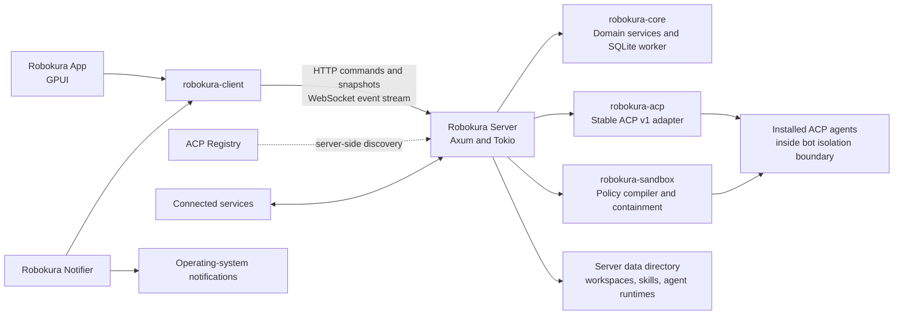
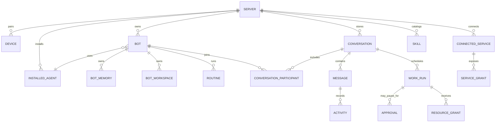
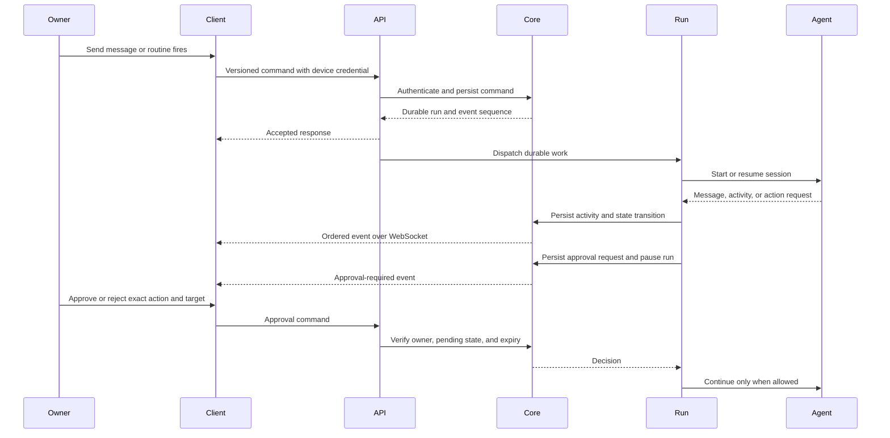

# Robokura System Architecture

## Purpose and status

This document translates the agreed product model and technical choices into
component responsibilities, data ownership, and runtime flows. It is a planning
document, not an implementation specification. The first release covers the
core bot workflow defined in the product plan. Group chats, bot-to-bot
conversations and handoffs, routines, connected services, skills, long-term
memory, browser control, backups, and exports follow that release.

Where the product plan leaves behavior undecided, this document marks the
boundary as open instead of silently treating a proposal as a commitment.

## Architecture principles

- A Robokura Server is the source of truth for one owner's bots, conversations,
  agent installations, resources, and background work.
- The desktop app and notifier are clients. They issue commands and render
  server state; they do not own bot state or ACP sessions.
- Local and remote connections use the same versioned API. Local mode uses a
  loopback server; remote mode uses authenticated encrypted transport.
- Persist accepted commands and meaningful state changes before publishing
  events. Reconnecting clients recover from server state and the event cursor.
- Keep product policy and durable identities independent from ACP, UI, and
  transport-specific types.
- Capability grants are explicit and scoped. Group conversation membership
  alone never grants access to another bot's files or workspace.
- Host enforcement is authoritative for sandbox boundaries. If required
  isolation cannot be enforced, the server does not launch the bot.
- Keep one Robokura sandbox policy across server hosts, with an OS-specific
  enforcement backend and capability check on each host. MXC is the selected
  enforcement engine, consumed only through `robokura-sandbox`. Its
  host-specific capabilities must still pass validation before any host is
  advertised as able to execute bots.
- Every claimed invariant must name the component that enforces it and the
  probe that proves it. A capability the architecture depends on but no
  component owns is not a guarantee. See "Invariant ownership rule".

### Invariant ownership rule

Every guarantee this document claims must resolve to three things: the component
that enforces it, the probe that demonstrates it, and the durable record that
holds the result. A guarantee with no enforcing component is a claim, not a
boundary, and it fails closed.

| Invariant | Enforced by | Probed by | Recorded in |
| --- | --- | --- | --- |
| Default-deny filesystem isolation | `robokura-sandbox` backend | case 1 | `capability_report.checks` |
| Exact-file and directory-tree grants | backend plus launch stub | case 2 | `capability_report.checks`, `resource_grants.resource_identity_json` |
| Grant target not replaced before launch | launch stub in-band identity check | case 2, replacement/move race | `sandbox_attempts.failure_code` |
| Revocation complete only after process-tree exit | `robokura-sandbox` containment guardian | case 3, case 4 | `sandbox_attempts.cleanup_confirmed_at` |
| No orphan process after server restart | containment guardian plus startup reconciliation | case 4, case 5 | `sandbox_attempts.state` |
| Workload cannot open any socket except the egress proxy | `robokura-sandbox` backend plus server egress proxy | case 6 | `server_metadata.capability_report_json` (`network_egress_enforced`) |
| A given agent routes provider traffic through the allowed path | nothing enforces this; it is observed per agent, version, and flow. An `unqualified` flow may run once with an owner-visible disclosure, and becomes `refused` if the run proves it does not use the allowed path | first-run outcome observation | `installed_agents.capabilities_json` (`provider_path_verified`) |
| Refuse launch when isolation is unavailable | `robokura-sandbox` capability loader | case 7 | `server_metadata.capability_report_json`, surfaced by `GET /server` |
| A retried command cannot execute twice | `robokura-core` receipt transaction | receipt replay test | `command_receipts` |
| A promoted file is either absent or complete | `robokura-server` promotion sequence | crash-injection test | `upload_intents.state`, `file_assets` |
| Exactly one ready default agent exists | `robokura-core` domain transaction | domain invariant test | `installed_agents.is_default` |
| A coordinating run always carries a turn budget | `robokura-core` domain transaction on group-run creation | domain invariant test | `work_runs.turn_budget` |
| A bootstrap secret cannot reach a server started outside the app | `fstat` gate on descriptor 0 in `robokura-server` bootstrap path | external-start integration test | server startup log (launch ID and outcome only) |
| A storage key is never derived from client input | `robokura-server` promotion sequence | crash-injection and collision test | `file_assets.storage_key` |
| A credential-shaped file can never enter a backup silently | `robokura-server` pre-backup content scan | scan against planted credential shapes on real hosts | backup failure code naming the workspace-relative path and the matched shape |
| A restored server never reports a host verdict it did not earn | restore clears the capability report, then `robokura-sandbox` loader re-probes | cross-platform restore test | `server_metadata.capability_report_json` reset to empty, `execution_status` back to `checking` |

The two egress rows are deliberately separate. The first is a host fact the
backend enforces and the guardian of which is the kernel; the second is a
property of a particular agent build and auth flow that nothing can enforce,
only measure. Conflating them is what makes the macOS provider question
unanswerable.

## Runtime topology



The app, notifier, and server are separate processes. Each long-running process
owns at most one Tokio runtime. The server composes the API, domain services,
event delivery, routines, and ACP sessions. Its SQLite connection belongs to a
dedicated database worker thread.

The server never delegates authority to the app for enforcement. The app can
present approval requests and collect a decision, but the server records and
enforces that decision before allowing a gated action.

## Component responsibilities

| Component | Owns or coordinates | Must not own |
| --- | --- | --- |
| `robokura-app` | Windows, tray UX, server profiles, local server start/attach/shutdown, user commands | Authoritative bot records, ACP sessions, server filesystem access |
| `robokura-notifier` | Selected server subscriptions, missed-notification refresh, native notification display | Product records, bot execution, server lifecycle decisions for remote hosts |
| `robokura-client` | Authentication per saved connection, HTTP calls, WebSocket connection/replay, typed API access | Runtime creation, domain rules, ACP protocol |
| `robokura-api` | Versioned JSON request/response/event contracts | Domain behavior, database models |
| `robokura-server` | Process lifecycle, HTTP/WebSocket serving, auth boundary, service composition, background scheduling | Desktop UI and client-side secrets |
| `robokura-core` | Product rules, durable records, authorization decisions, persistence operations | GPUI, HTTP, WebSocket, ACP SDK types |
| `robokura-acp` | Agent discovery/install adapter, ACP handshake, per-bot/per-conversation sessions, protocol translation | Product ownership rules, direct UI interaction |
| `robokura-sandbox` | Sandbox policy model, per-host backend translation, containment guardian, launch identity stub, runtime capability probes, verified capability matrix | Product rules, durable records, ACP protocol, approval decisions |

`robokura-core` includes SQLite access in the initial design. Do not add a
separate storage crate unless implementation reveals a concrete boundary.

`robokura-sandbox` exists because the enforcement guarantees in this document
are not delivered by the OS backend alone. The backend translates a Robokura
policy into host primitives; Robokura owns the three things no reviewed backend
provides: the containment guardian, the in-band grant identity check, and the
probe suite that decides whether this host may execute bots at all. Keeping that
behind one crate also keeps MXC swappable. The backend is a trait
implementation, pinned to an exact version, with no product type leaking
through it.


## Domain model and ownership

All durable product data belongs to one Server. IDs are server-scoped unless a
future multi-server import/export design requires globally portable IDs.



The diagram shows conceptual records, not settled SQL tables. Important rules:

- **Server:** one owner in the initial product. Owns its database, server-side
  data directory, installed agents, authentication policy, and execution state.
- **Device:** one app installation paired to a server with a revocable token.
  The client stores the token in the OS credential store; the server stores
  only a verifier. The notifier runs under the same OS user and reuses that
  store.
- **Installed agent:** a server-side installation pinned to a registry version
  and distribution. It has server-wide configuration and authentication. A
  bot may select it and override supported session options. One default agent
  is maintained for new bots and reassignment when an agent is removed.
- **Bot:** durable identity, purpose, instructions, selected agent, supported
  overrides, memory, workspace, routines, and status. The bot can participate
  in multiple conversations, each with a distinct ACP session.
- **Conversation:** one of three kinds: owner-to-bot, bot-to-bot, or user-owned
  group chat. It has a durable ordered history and participant records. A
  removed bot may remain a historical participant but cannot receive new work.
- **Message and activity:** user/bot messages are separate from structured
  activity such as tool calls, permission requests, status changes, and errors.
  This preserves a faithful transcript without flattening tool activity into
  prose. A bot message may be updated while streaming; its completion state is
  `streaming`, `complete`, or `interrupted`. The state and accumulated content
  live on one ordered item, while updates emit coalesced events.
- **Work run:** one bounded unit of execution, created by an owner message, a
  routine trigger, or a bot handoff. A group-chat message creates a coordinating
  run and each participating bot gets its own child run. A handoff also creates
  a child run. It records lifecycle, participating bots, and pending work.
  Permissions do not transfer to a child run or receiving bot. Runs move
  through queued, running, waiting-for-owner, and stopping states, then end as
  completed, canceled, or failed. Restart recovery continues the same run
  when safe. A coordinating run also carries the bot-turn budget: every bot turn
  and handoff in the thread increments `turns_used` on the coordinating run, not
  on the child, so the budget is global to the conversation.
- **Approval:** a server-owned pending decision tied to a specific action,
  target, run, and expiry. The action cannot proceed until an authorized owner
  decision is recorded. Timeout ends the gated routine run without approval.
  Approval expiry is a genuine wall clock: how long the owner is given to decide.
- **Resource grant:** a revocable capability scoped to a bot, selected resource,
  access modes, and one work run. File grants include read and write access,
  can be revoked at any time, and expire when the run completes, is canceled,
  or fails. Revocation immediately starts run termination; the grant remains in
  `revocation_pending` until the contained process tree has exited, then becomes
  `revoked`. Changes already written are not rolled back.
  Grant expiry is **run-scoped, not clock-scoped**. `expires_at` is null for a
  run-scoped grant and is populated only when the owner configures a wall-clock
  deadline. A null `expires_at` means "until this run ends", never "forever".
  This is deliberately different from approval expiry, which is always a clock.
- **Connected service:** owner-connected integration with server-side
  credentials and bot-level availability. Keep credentials in a dedicated
  server-side store behind a service broker; agents call the broker and never
  receive raw tokens. Exclude credentials from backups and exports. Ordinary
  changes through the connection are allowed; sending messages or permanently
  deleting data still require approval. A connection is in use while enabled
  for any bot, referenced by a routine, or held by an active operation. Show
  those dependencies and require the owner to remove them and finish or stop
  active operations before disconnecting. Apply the same in-use protection to
  agents and all other connected resources.
- **Memory:** bot-specific durable facts, separate from transcripts. Bots may
  save useful memories automatically; the owner can inspect, edit, or delete
  them. Group messages and routine output do not become long-term memory by
  default.
- **Skill:** reusable instruction/reference folder in the server library.
  Skills have no executable scripts and grant no permissions by themselves.
- **Routine:** a bot-owned trigger and task definition, with schedule or
  explicitly configured event sources. Each run uses the bot's existing
  capabilities and approval policy.

### Initial domain model draft

This draft names the durable concepts and their fields without committing to
SQL types, table layout, or API serialization. Use lowercase canonical UUIDv7
strings for Robokura-generated durable IDs and client-generated `command_id`
values. They are identifiers, not authorization secrets. Keep ACP-provided
session and message IDs opaque; never parse them as Robokura IDs. Persist
timestamps in UTC. Keep large content and filesystem data outside SQLite when
noted below.

| Record | Core fields | Lifecycle and relationships |
| --- | --- | --- |
| Server metadata | `server_id`, `created_at`, `product_version`, `last_event_sequence`, latest capability report and revision | One metadata record per server database. Schema version belongs to migration metadata, not an owner-editable field. Capability report is refreshed at startup and on relevant changes; it is descriptive, not authorization authority. |
| Device | `device_id`, `name`, `token_verifier`, `created_at`, `last_seen_at`, `revoked_at` | A paired app installation. Revocation is immediate and terminal; keep a minimal record so the server can reject old credentials. Token plaintext exists only at pairing and in the client's OS credential store. |
| Installed agent | `agent_id`, `registry_entry_id`, `display_name`, `version`, `distribution`, `install_state`, `default_config`, `capabilities`, `is_default`, `credential_ref`, timestamps, `last_error` | Server-owned installation. `credential_ref` points to host-managed secret storage; secret values never enter SQLite. State progresses through available/installing/installed-unauthenticated/ready/updating/failed. Exactly one ready agent is the default when bots can be created. |
| Bot | `bot_id`, `name`, `purpose`, `instructions`, `agent_id`, `agent_overrides`, `state`, timestamps | Durable owner-created identity. State is active or archived; permanent deletion is a command that settles work and applies retention rules, not a restorable state. Has exactly one private owner conversation and a generated workspace root outside SQLite. Memory, routines, and selected skills are later-feature relations. |
| Conversation | `conversation_id`, `kind`, `title`, `created_at`, `updated_at` | Kind is private-owner, bot-to-bot, or group. Initial release creates only private-owner conversations. Enforce one private-owner conversation per bot. Participants are represented separately so deleted bots can remain historical participants in retained conversations. User deletion removes the group and its history after active work is stopped. |
| Conversation participant | `conversation_id`, `participant_kind`, `participant_id`, `joined_at`, `left_at`, `display_name_snapshot` | Links an owner or bot to a conversation. Snapshot the display name for transcript history. A removed bot participant is historical and cannot receive work. Group/bot-to-bot membership is later-feature behavior. |
| Message | `message_id`, `conversation_id`, `sequence`, `sender_kind`, `sender_id`, `run_id`, `content`, `created_at`, `completion_state` | Ordered conversation entry. `sender_kind` distinguishes owner, bot, and server. Content is a versioned list of text/file-reference blocks; attached or generated file bytes live in the server data directory. Assistant completion state distinguishes complete from interrupted output. |
| Activity | `activity_id`, `conversation_id`, `run_id`, `sequence`, `kind`, `payload`, `created_at` | Ordered structured event such as tool activity, progress, approval request, state change, or error. Payload is versioned. Activity supplements messages and must not be flattened into transcript prose. |
| Work run | `run_id`, `conversation_id`, `bot_id`, `parent_run_id`, `trigger_kind`, `input_message_id`, `state`, `turns_used`, `turn_budget`, `external_outcome`, `started_at`, `finished_at`, `failure_code`, `failure_detail` | Bounded unit of bot work. Core trigger is an owner message; routine and handoff triggers are later-feature behavior. States: queued, running, waiting-for-owner, stopping, recovery-required, completed, canceled, failed. Restart recovery retains the run identity. `parent_run_id` supports later coordination/handoffs. `turns_used`/`turn_budget` are carried on the coordinating run and count every bot turn in the thread. A null `turn_budget` means the conversation has no turn budget, which is the correct state for an ordinary owner-and-bot conversation; only a coordinating run in a group conversation must carry one, enforced as a domain invariant. `external_outcome` is `settled` or `uncertain` and is set by a background process after the command has already committed, so it needs its own event. A coordinating run has no bot, so its identity snapshots are null. |
| Sandbox attempt | `attempt_id`, `run_id`, `backend_id`, `backend_version`, `policy_hash`, `process_identity`, `state`, start/end/cleanup timestamps, `failure_code` | One concrete process-tree launch for a run. A run may have another attempt only after every earlier attempt is confirmed exited. An uncertain cleanup blocks relaunch. `cleanup_confirmed_at` is set only when the containment guardian has observed the complete process tree gone, never on a kill request alone. |
| Approval | `approval_id`, `run_id`, `action_kind`, `target_summary`, `request_payload`, `state`, `created_at`, `expires_at`, `decided_at`, `deciding_device_id` | One exact gated action. States: pending, approved, rejected, expired, canceled. Only pending approvals can be decided; approval is scoped to the recorded action and target. `expires_at` is always a wall clock. |
| Resource grant | `grant_id`, `run_id`, `bot_id`, `resource_kind`, `resource_locator`, `access_modes`, `state`, `created_at`, `expires_at`, `expired_reason`, `revoked_at` | Temporary capability, initially for an owner-selected file or directory with read/write modes. State is active, revocation_pending, revoked, or expired. It is run-scoped and cannot be inherited by another run or bot. Persist a server-resolved resource identity, not an unchecked client path. `expires_at` is null for a run-scoped grant and set only for an owner-configured wall-clock deadline; `expired_reason` records why an expired grant ended. |
| Notification | `notification_id`, `category`, `title`, `body`, `resource_ref`, `source_event_id`, `created_at`, `cleared_at` | Server-owned notification history for the owner. Cleared items remain until explicitly removed; native delivery state is client-side. `source_event_id` is server-internal only: the referenced event row is pruned after 30 days while notifications are retained, so the reference becomes permanently dangling. Never expose it to clients and never cascade notification deletion from event pruning. |
| Command receipt | `device_id`, `command_id`, `payload_hash`, `result_refs`, `created_at` | Deduplicates a retried mutation and returns its original outcome and resource identifiers. Reuse with a different payload hash is rejected. Device revocation deletes that device's receipts explicitly, because revocation is a timestamp update and the foreign-key cascade cannot fire; an age purge also removes receipts for devices that are never revoked. Do not store request bodies, message text, credentials, or full resource representations. `result_refs` is an allow-list of `{kind, id}` pairs and never carries a filesystem locator. Pairing token exchange is excluded. |
| Event cursor | `server_sequence`, `event_id`, `kind`, `record_id`, `payload`, `created_at` | Monotonically ordered server event stream for reconnect/replay. Snapshots carry a sequence boundary. Compact replay retention is 30 days; durable domain records remain the source of truth. |

Relationships: a bot references one installed agent; each bot has one private
conversation; conversations own ordered messages and activities, with one
shared monotonically increasing sequence across both record kinds; each work run
belongs to one conversation and bot, and may have a parent run; approvals and
resource grants belong to one run. Agent credentials and bot workspace roots
are references to server-hosted resources, never embedded content.

The exact agent configuration representation is decided below as a free-form
document with its own `schema_version`; the error-code catalog is now fixed in
"Error response contract" below. Filesystem roots and grants store
server-resolved paths plus versioned filesystem identity metadata; short-lived
device-bound browse selections are ephemeral and consumed by message submission.
Robokura file assets use generated IDs with opaque server storage keys.
Command-receipt retention/privacy policy is decided below; concrete DDL remains
part of the schema work. Treat this as the starting model, not as a frozen
schema.

#### Agent configuration representation

`agent_overrides_json` is a **free-form JSON object** carrying the agent-defined
option keys, never an array and never a bare scalar. Its shape is deliberately
not modelled as relational rows, because the option set belongs to the agent and
changes with every agent version; a static column set would need a migration for
every upstream option change, and an EAV table would move the merge rule into a
query the domain cannot test.

Every stored document carries `schema_version` as its own top-level key, so a
document written by an older Robokura is recognizable without consulting the
agent. The envelope is:

```json
{
  "schema_version": "1",
  "options": { "agent-defined keys only": "…" },
  "effective_from": "…"
}
```

`options` holds the values; no other key carries an option. `schema_version`
bumps only when the envelope's structure changes, never when an agent adds or
removes an option, which is the distinction that keeps a version bump from
requiring an agent change.

Three rules follow, and they are what make the `PRODUCT_PLAN` merge rule
implementable:

1. **Robokura never invents an option key.** Keys come from the agent's
   advertisement, so a document can never describe a setting no agent reads.
2. **Values are copied, never merged.** On reassignment, a setting the new agent
   supports is copied verbatim into the new document and a setting it does not is
   surfaced to the owner for review rather than silently dropped, which is the
   behavior `PRODUCT_PLAN` already specifies.
3. **Validation is per agent and version.** The server validates the document
   against the installed agent's advertised option set at write time and records
   `agent_config_invalid` for a key or value that agent does not accept. Because
   validation is against the *installed* agent, an update that narrows the option
   set is caught at update time rather than at the next run.

The document is validated strictly before storage, using the same pre-hash
strict parser described under "Strict validation before canonicalization": no
duplicate keys, no numbers outside the I-JSON integer range, bounded depth. The
weaker `json_valid()` syntax check that protects the JSON columns is not
sufficient here, because it accepts duplicate keys and out-of-range integers,
and either would let two documents that differ in effect canonicalize
identically.

### Conversation retention and deletion

- A bot has exactly one private owner conversation.
- Bot-to-bot conversations are retained while at least one participating bot
  still exists. Deleted bots remain historical participants; they cannot take
  part in new turns. Delete the conversation once all participant bots are
  permanently deleted.
- Group chats belong to the owner and remain after participant bots are
  deleted. The owner can delete a group chat and its history independently.
- Archiving a bot hides it while keeping its data restorable. Permanent bot
  deletion stops active work and removes its identity, instructions, memory,
  settings, and private owner conversation, subject to the bot-to-bot retention
  rule above.
- Removing an agent does not delete bots or their histories. First settle active
  sessions and reassign dependent bots to the default agent. An agent or other
  connected resource cannot be disconnected while in use.

## Data and persistence boundaries

SQLite is the source of truth for server records, work state, compact ordered
events, and notification history. A single worker thread owns the SQLite
connection, migrations, and transactions. Large files, workspaces, browser
profiles, agent installations, and skill folders live in the server data
directory, referenced by database records where appropriate. Service
credentials live in a separate host-managed encrypted store, not in SQLite or
ordinary backups. Desktop hosts use the OS credential store. For Linux VPS
deployment, evaluate systemd encrypted service credentials using a host key and
TPM protection where available. The server decrypts them for runtime use; if a
secure store is unavailable, refuse service connection rather than falling
back to plaintext. Restore requires the owner to reconnect services.

Persist messages, structured activity, and unfinished work as they happen.
Keep compact replay events for thirty days and coalesce streamed output. Keep
notification history until the owner clears it. Agent-provider credentials stay
on the server and are excluded from ordinary export and portable backups.

The app stores connection profiles and presentation preferences locally. It
does not create a second authoritative copy of server-owned bot data.

### Excluding agent credentials

Keeping credentials out of backups cannot rely on the agents cooperating,
because they do not. At least one published agent reads a `.env` file from the
working directory and its parents, another reads one from the project directory,
one silently downgrades from the OS credential store to a plaintext file when the
store is unavailable, and at least one stores a credential class outside the
directory its documented configuration override relocates. A bot that writes a
token into its own workspace has therefore put it inside the backup set, and no
amount of server-side secret handling prevents that.

Exclusion is consequently structural rather than procedural. Each work run
receives a fresh ephemeral home and XDG base for configuration, data, cache, and
temporary files, so a stray credential file lands on a tmpfs that is discarded
with the run. An agent that must persist a refreshable login is given a
per-agent credential home that lives in a directory outside the backup set and
is bound into the sandbox as an installed-agent capability rather than as a
user file grant; whether an agent uses injected environment credentials or a
credential home is recorded per installed version, because an update that drops
a documented environment variable must re-qualify rather than keep injecting
something nothing reads. A declared exclusion manifest names every excluded path
prefix with a reason.

Redirecting a run's home and configuration directory is **per-backend
mechanics, not one uniform instruction**, and the difference decides whether the
containment actually holds:

| Host | How `HOME` is set | Failure mode if Robokura assumes otherwise |
| --- | --- | --- |
| Linux | Only by an explicit `process.cwd`, or by naming `HOME` in `process.env`. A `readwritePaths` grant is bind-mounted over `/tmp` **after** the temporary filesystem, so it replaces it | With no explicit home, `HOME` is unset and a stray credential lands in the **host's shared `/tmp`**, which is both persistent and outside the backup set's control. Robokura must set both `cwd` and `HOME` explicitly |
| macOS | `HOME` is set only when a working directory resolves, and it names that directory | Dotfiles there are read as *user-level* tool configuration (`.gitconfig`, `.npmrc`, `.curlrc`, `.config/*`), so the agent reads them as trusted global config rather than project input. Robokura sets `HOME` explicitly to the ephemeral directory rather than letting it default to the workspace |
| Windows | **Cannot be cleared.** ProcessContainer rejects an environment block that omits `SYSTEMROOT` and `LOCALAPPDATA`, including an explicitly empty one | `LOCALAPPDATA` is precisely where Windows agents cache credentials, so on Windows the "ephemeral home" guarantee covers directories Robokura chooses and *not* the platform profile locations. Any agent that persists there is recorded as needing the per-agent credential home, and Windows is a credential-containment exception rather than an oversight |

Two further backend defaults interact with the same decision. `nestedPty` defaults
on and is required by ordinary agent tooling, so it stays on and is not a
tightening lever. And on macOS the option that permits UI access additionally
grants read and write across `/private/tmp` and `/var/folders` regardless of the
filesystem policy, which would silently defeat an ephemeral `/tmp`; it therefore
stays off, permanently, and its absence is a recorded invariant in the capability
matrix rather than a default left to chance.

Before a backup writes any entry, a content scan checks the leading bytes of
candidate files against known credential shapes. If a credential-shaped file
appears inside a workspace, the **backup fails** with a code that names the
workspace-relative path and the shape that matched, never the value. The owner
either tells the bot to move the file or adds an explicit recorded exclusion.
There is no force flag and no silent inclusion, because silently including leaks
a credential and silently dropping leaves the backup's workspace copy diverging
from the live one. A backup that fails is recoverable; a leaked credential is
not.

`credential_ref` is a pointer plus non-secret metadata: the store kind, the slot
identity, the secret kind, the environment variable names in use, the credential
mode, and rotation timestamps. Secret values never enter SQLite. Because the
registry schema carries no authentication field at all, `credential_ref` cannot
be populated until the agent has completed a live handshake; it is a
post-handshake fact, not an install-time one.

### Persistence mapping draft

The following are logical record groups, not committed SQL table names:

| Resource family | Durable relational records | Data outside SQLite |
| --- | --- | --- |
| Server and devices | Server metadata, paired-device identity, token verifier, revocation state | Certificates and server configuration files where needed |
| Agents | Registry source/version, distribution, installation status, agent defaults, bot assignment, session reference | Agent binaries, managed runtimes, agent-owned provider credentials |
| Bots | Identity, instructions, selected agent, overrides, status, memory, skill links | Persistent bot workspace and files |
| Conversations and files | Conversation kind, owner, participants including historical identities, messages, structured activity, per-bot ACP session reference, file metadata and upload intents | Attachment bytes, upload staging, and large artifacts |
| Work runs | Trigger, conversation, bot/run relationships, state, command origin, cancellation/recovery data, resource grants, approval requests and decisions | None required for the core run record |
| Routines | Definition, trigger configuration, pause state, run history, outcomes | Optional routine input/output artifacts |
| Skills | Metadata, version, owner/library linkage | Portable `SKILL.md` folder and reference files |
| Connected services | Provider type, connection metadata, bot/routine availability, vault reference, health/status | Encrypted service credentials in the host-managed secret store |
| Events and commands | Ordered event log, event retention metadata, command ID, payload hash, compact outcome/resource-reference receipt | None |
| Notifications | Owner-visible notification history, server and bot references, cleared state | None |

`robokura-core` owns the SQLite schema and migrations through the dedicated
database worker. Database schema versioning is separate from the public API
version and the portable export version. A backup snapshot must coordinate the
database and referenced server files; service and provider credentials and
their host key material remain outside the backup.

### SQLite schema draft

The following table names and keys are a proposed mapping for the core release,
not SQL DDL. The owner approved storing messages and activities in one ordered
`conversation_items` table; the API and domain layer still expose distinct
message and activity representations. Use `TEXT` for opaque IDs and JSON documents, integer UTC
milliseconds for stored timestamps, and integer booleans constrained to 0/1.
Keep JSON documents versioned where their shape can evolve. Enable SQLite
foreign-key enforcement on every connection.

| Proposed table | Key columns and important constraints |
| --- | --- |
| `server_metadata` | Singleton row (`singleton_id = 1`), `server_id`, `created_at`, `product_version`, monotonic `last_event_sequence`, latest capability report JSON/revision/probe time. |
| `devices` | `device_id` primary key, unique `token_verifier`, `name`, timestamps, nullable `revoked_at`. Never store the bearer token. |
| `installed_agents` | `agent_id` primary key, registry entry/version/distribution, status, `default_config_json`, `capabilities_json`, nullable `credential_ref`, timestamps. Partial unique index permits at most one `is_default = 1`; domain transaction ensures exactly one ready default before bot creation. |
| `bots` | `bot_id` primary key, profile fields, `agent_id` FK to installed agent with `ON DELETE RESTRICT`, `agent_overrides_json`, active/archive state, timestamps. Index by `(state, updated_at)` and `agent_id`. |
| `conversations` | `conversation_id` primary key, kind, title, timestamps, `next_item_sequence`, nullable `owner_bot_id` FK to bot with `ON DELETE CASCADE`. For private-owner kind, `owner_bot_id` is required and unique; it is null for group and bot-to-bot conversations. |
| `conversation_participants` | `participant_id` primary key, conversation FK, `participant_kind` (`owner`/`bot`), nullable `bot_id` FK with `ON DELETE SET NULL`, `historical_bot_id`, display-name snapshot, join/leave timestamps. Owner is a single implicit server identity. A null `bot_id` with retained historical ID/name preserves transcript identity after bot deletion. |
| `conversation_items` | `item_id` primary key, conversation FK, per-conversation `sequence`, item kind (`message`/`activity`), nullable run FK, sender kind, nullable sender bot FK with `ON DELETE SET NULL`, sender ID/name snapshot, content/payload JSON, completion state, creation time. Unique `(conversation_id, sequence)`. One table for messages and activities guarantees their shared ordering. |
| `work_runs` | `run_id` primary key, conversation FK, nullable bot FK with `ON DELETE SET NULL`, bot ID/name snapshot, optional self-FK `parent_run_id`, trigger kind, input item FK, state, recovery/cancellation fields, timestamps and failure fields. Defer the run/input-item foreign-key pair to transaction commit. Index by `(state, created_at)`, `(bot_id, state)`, and `(conversation_id, created_at)`. |
| `sandbox_attempts` | `attempt_id` primary key, run FK, backend ID/version, canonical policy hash, versioned process/containment identity JSON, state, start/end/cleanup-confirmed timestamps, failure code. Keep one active or cleanup-unknown attempt per run; preserve attempts for restart reconciliation. |
| `approvals` | `approval_id` primary key, run FK, action/target/request summary, state, created/expiry/decision timestamps, deciding device FK. Index pending approvals by `(state, expires_at)` and run. |
| `filesystem_roots` | `root_id` primary key, server-canonical path, filesystem object identity, display name, enabled state, timestamps. Roots define only what the owner can browse. |
| `resource_grants` | `grant_id` primary key, run and bot FKs, filesystem root, server-resolved path, versioned filesystem object identity, entry kind, access modes, state, created/expiry/revocation timestamps. Index active grants by `(run_id, state)` and `(bot_id, state)`. Never treat the stored locator as authority without current grant and sandbox checks. |
| `server_events` | Integer `sequence` primary key, unique `event_id`, event type, resource type/ID, versioned payload JSON, creation time. Index by creation time for 30-day retention and by resource reference for diagnostics. |
| `command_receipts` | Composite primary key `(device_id, command_id)`, device FK, payload hash, HTTP status, outcome, resource-reference JSON, creation time. Same key/same hash returns the stored compact result; same key/different hash is rejected. Purge receipts when their device is revoked. |
| `notifications` | `notification_id` primary key, unique source event ID where applicable, category/title/body, resource reference, created/cleared timestamps. Index uncleared notifications by creation time. |
| `acp_sessions` | Composite key `(conversation_id, bot_id)`, agent FK, external session ID, state, updated time. Stores session references only; agent-owned session data remains with the server-side agent/runtime. |
| `pairing_challenges` | One-time pairing-code verifier, creation/expiry/consumption times, and failed-attempt count. Never store the plaintext pairing code. |
| `upload_intents` | Expected file metadata and digest, upload state, created/expiry times, and opaque staging ID. Staging paths are derived by the server and are not client-supplied. |
| `file_assets` | Immutable file metadata, verified SHA-256, opaque storage key, creation time, and attachment reference state. File bytes live outside SQLite. |
| `schema_migrations` | Monotonic migration version primary key, applied timestamp, migration identifier/checksum. This is separate from the public API version. |

#### Column and constraint specification

Use the following names and SQLite storage classes as the concrete design
baseline. `TEXT` JSON columns contain versioned JSON objects or arrays. Timestamps
are UTC Unix milliseconds; nullable timestamps represent an unset lifecycle
time. Every Robokura ID is a lowercase canonical UUIDv7 `TEXT` value. Do not
add a generic `updated_at` trigger: domain transactions set update times
explicitly.

| Table | Column contract |
| --- | --- |
| `server_metadata` | `singleton_id INTEGER PRIMARY KEY CHECK (singleton_id = 1)`; `server_id TEXT NOT NULL UNIQUE`; `created_at INTEGER NOT NULL`; `product_version TEXT NOT NULL`; `last_event_sequence INTEGER NOT NULL DEFAULT 0 CHECK (last_event_sequence >= 0)`; `capability_report_json TEXT NOT NULL`; `capability_revision INTEGER NOT NULL DEFAULT 0`; `capabilities_probed_at INTEGER NOT NULL`. |
| `devices` | `device_id TEXT PRIMARY KEY`; `name TEXT NOT NULL`; `token_verifier TEXT NOT NULL UNIQUE`; `created_at INTEGER NOT NULL`; `last_seen_at INTEGER NULL`; `revoked_at INTEGER NULL`. |
| `installed_agents` | `agent_id TEXT PRIMARY KEY`; `registry_entry_id TEXT NOT NULL`; `display_name TEXT NOT NULL`; `version TEXT NOT NULL`; `distribution TEXT NOT NULL`; `install_state TEXT NOT NULL`; `auth_state TEXT NOT NULL`; `default_config_json TEXT NOT NULL`; `capabilities_json TEXT NOT NULL`; `is_default INTEGER NOT NULL CHECK (is_default IN (0,1))`; `credential_ref TEXT NULL`; `last_error_code TEXT NULL`; `created_at INTEGER NOT NULL`; `updated_at INTEGER NOT NULL`. Add `CHECK (is_default = 0 OR install_state = 'ready')`. `credential_ref` cannot be populated from the registry, because the registry schema has no authentication field at all; it is a post-handshake fact discovered from the agent's live initialize response. |
| `bots` | `bot_id TEXT PRIMARY KEY`; `name TEXT NOT NULL`; `purpose TEXT NOT NULL`; `instructions TEXT NOT NULL`; `agent_id TEXT NOT NULL REFERENCES installed_agents ON DELETE RESTRICT`; `agent_overrides_json TEXT NOT NULL`; `state TEXT NOT NULL CHECK (state IN ('active','archived'))`; `created_at INTEGER NOT NULL`; `updated_at INTEGER NOT NULL`. |
| `conversations` | `conversation_id TEXT PRIMARY KEY`; `kind TEXT NOT NULL CHECK (kind IN ('private_owner','bot_to_bot','group'))`; `title TEXT NULL`; `owner_bot_id TEXT NULL REFERENCES bots ON DELETE CASCADE`; `next_item_sequence INTEGER NOT NULL DEFAULT 1 CHECK (next_item_sequence >= 1)`; `created_at INTEGER NOT NULL`; `updated_at INTEGER NOT NULL`. Check that `owner_bot_id` is non-null only for `private_owner` conversations. |
| `conversation_participants` | `participant_id TEXT PRIMARY KEY`; `conversation_id TEXT NOT NULL REFERENCES conversations ON DELETE CASCADE`; `participant_kind TEXT NOT NULL CHECK (participant_kind IN ('owner','bot'))`; `bot_id TEXT NULL REFERENCES bots ON DELETE SET NULL`; `bot_id_snapshot TEXT NULL`; `display_name_snapshot TEXT NOT NULL`; `joined_at INTEGER NOT NULL`; `left_at INTEGER NULL`. `bot_id` is the live foreign key and is nulled on permanent bot deletion, while `bot_id_snapshot` always retains the identity; holding both is what keeps a bot participant resolvable after the bot is gone. A row check requires owner rows to have both null and bot rows to have a non-null snapshot. Uniqueness for active bot members is indexed on `bot_id_snapshot`, not `bot_id`, because a unique index treats nulls as distinct and could not prevent duplicate rows once a deleted bot has a null `bot_id`. |
| `work_runs` | `run_id TEXT PRIMARY KEY`; `conversation_id TEXT NOT NULL REFERENCES conversations ON DELETE CASCADE`; `bot_id TEXT NULL REFERENCES bots ON DELETE SET NULL`; `bot_id_snapshot TEXT NULL`; `bot_name_snapshot TEXT NULL`; `parent_run_id TEXT NULL REFERENCES work_runs ON DELETE SET NULL`; `trigger_kind TEXT NOT NULL`; `input_item_id TEXT NOT NULL REFERENCES conversation_items DEFERRABLE INITIALLY DEFERRED`; `state TEXT NOT NULL CHECK (state IN ('queued','running','waiting_for_owner','stopping','recovery_required','completed','canceled','failed'))`; `turns_used INTEGER NOT NULL DEFAULT 0 CHECK (turns_used >= 0)`; `turn_budget INTEGER NULL CHECK (turn_budget IS NULL OR turn_budget >= 1)`; `external_outcome TEXT NOT NULL DEFAULT 'settled' CHECK (external_outcome IN ('settled','uncertain'))`; `external_outcome_detail TEXT NULL`; `external_provider_ref TEXT NULL`; `started_at INTEGER NULL`; `finished_at INTEGER NULL`; `failure_code TEXT NULL`; `failure_detail TEXT NULL`; `created_at INTEGER NOT NULL`; `updated_at INTEGER NOT NULL`. The turn budget lives on the coordinating run so it is global to the thread; a child run's value is only ever informational and is copied from the coordinating run at creation, because every increment lands on the coordinating row. `turn_budget` is **nullable, and the null is not a default of unlimited**: a null means "this conversation has no turn budget", which is correct for an ordinary owner-and-bot conversation where one bot takes one turn at a time with the owner present. Only a coordinating run — `bot_id IS NULL` and member of a `group` conversation — must carry a non-null budget, because that thread can keep itself going without the owner. The check cannot be a `CHECK` constraint, because it needs the conversation's `kind` and a row check cannot see another table; it is a domain invariant on the transaction that creates a coordinating run, with a test, and the failure is `run_turn_budget_required`. A coordinating run is identified by `bot_id IS NULL` **and** membership of a `group` conversation, which needs no extra table and does not extend the `trigger_kind` vocabulary beyond owner message, routine, and handoff. `bot_id_snapshot` and `bot_name_snapshot` are nullable because a coordinating run has no bot to snapshot; require both null exactly when `bot_id IS NULL`, and non-null otherwise. |
| `sandbox_attempts` | `attempt_id TEXT PRIMARY KEY`; `run_id TEXT NOT NULL REFERENCES work_runs ON DELETE CASCADE`; `backend_id TEXT NOT NULL`; `backend_version TEXT NOT NULL`; `policy_hash TEXT NOT NULL`; `process_identity_json TEXT NOT NULL`; `state TEXT NOT NULL CHECK (state IN ('launching','running','stopping','exited','cleanup_unknown'))`; `started_at INTEGER NULL`; `ended_at INTEGER NULL`; `cleanup_confirmed_at INTEGER NULL`; `failure_code TEXT NULL`; `created_at INTEGER NOT NULL`; `updated_at INTEGER NOT NULL`. A partial unique index permits at most one attempt per run in `launching`, `running`, `stopping`, or `cleanup_unknown`. Never start another attempt until the prior one is `exited` with cleanup confirmed. `cleanup_confirmed_at` is written only when the containment guardian has observed the complete process tree gone, never on a kill request alone, so it is the durable proof a revocation report depends on. |
| `conversation_items` | `item_id TEXT PRIMARY KEY`; `conversation_id TEXT NOT NULL REFERENCES conversations ON DELETE CASCADE`; `sequence INTEGER NOT NULL CHECK (sequence >= 1)`; `item_kind TEXT NOT NULL CHECK (item_kind IN ('message','activity'))`; `run_id TEXT NULL REFERENCES work_runs DEFERRABLE INITIALLY DEFERRED`; `sender_kind TEXT NOT NULL CHECK (sender_kind IN ('owner','bot','server'))`; `sender_bot_id TEXT NULL REFERENCES bots ON DELETE SET NULL`; `sender_id_snapshot TEXT NULL`; `sender_name_snapshot TEXT NOT NULL`; `content_json TEXT NULL`; `payload_json TEXT NULL`; `completion_state TEXT NULL`; `created_at INTEGER NOT NULL`; `updated_at INTEGER NOT NULL`. Require exactly one of content/payload based on item kind; message completion state is `streaming`, `complete`, or `interrupted`, while activity completion state is null; unique `(conversation_id, sequence)`. |
| `approvals` | `approval_id TEXT PRIMARY KEY`; `run_id TEXT NOT NULL REFERENCES work_runs ON DELETE CASCADE`; `action_kind TEXT NOT NULL`; `target_summary TEXT NOT NULL`; `request_payload_json TEXT NOT NULL`; `state TEXT NOT NULL CHECK (state IN ('pending','approved','rejected','expired','canceled'))`; `created_at INTEGER NOT NULL`; `expires_at INTEGER NOT NULL`; `decided_at INTEGER NULL`; `deciding_device_id TEXT NULL REFERENCES devices ON DELETE RESTRICT`; `owner_note TEXT NULL`. |
| `filesystem_roots` | `root_id TEXT PRIMARY KEY`; `canonical_path TEXT NOT NULL`; `identity_json TEXT NOT NULL`; `display_name TEXT NOT NULL`; `state TEXT NOT NULL CHECK (state IN ('enabled','disabled'))`; `validated_at INTEGER NOT NULL`; `created_at INTEGER NOT NULL`; `updated_at INTEGER NOT NULL`; `disabled_at INTEGER NULL`. These roots affect owner browsing only. |
| `resource_grants` | `grant_id TEXT PRIMARY KEY`; `run_id TEXT NOT NULL REFERENCES work_runs ON DELETE CASCADE`; `bot_id TEXT NULL REFERENCES bots ON DELETE SET NULL`; `bot_id_snapshot TEXT NOT NULL`; `root_id TEXT NOT NULL REFERENCES filesystem_roots ON DELETE RESTRICT`; `resource_locator TEXT NOT NULL`; `resource_identity_json TEXT NOT NULL`; `entry_kind TEXT NOT NULL CHECK (entry_kind IN ('file','directory'))`; `access_modes_json TEXT NOT NULL`; `state TEXT NOT NULL CHECK (state IN ('active','revocation_pending','revoked','expired'))`; `created_at INTEGER NOT NULL`; `expires_at INTEGER NULL`; `expired_reason TEXT NULL`; `revoked_at INTEGER NULL`. `bot_id` deliberately uses `SET NULL` with a snapshot rather than `CASCADE`: a cascade would silently delete grant rows, so the `revocation_pending` to `revoked` transition would never be observable and no final event would be emitted. `expires_at` is null for a run-scoped grant and set only for an owner-configured wall-clock deadline; `expired_reason` records `run_ended`, `run_failed`, `run_canceled`, or `ttl_elapsed`. Store a versioned identity descriptor and revalidate it at launch; a locator alone is not authority. |
| `server_events` | `sequence INTEGER PRIMARY KEY`; `event_id TEXT NOT NULL UNIQUE`; `event_type TEXT NOT NULL`; `resource_type TEXT NOT NULL`; `resource_id TEXT NOT NULL`; `payload_json TEXT NOT NULL`; `created_at INTEGER NOT NULL`. |
| `command_receipts` | `device_id TEXT NOT NULL REFERENCES devices ON DELETE CASCADE`; `command_id TEXT NOT NULL`; `payload_hash TEXT NOT NULL`; `http_status INTEGER NOT NULL`; `outcome TEXT NOT NULL`; `result_refs_json TEXT NOT NULL`; `created_at INTEGER NOT NULL`; primary key `(device_id, command_id)`. No request or response body column. The foreign-key cascade cannot fire in practice, because device revocation is a timestamp update rather than a row deletion, so the revoke transaction issues an explicit `DELETE FROM command_receipts WHERE device_id = ?` and the maintenance pass also purges by age for devices that are never revoked. `result_refs_json` is an allow-list of `{kind, id}` pairs and never carries a filesystem locator. |
| `notifications` | `notification_id TEXT PRIMARY KEY`; `source_event_id TEXT NULL UNIQUE`; `category TEXT NOT NULL`; `title TEXT NOT NULL`; `body TEXT NOT NULL`; `resource_type TEXT NULL`; `resource_id TEXT NULL`; `created_at INTEGER NOT NULL`; `cleared_at INTEGER NULL`. `source_event_id` is server-internal: the referenced event is pruned after 30 days while the notification is retained, so the reference becomes permanently dangling. Never expose it and never cascade notification deletion from event pruning. |
| `acp_sessions` | `conversation_id TEXT NOT NULL REFERENCES conversations ON DELETE CASCADE`; `bot_id TEXT NOT NULL REFERENCES bots ON DELETE CASCADE`; `agent_id TEXT NOT NULL REFERENCES installed_agents ON DELETE RESTRICT`; `external_session_id TEXT NULL`; `state TEXT NOT NULL CHECK (state IN ('opening','open','restore_failed','closed','unknown'))`; `created_at INTEGER NOT NULL`; `updated_at INTEGER NOT NULL`; primary key `(conversation_id, bot_id)`. |
| `pairing_challenges` | `challenge_id TEXT PRIMARY KEY`; `code_verifier TEXT NOT NULL UNIQUE`; `created_at INTEGER NOT NULL`; `expires_at INTEGER NOT NULL`; `consumed_at INTEGER NULL`; `failed_attempts INTEGER NOT NULL DEFAULT 0 CHECK (failed_attempts >= 0)`. |
| `upload_intents` | `upload_id TEXT PRIMARY KEY`; `file_name TEXT NOT NULL`; `content_type TEXT NOT NULL`; `byte_length INTEGER NOT NULL CHECK (byte_length >= 0)`; `sha256 TEXT NOT NULL`; nullable `file_id TEXT REFERENCES file_assets ON DELETE SET NULL`; nullable `storage_key TEXT`; `state TEXT NOT NULL CHECK (state IN ('created','received','promoting','completed','expired','failed'))`; `created_at INTEGER NOT NULL`; `expires_at INTEGER NOT NULL`; `updated_at INTEGER NOT NULL`. |
| `file_assets` | `file_id TEXT PRIMARY KEY`; `file_name TEXT NOT NULL`; `content_type TEXT NOT NULL`; `byte_length INTEGER NOT NULL CHECK (byte_length >= 0)`; `sha256 TEXT NOT NULL`; `storage_key TEXT NOT NULL UNIQUE`; `created_at INTEGER NOT NULL`; nullable `unattached_expires_at INTEGER`; nullable `attached_at INTEGER`; `pending_delete INTEGER NOT NULL DEFAULT 0 CHECK (pending_delete IN (0,1))`. The domain transaction clears `unattached_expires_at` and sets `attached_at` together when a message references the file; without `attached_at` a never-attached asset is indistinguishable from an expired one. `pending_delete` makes byte removal crash-safe: flag in one transaction, commit, unlink, then delete the row. `storage_key` is derived from the server-generated `file_id`, never from client input, which makes collisions impossible and keeps Windows rename-replace semantics out of the promotion path. |
| `file_attachments` | `item_id TEXT NOT NULL REFERENCES conversation_items ON DELETE CASCADE`; `file_id TEXT NOT NULL REFERENCES file_assets ON DELETE RESTRICT`; composite primary key `(item_id, file_id)`. Keep these references in sync with file blocks in the item content. |

Use these indexes in addition to primary-key/unique constraints:

- Unique partial index on `conversations(owner_bot_id)` where kind is
  `private_owner`; partial unique index on `installed_agents(is_default)`
  where `is_default = 1`.
- Partial unique index on `conversation_participants(conversation_id)` for
  active owner rows; partial unique index on
  `conversation_participants(conversation_id, bot_id_snapshot)` for active bot
  rows. Indexing `bot_id` instead would not work: a unique index treats nulls as
  distinct, so it cannot prevent duplicate rows once a deleted bot has a null
  `bot_id`. The same reasoning applies to every secondary index that must keep
  resolving rows after the referenced bot is deleted, which is why
  `resource_grants` is indexed on `bot_id_snapshot` as well.
- `bots(state, updated_at)`, `bots(agent_id)`,
  `conversation_items(conversation_id, sequence DESC)`,
  `conversation_items(run_id)` where `run_id` is not null,
  `conversations(kind, updated_at)`,
  `work_runs(state, created_at)`, `work_runs(bot_id, state)`,
  `work_runs(conversation_id, created_at)`,
  `sandbox_attempts(run_id, state)`, `approvals(run_id)`,
  `approvals(state, created_at)` for the owner-facing pending queue,
  `approvals(state, expires_at)` for the expiry sweep,
  `resource_grants(run_id, state)`, `resource_grants(bot_id_snapshot, state)`,
  `resource_grants(root_id, state)`, `resource_grants(state, run_id)` where the
  state is active or revocation-pending,
  `server_events(created_at)`, `server_events(resource_type, resource_id)`,
  `notifications(cleared_at, created_at)`, `pairing_challenges(expires_at)`,
  `upload_intents(state, expires_at)`, `file_attachments(file_id)`,
  `file_assets(unattached_expires_at)` where it is not null,
  `acp_sessions(agent_id)`, and `acp_sessions(external_session_id)` where it is
  not null. `server_events(resource_type, resource_id, sequence)` is redundant
  because every secondary index already stores the rowid.
- `devices(created_at)`.

`conversations(owner_bot_id)` and `installed_agents(is_default)` partial unique
indexes each guarantee **at most** one row. The "exactly one ready default agent"
claim is a domain invariant enforced by the transaction that creates or
reassigns a bot, and it is covered by tests rather than by DDL: a fresh database
with no agents has no default and bot creation returns `422 agent_not_ready`;
once an agent reaches `ready` there is exactly one; assigning a second default
is a unique-constraint violation surfaced as `409 state_conflict`.

Apply JSON validity checks to JSON columns. The bundled SQLite version is now
fixed by the `rusqlite` `bundled` feature, which is well past the release where
the JSON functions became unconditional, so these checks apply unconditionally.
They are worth having as insurance against a hand-written update, a future
migration, or a serializer change, but they are **syntax checks only**: SQLite's
`json_valid()` accepts duplicate object keys and does not enforce the I-JSON
integer range, so it is not a substitute for the strict parser described under
command conventions. Use the one-argument form; the flag form would enable JSON5
spellings. Keep enum checks aligned with domain transitions; the application
still validates transitions and cross-row invariants.

#### Migration sequence

Use an empty new database and numbered, immutable, forward-only migrations:

1. **`0001_server_devices_agents_bots`** — create `schema_migrations`, server
   metadata, devices, installed agents, bots, and their base indexes/checks.
2. **`0002_conversations_and_work`** — create conversations, participants,
   work runs, conversation items, approvals, resource grants, ACP sessions, and
   all cross-referencing indexes in one migration. Define the deferred
   run/item foreign-key pair in both table declarations.
3. **`0003_events_receipts_notifications_files`** — create ordered server
   events, command receipts, notification history, pairing challenges, upload
   intents, file metadata/attachment references, retention indexes, and indexes
   for event/resource lookup.

Each migration runs in its own SQLite transaction and records its version and
checksum only after all DDL succeeds. Never edit a migration after release;
append a new version for corrections. Test migration from every released
schema version. Before a migration that rebuilds or drops populated tables,
create and validate a consistent backup. If a migration fails, roll it back,
keep the server offline, and preserve the database for diagnosis. Public API
versioning remains independent from schema migration versioning.

The migration runner is written for this project rather than taken from a
general-purpose crate. The reason is specific: the point of storing a checksum
in `schema_migrations` is to make a migration **edited after release a detectable,
fatal condition**, and a runner that keeps its state in `PRAGMA user_version`
cannot express a checksum or an applied timestamp at all. The runner embeds each
migration's SQL in the binary, verifies every already-applied checksum **before
running any DDL**, requires the applied set to be exactly contiguous, and records
the version row last inside the same transaction. It also sets
`legacy_alter_table` explicitly so `ALTER TABLE ... RENAME` keeps rewriting
referencing foreign-key clauses, and it never writes `PRAGMA user_version`.

Later features append `0004` onward; the core release reserves no gaps. A
migration that must rebuild a table follows SQLite's documented rebuild
procedure, because a foreign key or check constraint cannot be altered in place.

The polymorphic resource references in events and notifications are diagnostic
references, not foreign keys. All authoritative relationships use foreign
keys. Historical sender and participant identity snapshots are retained only
where the product's conversation-retention rule requires them.

#### Indexes and integrity rules

- Add a unique partial index for one private conversation per bot and a unique
  partial index for the single default agent. Enforce readiness of the default
  in the same domain transaction that creates or reassigns bots.
- Enforce one active owner membership per conversation and one active
  membership for each bot in a conversation with partial unique indexes; use
  checks to require owner rows to have no bot FK and bot rows to identify a
  live or historical bot. Allocate the next item sequence by updating a
  conversation counter inside the write transaction; do not calculate it with
  an unlocked `MAX(sequence) + 1` query.
- Allocate server event sequence by incrementing `server_metadata` in the same
  transaction that inserts the event. Pruning old events must never reuse a
  sequence.
- Keep state values constrained to the domain enums above. Reject invalid
  transitions in domain logic even when a row-level `CHECK` also restricts the
  stored values.
- Use `ON DELETE RESTRICT` for installed agents referenced by bots. Agent
  removal first reassigns bots and settles active sessions. Device revocation
  is a timestamp update, not a row deletion.
- Permanent bot deletion first stops active runs and expires/revokes their
  grants. Delete its private conversation and dependent private history. In
  retained group or bot-to-bot history, null the live bot foreign key while
  keeping historical ID/name snapshots. Do this in one explicit domain
  operation; do not rely on cascades for product deletion policy.
  Delete attachment records and file assets only when no remaining conversation
  references each asset; remove the corresponding bytes after the database
  commit and reconcile stale storage keys after a crash.
- Deleting a user-owned group conversation cascades its participants, items,
  runs, approvals, grants, and session references after active work is stopped.
  A bot-to-bot conversation is deleted only after all participating bots have
  been permanently deleted, per the retention rule.

#### Transaction boundaries

Use a serialized SQLite write transaction for each accepted command or
meaningful agent transition. At minimum:

1. **Create bot:** validate a ready agent; insert the bot, private conversation,
   owner/bot participant records, and event atomically.
2. **Send message:** validate conversation and bot; allocate item sequence;
   validate and consume every one-time filesystem selection; insert owner
   message, queued work run, exact scoped grants, command receipt, and event
   atomically. Defer the run/input-item foreign-key pair until commit to allow
   both records to reference one another. Start ACP only after commit and
   revalidate each target's filesystem identity while assembling the sandbox.
3. **Record agent output:** insert or update the message/activity item and run
   state; append event sequence in the same transaction.
4. **Request/decide approval:** insert the approval and transition the run to
   waiting-for-owner, or record the decision and next run state, with event and
   command receipt atomically.
5. **Revoke a device:** set `revoked_at`, then delete that device's command
   receipts explicitly in the same transaction. The receipts foreign key cascade
   is a safety net for a future hard-delete path, not the mechanism, because
   revocation never deletes the device row.
6. **Grant/revoke path:** grants are fixed when the per-run sandbox starts;
   adding a path always requires a new run. To revoke, first persist the run as
   `stopping`, the grant as `revocation_pending`, the accepted command receipt,
   and ordered events. Then terminate the complete contained process tree.
   After exit is confirmed, atomically mark the grant revoked and run canceled
   and append final events. If exit cannot be confirmed, keep the visible
   stopping/pending state and retry cleanup; never report revocation complete.
   Already-written changes are not rolled back. Disabling a filesystem browse
   root is rejected while any active or pending grant uses that root or a path
   beneath it; browse visibility never changes an existing grant's authority.
7. **Finish/cancel/fail run:** transition run state, expire its grants with
   `expired_reason` naming which terminal condition ended them, resolve or
   cancel pending approvals, and emit resulting events atomically.
8. **Attach files to a message:** validate that each file is complete and
   unexpired; insert the message item and attachment relations, clear the
   unattached expiry and set `attached_at`, and create its run/event/receipt in
   one transaction.
9. **Delete a file asset's bytes safely:** never delete a `file_assets` row while
   any `file_attachments` row still references it. Set `pending_delete`, commit,
   unlink the bytes, then delete the row. A crash between the unlink and the row
   delete leaves a row with no bytes, which the maintenance pass resolves
   idempotently by retrying the unlink and treating `NotFound` as success rather
   than as a failure, so the pass converges instead of retrying a permanent
   error forever.

External ACP process control cannot be made atomic with SQLite. Persist the
requested transition first, perform the external operation, then persist its
observed result. After a crash, reconcile the durable requested state against
the process/session state before resuming work. A run in `stopping` is never
resumed. On restart, retry process-tree cleanup; finalize pending grants as
revoked only after the old sandbox is confirmed gone. A resumable run starts a
fresh sandbox and revalidates every still-active grant before launch.

File promotion also spans the filesystem and SQLite, so make it recoverable:
after verifying staging bytes, persist `promoting` with a generated `file_id`
and opaque final storage key, move the file on the same data volume, then
commit the asset record and completed upload state. A retry or startup
reconciliation resumes that promotion idempotently. Remove expired incomplete
staging data; never trust a client path as a storage key.

The ordering is the invariant: **rename before commit**, never the reverse. Once
the rename has happened but the asset row has not, the failure mode is an orphan
file with no row, which a sweep deletes cheaply. The opposite order would let a
client learn a `file_id` whose bytes do not exist, and a dangling row is not
cheap. The server asserts at startup that the staging and final-store
directories are on the same volume, because a cross-device rename fails midway
through promotion. Reconciliation of a `promoting` intent checks the final
location first, then staging, then neither, and quarantines a final file whose
digest no longer matches rather than accepting it.

#### Migration and database operation

Start with a new empty database. The schema begins at version one. Apply
numbered, forward-only migrations in order before serving requests. Each migration records its version only after successful completion.
Use a consistent backup before any migration that rebuilds or drops populated
tables. On migration failure, leave the server unavailable and preserve the
database for diagnosis; do not start with a partially upgraded schema.

Use WAL mode for concurrent readers with the single database worker owning all
writes. Keep foreign keys enabled and set a bounded busy timeout. The worker
serializes migrations and write transactions; read snapshots must not observe
half-applied transitions. Event pruning removes only replay rows older than 30
days. It does not delete messages, activities, runs, or notification history.

Two operational rules follow from the WAL design rather than from the schema.
No read transaction may be held across an await point that can block on I/O,
because a long-lived read prevents checkpointing and grows the log without
bound. A deferred foreign-key violation surfaces at **commit**, not at the
offending statement, and must map to `409 state_conflict` rather than
`500 internal_error`, or an entire transaction's work is lost with no usable
diagnostic.

Durability defaults to `synchronous = FULL`. The architecture's central promise
is that state is persisted before events are published; that promise holds
under `NORMAL`, but a power loss can roll back transactions whose events
clients already received, leaving a client cursor ahead of the server. The
`/sync` contract already handles that by returning `invalid_cursor`, so `NORMAL`
is survivable, but the write rate is low enough that per-commit cost is
single-digit milliseconds and real durability is the better default. `secure_delete`
is enabled so owner-cleared conversation text does not persist in freed pages,
paired with a truncating checkpoint at clean shutdown.

Command receipts are retained for the paired device's lifetime and purged when
the device is revoked. They keep only the payload hash and compact outcome and
resource references, never the request body or full resource representation.
Pairing token exchange is excluded so a lost one-time token cannot be replayed
from the database; the owner starts a new pairing if that response is lost.


## Request, execution, and approval flow



Server command handling should be idempotent where retries could duplicate
messages, approvals, routine runs, or external side effects. API request IDs and
deduplication policy need to be specified with the endpoint design.

Before an action runs, the server evaluates Robokura policy and host-enforced
capabilities. ACP permission prompts are surfaced to the owner when relevant,
but they do not replace OS sandbox restrictions. High-impact actions such as
sending/publishing, purchasing, permanent deletion, or changing production
systems pause for explicit approval with the exact action and target. Routines
obey the same gate and never treat a timeout as approval.

## Conversation orchestration

- The server serializes writes to each conversation history and assigns an
  ordered sequence. Work across unrelated conversations can proceed
  concurrently.
- Robokura keeps one logical conversation per bot and owner. Use a stable ACP
  session across work runs when the agent advertises and supports loading that
  session; otherwise use a fresh ACP session for each run and supply the
  appropriate context from Robokura's durable conversation history. The
  adapter resolves the bot's installed agent, configuration defaults,
  bot-specific overrides, memory, selected skills, and capability policy when
  opening or restoring a session.
- Start a fresh sandboxed ACP process for each work run and end it when the run
  completes, is canceled, or fails. Preserve the bot workspace and logical
  conversation across runs. Load/resume the conversation's ACP session in the
  new process when the agent supports it; otherwise create a fresh ACP session
  with the durable conversation context. This process boundary makes each
  run's file grants expire with the process.
- A user-created group chat has one shared transcript, but each selected bot
  has its own workspace, memory, connected-service policy, and ACP session.
  An unmentioned message invites all participating bots to decide whether to
  respond; they may abstain without posting. An explicit mention invites only
  the named bot or bots. Count bot turns and handoffs against a configurable
  per-run budget starting at eight. Pause at the limit for the owner to continue
  or end the run.
- Bots can hand work to another bot asynchronously. The handoff is visible in
  the coordinating conversation. The recipient works in its own session and
  can reply later.
- A group chat shares only its conversation by default. File/resource sharing
  requires an explicit grant to selected bot(s), scoped to a work run.

### Release sequencing

Deliver the core bot workflow defined in `PRODUCT_PLAN.md` first. Add group
chats and bot-to-bot conversations and handoffs, routines, connected services,
skills, long-term memory, browser control, backups, and exports afterward.

## Server, agent, and client lifecycles

### Local server

On app launch, health-check the configured loopback address. Attach to a
compatible ready server if one is present; otherwise start the packaged server
binary as a separate process and wait for readiness. The server bind prevents
duplicates. An incompatible listener or authentication failure is reported,
not bypassed with a second server. Track whether the app started or attached to
the server. Closing the app hides it to tray and leaves the server running;
the tray can explicitly request graceful shutdown.

For the first local pairing, the app receives a one-time bootstrap secret over
a private parent/child control channel when it starts the server. The app
exchanges that secret for its device token and stores the token in the OS
credential store. The secret is not passed through command-line arguments,
environment variables, or server logs. Do not expose a pairing-code creation
route without authentication.
If a local server was started outside the app and has no paired device, require
the owner to use the same explicit server-side pairing-code flow as a remote
server.

#### Bootstrap channel design

The bootstrap channel is **an inherited anonymous pipe or socket pair**, not a
named pipe, named socket, or file path. A named channel cannot be private
against same-user processes: the app, the notifier, and every other desktop
program run as that user, and a Windows pipe DACL or a `0700` directory can only
exclude *other* users and remote clients. Secrecy therefore comes from
possession of a handle, not from a name. There is nothing to squat, no DACL
race, and no check-to-launch window.

- **App to server** travels on the child's standard input; **server to app** on a
  second inherited channel. Logs use the ordinary standard output and error
  handles, which are *not* part of the bootstrap channel.
- The two hosts do **not** build the same shape, and conflating them is the
  source of most of the risk here:

  - **Unix**: one bidirectional `socketpair`, whose single child end is
    duplicated to descriptor 0 and descriptor 3 in `pre_exec`, with
    `FD_CLOEXEC` cleared on only those two. Descriptor 0 therefore *is* the same
    open file description as descriptor 3 — the server reads requests from one
    and writes replies to the other. Rust marks every other descriptor
    close-on-exec by default, so Unix gets the guarantee for free without a
    handle list.
  - **Windows**: two separate unidirectional pipes, because there is no
    equivalent to duplicating one end into two standard-handle slots. Windows
    can only assign the three *standard* handles through
    `STARTF_USESTDHANDLES`; it has no supported way to place an arbitrary
    inherited handle on descriptor 3. The server therefore enumerates the
    inherited handle table, locates the fourth pipe by a value the app encodes in
    the launch frame rather than by position, and `DuplicateHandle`s it onto
    descriptor 3 itself. This is a convention rather than a platform guarantee,
    it is exactly what the Windows validation item exists to check, and the
    server must fail closed with `bootstrap_channel_unavailable` if it cannot
    find exactly one candidate descriptor.
- On Windows the app builds a `PROC_THREAD_ATTRIBUTE_HANDLE_LIST` containing
  exactly the four bootstrap pipe handles and passes `bInheritHandles = TRUE`.
  That list is the security boundary: the server cannot inherit the app's log
  files, keyring handles, or the notifier's channels. Note the asymmetry — the
  list contains the four bootstrap pipes only, while standard output and error
  are redirected through `STARTF_USESTDHANDLES`; including the app's own log
  handles in the list would defeat the point of excluding them.
- The server gates its entire bootstrap path on `fstat` of descriptor 0
  reporting a FIFO or a socket. A server run from a terminal, or under a service
  manager with standard input on `/dev/null`, therefore **cannot** be fed a
  bootstrap secret by accident. This makes the "started outside the app" rule
  above an invariant rather than a user-interface rule.

#### Linux service bootstrap

On Linux the server is **not the app's child**, so the inherited-handle channel
does not exist for it: the installer starts the server as a systemd service and
there is no parent process to hand a handle to. The gate above is deliberate and
applies unchanged — a systemd-started server's descriptor 0 is not a FIFO or
socket, so it must not be able to accept a bootstrap secret blindly.

The Linux path therefore delivers the bootstrap secret by a different mechanism,
and it is the one systemd already provides. The installer drops a
`LoadCredential=` entry into the service unit naming the bootstrap secret, and
the server reads it **exactly once** from `$CREDENTIALS_DIRECTORY` at startup, then deletes its copy from memory and refuses to read it again. A second launch of the service with the same credential content is treated as a replay and rejected, so a restarted service cannot reuse an old secret.

This is why the inheritance channel and the systemd credential are the *same
concept* in two shapes — both are "the secret was delivered out of band by the
process that launched me" — and both feed the same length-prefixed exchange with the
same nonce, launch ID, instance ID, and bind-address fields. The only difference
is where the secret arrives from.

Two consequences are worth stating explicitly. First, this sharpens the
**systemd 250 floor** rather than merely adding to it: plain `LoadCredential=`
predates 250, but it puts the secret into the unit file, where it is readable by
anything that can read the unit — which for a bootstrap secret means a
same-user process could replay it before the owner ever opened the app. The
encrypted form, `LoadCredentialEncrypted=`, is the 250+ one and does not have
that property. Robokura therefore uses the encrypted form for bootstrap as well
as for credential storage, and the floor is one requirement rather than two
coincidental ones. Second, a Linux server started by hand outside the installer
is in exactly the same position as a server started outside the app on any other
host — it has no bootstrap secret and requires the explicit server-side
pairing-code flow. That is the invariant, not a fallback.
- The exchange is length-prefixed frames carrying a launch ID, a nonce the
  server must echo, a per-launch server instance ID, and the bind address the
  server actually used. The app stores the instance ID in its connection profile
  and requires it to match on every later attach, so a different process that
  later binds the address is detected rather than trusted.
- The app writes the secret only after the server's acknowledgement, so a server
  that dies during startup never receives one. The secret is zeroized after use
  and is never logged; only the launch ID, instance ID, and outcome are.
- Any other app-spawned child, including the notifier, uses a separate handle set
  and must never inherit the bootstrap channel. On Windows this is enforced by
  omission: a handle absent from `PROC_THREAD_ATTRIBUTE_HANDLE_LIST` is simply not
  inherited, so the notifier launch uses a list of its own.

A second, **named** channel is still required for the tray's graceful local
shutdown and for the server-side CLI creating a pairing code against an
already-running local server. That channel does need path selection and
permissions: `$XDG_RUNTIME_DIR` on Linux, a short random leaf under `$TMPDIR` on
macOS because `sun_path` is limited to 104 bytes and `$TMPDIR` already consumes
about 53 of them, and a named pipe with `PIPE_REJECT_REMOTE_CLIENTS` and an
owner-only security descriptor on Windows. Because a same-user process *can*
connect to it, every control message is mutually authenticated with an HMAC over
a per-launch key file in the data directory. The residual risk is accepted and
bounded: a same-user process that can already read the data directory can
impersonate the app, and the only two operations it could trigger are a graceful
shutdown and pairing-code creation, both of which require an owner-visible
confirmation.

### Remote server

Remote servers have an independent lifecycle. Direct pairing is primary: the
owner runs a server-side CLI command over SSH or a local console to create a
one-time pairing code, then enters it in the app with the server address. The
code contains 256 random bits, is single-use, expires after ten minutes, is
rate-limited, and is accepted only over HTTPS with normal certificate
validation. Store only a verifier for the temporary code. The app exchanges it
in a request body, registers a named device, and receives its unique token
once; the server stores only that token's verifier. The owner can revoke that
device immediately. The owner supplies network reachability and valid TLS.
Optionally tunnel over SSH using
the owner's existing SSH agent and host configuration; retain HTTPS and
certificate validation end-to-end inside the tunnel. Robokura stores no SSH
password or private key. A remote connection can never present the tray's
local-server shutdown action. The server remains available when the client
disconnects. The app sends the code only in the pairing-exchange HTTPS request
body, never in an API URL or routine access log.

Transport rule for the pairing exchange: a request arriving from a **loopback**
peer may use plain HTTP, which is what local mode requires; a request arriving
from any **non-loopback** peer is refused unless the connection is HTTPS with
normal certificate validation. On a remote server the server verifies at startup
that its public listener terminates TLS and refuses to start otherwise, rather
than trusting configuration. This resolves the tension between "pairing codes
are accepted only over HTTPS" and a loopback server that does not use TLS.

### Agents

Agent state progresses through available, installing, installed but
unauthenticated, ready, updating, or failed. Discovery and install execute in
the server platform context. Prefer a pinned standalone binary, then `npx`,
then `uvx`; managed Node.js/npm and uv/Python runtimes live under the server data
directory. Verify registry SHA-256 where provided. If absent, show source and
version and require explicit owner confirmation. Integrity failures stop
installation without fallback.

Keep installation, authentication, configuration, assignment, update, and
removal as separate actions. Agent authentication stays on the server host;
terminal login can be relayed through the app. A remote-incompatible agent is
marked unsupported. Updates wait for active sessions or require the owner to
stop them. Removal first reassigns dependent bots to the default agent.

### Restart and recovery

Persist the active work run and state before starting side effects. On restart,
load/resume the ACP session when supported. Otherwise create a fresh session
with the original request, relevant history, and saved activity; clearly tell
the agent that it was interrupted and have it inspect current state before
repeating actions. If safe continuation cannot be established, leave the run
paused for the owner. Never relabel interrupted work as completed.

### Notifications

One notifier process runs under the user's login and may outlive the app window
or app process. It subscribes to selected servers and exits only when none
remain. It delivers approvals, attention requests, and completion notifications
through native OS notifications; it does not notify on every progress update.
After reconnect, it fetches current server state, surfaces outstanding
approvals/attention, and summarizes completed work. Notification history stays
on the server until cleared.

## API and event recovery

Use versioned JSON with explicit Serde transport types in `robokura-api`.
Commands and snapshots use HTTP; a WebSocket carries live ordered events. The
app first fetches current state, then resumes events from its last event ID.
Persist ordered events for thirty days. Replay retained events after a
reconnect; if the cursor is too old, return a current snapshot with its event
sequence boundary and resume from there. SQLite remains authoritative if the
event stream is unavailable.

Every mutating request carries a client-generated command ID. In one database
transaction, persist its state transition, ordered event record, and compact
command receipt. A retry with the same ID and payload returns the original
outcome and resource identifiers; the same ID with a different payload is
rejected. Receipts last for the paired device's lifetime and store no request
body or full resource representation. Exclude one-time pairing token exchange
from durable receipts. For external side effects, pass an idempotency key to
the provider when supported. If the connection fails and the outcome cannot
be established for a provider without idempotency support, mark it uncertain
and ask the owner to resolve it instead of retrying blindly.

Events express meaningful domain transitions such as the initial event types
listed below. Those names are a draft; final payload fields and any
per-resource ordering guarantees remain to be specified.

Use ordinary resource operations for creating and editing records, and explicit
action operations for guarded transitions. The initial resource families are
server/device, registry/installed agent, bot, conversation/message/activity,
work run, approval, routine, memory, skill, connected service, and notification.
Examples of explicit actions include agent install/update/removal, bot
archive/restore, run cancel/continue, approval decision, service connect or
disconnect, and local server shutdown. Do not let clients patch lifecycle
states directly.

Every event has a server sequence, event ID, event type, resource reference,
timestamp, and typed payload. Initial event families cover agent and bot state,
conversation/message/activity changes, run transitions, approval requests and
decisions, routine runs, connected-service changes, and notifications. A state
snapshot includes the sequence boundary from which the client can resume.

### Core HTTP operation inventory

All paths below are draft routes under `/api/v1`. Require a paired-device
credential except for health and the one-time pairing exchange. Use JSON bodies
and return a stable error envelope. Ordinary fields may be updated through
resource operations; lifecycle changes use named action routes.

| Method and path | Purpose |
| --- | --- |
| `GET /health` | Check only that the server API process is healthy and compatible for connection. It does not imply that bot execution is available. Exposes no owner data. |
| `POST /pairings/exchange` | Exchange a pairing code supplied in the HTTPS request body for a named device and its one-time token. Keeping the code out of the URL avoids routine URL logging. This endpoint requires the pairing code, not an existing device credential. |
| `GET /server` | Read server identity/version, API readiness, and a fresh, owner-visible execution capability report. API readiness and bot execution availability are independent. |
| `GET /registry/agents?query=…&platform=…` | Search available ACP Registry entries for this server platform. |
| `GET /agents` | List installed agents and installation/authentication status. |
| `POST /registry/agents/{registry_entry_id}/install` | Install a selected registry version and distribution. |
| `GET /agents/{agent_id}` | Read agent details, exposed configuration options, capabilities, and status. |
| `PUT /agents/{agent_id}/configuration` | Save installation-wide agent configuration defaults. |
| `POST /agents/{agent_id}/authentication-sessions` | Begin ACP authentication and return the interaction mode/state. |
| `GET /agents/{agent_id}/authentication-sessions/{session_id}` | Read current authentication interaction state and next prompt. |
| `POST /agents/{agent_id}/authentication-sessions/{session_id}/input` | Submit a structured response only when the selected agent-auth flow explicitly requests one. |
| `GET /agents/{agent_id}/authentication-sessions/{session_id}/terminal` | Upgrade to an authenticated WebSocket carrying only PTY input/output and resize/exit control for this specific terminal-auth session. |
| `GET /bots` / `POST /bots` | List bots / create a bot and its private owner conversation atomically. |
| `GET /bots/{bot_id}` / `PATCH /bots/{bot_id}` | Read or edit bot profile and supported agent overrides. |
| `POST /bots/{bot_id}/archive` / `POST /bots/{bot_id}/restore` | Hide or restore a bot without deleting its history. |
| `GET /conversations` / `GET /conversations/{conversation_id}` | List conversations / read transcript, participant history, and structured activity. |
| `POST /conversations/{conversation_id}/messages` | Append an owner message, create its work run, attach confirmed resource selections as run-scoped grants, and durably queue the run atomically. |
| `GET /filesystem/roots` / `POST /filesystem/roots` | List server-side browse roots / add an owner-configured path on that server as a browse root. Browse roots grant no bot capability. |
| `POST /filesystem/roots/{root_id}/disable` | Disable a browse root after checking it has no active grants underneath. |
| `GET /filesystem/roots/{root_id}/entries?cursor=…` | Page the first level beneath a configured server-side browse root. |
| `GET /filesystem/selections/{selection_id}/entries?cursor=…` | Page a selected directory's children. Returned entry selection IDs are short-lived, device-bound references, not credentials. |
| `GET /runs/{run_id}` / `POST /runs/{run_id}/cancel` | Inspect a run / request cancellation. Cancellation returns `202 stopping`; final cancellation follows confirmed process-tree exit. If cleanup cannot be proved after restart, the run becomes `recovery_required` and cannot relaunch. |
| `GET /approvals` / `POST /approvals/{approval_id}/decision` | List pending approvals / approve or reject the exact pending action. |
| `POST /resource-grants/{grant_id}/revoke` | Stop the associated run and its complete contained process tree, then confirm the run-scoped grant is revoked. The command does not report completion while any process can still use the path. |
| `POST /uploads` / `PUT /uploads/{upload_id}/content` / `POST /uploads/{upload_id}/complete` | Create an upload intent, stream bytes to server-side staging, verify the declared length and SHA-256, then finalize an immutable server file reference. |
| `GET /files/{file_id}` | Download a file attached to an authorized conversation or otherwise available to the paired owner. Streams bytes with a sanitized download name and integrity metadata. |
| `GET /devices` / `POST /devices/{device_id}/revoke` | List paired devices / revoke a device credential. |
| `GET /sync?after_sequence=N` | Return retained events after a cursor, or a bounded summary snapshot with its sequence boundary when replay is no longer possible. |
| `GET /events?after_sequence=N` | Upgrade to the ordered WebSocket event stream and replay from the supplied cursor before sending live events; require a fresh sync if the cursor predates retention. |

Group-chat creation, bot-to-bot conversations/handoffs, routines, memories,
skills, connected services, and backup/export endpoints are later features and
are intentionally not part of this core route set. Agent update/removal,
default-agent changes, permanent bot deletion, local shutdown, and notification
management need explicit action/operation design before they are added.
Pairing-code creation is a server-side CLI or local process-control action, not
an unauthenticated public API route.

For terminal authentication, the WebSocket accepts binary frames as raw PTY
input/output and small JSON text frames for resize, end-of-input, exit, and
error control. It is scoped to one short-lived authentication session, uses
the paired-device credential, and is never a general shell endpoint. Do not
persist terminal bytes or include them in command receipts. Closing the socket
or restarting the server terminates the authentication attempt; the owner can
start it again. Agents that require a server desktop or an unrelayable browser
callback remain unsupported for remote authentication.

This authentication PTY is distinct from ACP `terminal/*`, where an agent
requests terminals from the ACP client during a bot run. In both cases, the
server creates the PTY inside the agent's applicable host boundary; the app
only relays the authentication PTY for the owner.

### Command and response conventions

Every paired-device JSON command includes a fresh `command_id` generated by
the client. The server scopes deduplication to the authenticated device. The
binary upload-content PUT is the sole regular mutation exception: its
`upload_id`, declared length, and SHA-256 digest make retries safe without
storing command receipts for raw file bytes. Pairing exchange and ephemeral
agent-auth input are also excluded because they carry one-time credentials.
A successful message submission returns `202 Accepted` with the message and run
identifiers and accepted event sequence; completion arrives through events. A
retried command returns the original status, outcome, and resource identifiers,
not the original request or full resource body. Reusing the ID with changed
content returns a conflict error.

Compute the receipt hash for durable commands over the HTTP method, normalized
API path, and RFC 8785 JSON Canonicalization Scheme representation of the validated request
body, including the `command_id`. Hash the UTF-8 bytes of
`robokura-command-v1\n{METHOD}\n{NORMALIZED_PATH}\n{JCS_BODY}` with SHA-256.
Reject duplicate JSON object keys and values outside the JCS/I-JSON constraints
before hashing. This makes one ID single-use across operation types for a
device. Validate request shape and
authorization before opening the mutation transaction; malformed or
unauthorized requests create no receipt. Never retain a receipt hash for a
request carrying an agent credential or authentication secret; those ephemeral
requests use the authentication-session state and must be retried only after
checking that state. Once a valid command reaches domain
execution, commit its deterministic success or state-conflict outcome and
receipt atomically. A retry with the same ID and hash returns that outcome; a
different hash returns `409 command_id_reused`. For commands that start external
work, the receipt records acceptance, not completion. The durable operation
resource and events report later progress or uncertain external outcomes.

#### Strict validation before canonicalization

The canonicalizer is trusted for formatting only. The server parses and
validates the raw request bytes into a strict value tree **before** hashing,
because neither the JSON parser nor SQLite can be relied on for this:

- **Duplicate object keys must be rejected.** Serde's object handling is
  insert-semantics, so a repeated key silently takes the last occurrence, and
  SQLite's `json_valid()` preserves duplicates rather than rejecting them. Two
  request bodies that differ only in a duplicated key would otherwise be
  accepted as the same command. A custom deserializer rejects a repeated key at
  any depth.
- **Numbers must stay inside the I-JSON integer range.** Without
  `arbitrary_precision`, a large integer literal is silently converted to a
  double and canonicalized to a different decimal string, so two genuinely
  different bodies can canonicalize identically. That would let the same
  `command_id` with changed content be accepted as a retry instead of
  rejected, defeating the property the fingerprint exists to provide. Every
  number must therefore be an integer literal with absolute value at most
  2^53 − 1; fractions, exponents, negative zero, `NaN`, and `Infinity` are
  rejected before hashing. Agent-defined configuration documents that genuinely
  need finite floats are validated by a documented relaxation that requires
  `canonicalize → parse → canonicalize` to reach a fixed point.
- **Nesting depth is bounded** (32), which also removes a cheap CPU
  denial-of-service vector.

Rejecting these cases creates no receipt. Canonicalization is implemented
against RFC 8785 with `serde_json_canonicalizer`; `serde_jcs` is not used
because its own ecosystem documents RFC divergences from it.

Use a common error envelope with a stable machine-readable `code`, human-readable
`message`, optional field errors, and optional retry guidance. Expected
conflicts include stale lifecycle state, unavailable agent, invalid or expired
grant, already-resolved approval, expired pairing code, and reused command ID
with a different payload. Do not expose secret values or host filesystem paths
in errors.

An approval decision request names `command_id`, `decision` (approve/reject),
and an optional owner note. It does not resubmit or alter the action. The server
checks that the approval is still pending and unexpired, then records the
decision against the original action and target. Cancellation and grant
revocation similarly use explicit commands and return the resulting durable
state; they do not promise rollback of already completed writes.

### Synchronization and event contract

The client first calls `GET /sync` with its last applied sequence. If retained
events cover the cursor, the response contains ordered events and a
`through_sequence`. Otherwise it contains a bounded snapshot of server identity,
API readiness, the current execution capability report, agent status, bot summaries, conversation summaries with latest item
sequences, active runs, pending approvals, and notification history, plus
`snapshot_sequence`. Conversation items and other large collections are loaded
through paged resource routes, not embedded in the sync snapshot. The client
applies the response, then opens the WebSocket from the returned boundary. The
server must atomically establish replay followed by live delivery so events
committed between sync and socket connection are not missed. If the requested
cursor is older than retained events, `/sync` returns a snapshot instead of a
partial event list.

Represent these as a tagged response: `{mode: "events", events,
through_sequence}` or `{mode: "snapshot", snapshot, snapshot_sequence}`. The
snapshot contains only bounded summaries and pending/active state; clients page
conversation items and notification history through their resource endpoints.
For a new device with no cursor, return the same bounded snapshot. A cursor
ahead of the server's current sequence is invalid and returns `400
invalid_cursor`, after which the client retries without a cursor.

Bounded means numerically bounded, and the limits are part of the contract. The
snapshot includes at most 50 conversations ordered by most recently updated, 200
notifications newest-first, 200 bots, and 200 agents, and it always includes
**all** pending approvals and active runs, which are small and must never be
truncated. A `truncation` object names each collection that was cut so the client
knows to page it. The event response is bounded the same way: if the retained
range from the cursor exceeds 2000 events, `/sync` returns a snapshot instead of
a partial event list. The snapshot is assembled inside a **single** read
transaction so `snapshot_sequence` is a real consistency boundary, and no read
transaction is ever held across an await point that can block on I/O, because a
long-lived read prevents the write-ahead log from checkpointing and grows it
without bound.

Notification history is retained on the server until the owner clears it, and
cleared entries are kept until explicitly removed. Because no core removal route
exists, history is unbounded by design. Both the paged notification resource
route and an owner-set retention bound are **first-release prerequisites**, not
later additions: the notifier is a first-release crate and its
missed-notification refresh has no other source beyond the 30-day event
retention window, where the event log stops being usable and the only fallback
is the sync snapshot plus the paged list. Both are listed as open items rather
than assumed done.

The WebSocket event envelope is `{sequence, event_id, event_type, resource,
occurred_at, payload}`. The sequence is strictly increasing per server. The
initial core event types are `server_capabilities_changed`,
`filesystem_root_changed`, `agent_status_changed`, `bot_changed`,
`message_appended`, `message_updated`, `activity_appended`, `run_state_changed`,
`approval_required`, `approval_resolved`, `resource_grant_changed`,
`device_revoked`, `notification_created`, and `run_external_outcome_changed`.
The last one exists because `external_outcome` can be set by a background
process after the originating command already committed; without it, a run that
becomes `uncertain` would never reach the app.
Payloads identify the affected
record and include its new state or the minimal event-specific data needed to
update the client. Clients deduplicate by sequence and fetch a fresh sync after
a detected gap. If the WebSocket cursor is older than retention, send a
`resync_required` control frame and close the stream; the client then requests
`/sync` for a new boundary. WebSocket delivery alone is never the source of
truth.

The event envelope is deliberately **not** a tagged enum. A client that cannot
read an unknown `event_type` must still be able to read `sequence` and advance
its cursor, so the envelope is a flat struct whose `payload` is an untyped JSON
document, with a server-side constructor that is the only place an event is
built and a client-side typed accessor that fails loudly rather than silently.
On an unrecognized `event_type` a client skips the payload, still applies the
sequence, and redraws from cached state.

These routes and shapes are the core API contract. The pairing, upload, and
terminal transport choices are defined; exact Serde schemas and concrete DDL are
generated from these contracts and checked against the transaction and retention
rules before implementation. The bootstrap channel is designed above and still
needs validation on all three supported hosts, in particular the Windows
handle-list inheritance behaviour.

### Core request and response schemas

Use UTF-8 JSON, `snake_case` field names, opaque string IDs, and RFC 3339 UTC
timestamps. Unknown response fields may be ignored by clients; clients must not
send unknown fields on commands unless a field is explicitly an extension map.
Use a common paged-list response `{items, next_cursor}`; `next_cursor` is null
when exhausted. Ordering is stable for a cursor and ordered by the resource's
documented sequence or creation time.

All durable authenticated JSON commands from a paired device use a top-level
`command_id` plus endpoint-specific fields. The client generates a fresh ID
for each distinct user action and reuses it only for retries of the exact same
request. Pairing exchange and ephemeral agent-auth input are excluded from
receipts. GET requests have no command ID.

| Operation | Request body | Success response |
| --- | --- | --- |
| Exchange pairing | `{pairing_code, device_name}` | `{server, device, device_token}`. Return the token once only; the client immediately stores it in the OS credential store. The code is single-use and never appears in a URL. |
| Install agent | `{command_id, version, distribution}` to `/registry/agents/{registry_entry_id}/install` | `{command_id, outcome: "accepted", agent_id}`; long work completes through events and ordinary GETs. |
| Save agent defaults | `{command_id, values}` | `{command_id, outcome: "updated", agent_id}`. `values` must satisfy the agent's advertised ACP configuration schema. |
| Start agent authentication | `{command_id}` | `{command_id, outcome: "started", agent_id, session_id, mode}`. Read challenge state from the authentication-session resource; never persist credential values in a receipt. |
| Continue authentication | `{input}` to the short-lived auth-session endpoint; no command ID or durable receipt | `{outcome: "advanced", session_id}`. Never persist or hash the credential input. If the response is lost, read session state and do not replay the secret automatically. |
| Create bot | `{command_id, name, purpose, instructions, agent_id, agent_overrides}` | `{command_id, outcome: "created", bot_id, conversation_id}`. The private owner conversation is created in the same transaction. |
| Edit bot | `{command_id, name?, purpose?, instructions?, agent_id?, agent_overrides?}` | `{command_id, outcome: "updated", bot_id}`. Lifecycle fields are not patchable. |
| Read server and execution capabilities | Authenticated `GET /server` | `{server_id, product_version, api_version, api_ready, capability_report}`. `api_ready` means the management API is operational; it does not imply bots can run. The report includes `revision`, `probed_at`, host OS/build/architecture, backend ID/version, `execution_status` (`checking`, `ready`, `limited`, `unavailable`), and capability checks. |
| Append owner message | `{command_id, content, resource_selections?: [{selection_id}]}` | HTTP 202 `{command_id, outcome: "accepted", message_id, run_id, accepted_sequence}`. Content supports text blocks and verified `{type: "file", file_id}` references to completed uploads. The app displays the exact server, selected path, entry kind, bot, and both read/write modes before submit. In one transaction, consume selections, create the message/run/grants, and queue the run; start ACP only after commit. Recheck required capabilities before launch; if unavailable, fail the run with a stable capability error instead of leaving it queued or downgrading isolation. |
| Decide approval | `{command_id, decision, owner_note?}` | `{command_id, outcome: "decided", approval_id, run_id, state}` after the exact pending action is resolved. |
| Add filesystem browse root | `{command_id, path, display_name?}` | `{command_id, outcome: "created", root_id}` after the server canonicalizes and validates the server-side path. This changes only the owner's browse scope, not bot access. |
| Browse filesystem entries | `GET /filesystem/roots/{root_id}/entries?cursor=…` or `GET /filesystem/selections/{selection_id}/entries?cursor=…` | Paged entries with display name, kind, and a fresh selection ID for each selectable file/directory. Do not follow symlinks/reparse points. Selection IDs are in-memory, device-bound, expire after ten minutes, and are invalidated on server restart. They can navigate within the configured root; only successful message submission consumes them as grants. |
| Revoke file grant | `{command_id}` to `/resource-grants/{grant_id}/revoke` | HTTP 202 `{command_id, outcome: "revocation_requested", grant_id, run_id, run_state: "stopping"}`. Emit the final revoked/canceled event only after the contained process tree has exited; already-written changes are not rolled back. |
| Create upload | `{command_id, file_name, content_type, byte_length, sha256}` with `sha256` as lowercase hexadecimal | `{command_id, outcome: "created", upload_id, content_url, expires_at}`. The server rejects declared lengths above its advertised upload limit. |
| Upload bytes | Raw octets to `PUT /uploads/{upload_id}/content`, with exact `Content-Length` and RFC 9530 `Content-Digest: sha-256=:<base64>:` matching the intent | `204 No Content` after the complete staged file passes length and SHA-256 checks. Repeating the same verified content is safe; different bytes are rejected. A digest in a trailer is refused, because a trailer is only readable after the body is complete, which defeats the point. |
| Complete upload | `{command_id}` to `/uploads/{upload_id}/complete` | `{command_id, outcome: "completed", file_id, byte_length, sha256}` after atomic promotion from staging to immutable server storage. Promotion is synchronous, so this returns `200`, not `202`. |
| Download file | Authenticated `GET /files/{file_id}` | Stream file bytes with `Content-Length`, a sanitized `Content-Disposition`, and integrity metadata; no file bytes are embedded in JSON. Byte ranges are supported so the app can resume a large download. |
| Paged owner notification list | Authenticated `GET /notifications?cursor=…` | Newest-first pages of retained server-owned notifications, each with category, title, body, resource reference, and timestamps. This route is a **first-release prerequisite, not a later addition**, because the notifier's missed-notification refresh depends on it: the server event log is the authoritative recent record, but it is pruned after 30 days, and beyond that the notifier can only fall back to the sync snapshot plus this list. It does not exist in this document today, which makes it an open item rather than an oversight. |
| Notification retention | `{command_id}` to `/notifications/retention` | Owner-set retention bound in days, with an explicit "until I clear them" option. History is otherwise unbounded by design, because no core removal route exists. The owner-set bound is required before the notifier can decide what "missed" means on a long-running server. |
| Cancel run | `{command_id}` in the request body | HTTP 202 `{command_id, outcome: "stopping", run_id, state: "stopping"}`. Final cancellation arrives through events after contained process exit is confirmed. |
| Revoke device | `{command_id}` to `/devices/{device_id}/revoke` | `{command_id, outcome: "revoked", device_id, revoked_at}`; the revoked device cannot use the response afterward. |

Downloads carry integrity metadata under two distinct RFC 9530 fields, because
they answer different questions and ranges make the difference matter:

- **`Repr-Digest`** digests the **selected representation**, which is the whole
  immutable file regardless of range. This is the value the app verifies after a
  download or a resumed download is reassembled, and it is always present.
- **`Content-Digest`** digests the **message content actually sent**, so on a
  `206` it covers only the returned range. It is present and correct, and it is
  *not* comparable to the full-file digest. A client must verify the range bytes
  against `Content-Digest` and the assembled file against `Repr-Digest`; it must
  never treat a satisfied `Content-Digest` as proof the whole file arrived.
- A client that receives `206` without `Repr-Digest` on the initial response
  cannot verify the complete file at all and must restart from offset zero rather
  than resume blindly. The server therefore always sends `Repr-Digest` on the
  first response of a file, including the first response to a range request.

Capability checks have stable keys, `required_for` scopes (`all_runs` or a
specific capability), `status` (`available`, `unavailable`, `unknown`), a
stable `reason_code`, and an owner-safe summary/remediation hint. Baseline run
checks cover default-deny isolation, provider connectivity under the configured
network policy, and complete process-tree cleanup. File-grant checks separately
report exact-file and directory-tree enforcement. `ready` means all baseline
checks pass; `limited` means baseline runs work but one or more optional
capabilities (such as a file-grant kind) do not; `unavailable` means a baseline
check fails. `unknown` is never treated as available. API reachability is shown
separately as server online/offline state in the client.

One capability is the deliberate exception to "`unknown` is never treated as
available": `provider_path_verified`, whose third state is `unqualified` and is
defined immediately below. `network_egress_enforced` is not an exception, because
Robokura can answer it itself rather than asking the backend.

Egress is reported as **two independent facts**, because conflating them is what
made the macOS provider question unanswerable. `network_egress_enforced` is a
**host fact**: the backend proves the workload cannot open any socket other than
the server-managed loopback proxy. It is always required, there is no owner
override, and no weaker-boundary consent path. Its status is `available` or
`unavailable` and **never `unknown`**, because this is a property Robokura can
test itself by launching a sandbox and asking it to open a socket. When it is
`unavailable`, no bot runs on this host at all.

`provider_path_verified` is the second fact, and it is a **per agent, version,
and auth flow** question: does the agent actually route provider traffic through
the allowed path? It has three states, not two:

- `verified` — for this agent, version, and auth flow, a run has reached the
  provider through the allowed path, recorded from an observed run.
- `refused` — a run demonstrated that this flow reaches the provider by some
  other route. The flow is unsupported on this host, the bot shows unavailable
  with a reason and a concrete alternative, and the sandbox policy is never
  widened to make it work.
- `unqualified` — not yet observed. **This is the state every agent starts
  in**, and it is neither pass nor fail.

`unqualified` has to exist because qualification is an empirical result, not an
install-time fact, and the very first run is the experiment. Without it there is
a bootstrapping problem with no way out: an agent cannot be qualified until a run
reaches its provider, and a run cannot start if an unqualified agent is treated
as a failure. Every agent on every host would therefore be unable to start. The
resolution is that `unqualified` is **permitted, with an explicit owner-facing
disclosure**: the run proceeds, the app labels it as a first, unverified run, and
the record of that run's outcome is what sets `verified` or `refused`.

The consequence of a run discovering `refused` is stated rather than implied: the
run's outcome is recorded as what it actually was — completed, or failed, or
`uncertain` — and is **not** reclassified. The run really did reach the provider
or really did not, and rewriting that would break the command-receipt contract.
What changes is the future: that flow is refused from then on, active runs using
it are stopped, and the owner is told which bot, which agent, which version, and
which flow. `provider_path_unverified` therefore names an *owner-visible
disclosure*, not a failure: it accompanies the first run's result so the app can
show "this worked, and it was never proven" rather than presenting the run as
ordinary.

The split matters because under a kernel-enforced deny-all-network rule with a
loopback allowlist, an agent that ignores proxy environment variables is not a
security hole; it is simply a login that cannot work. That lets a host be both
strict and honest about what it enforces.

Probe at startup and after relevant runtime/backend changes. Emit
`server_capabilities_changed` only when the effective report changes, so the
revision advances on a real change rather than on every probe. Keep the current
report/revision in `GET /server` and every sync snapshot. Before every ACP
launch, recheck the baseline and any capability requested by the run. If a
required capability is lost during work, stop affected runs and expose that
state in run activity; never let cached client status authorize execution.

The bot representation includes `bot_id`, profile fields, `agent_id`,
`agent_overrides`, `state`, and timestamps. The conversation representation
includes `conversation_id`, `kind`, participant summaries, and timestamps.
The message representation includes `message_id`, `conversation_id`,
`sequence`, sender identity, `run_id`, content blocks, creation time, and
completion state (`streaming`, `complete`, or `interrupted`; owner messages are
complete when accepted). An initial text block is `{type: "text", text: "…"}`.
The run representation includes `run_id`, `conversation_id`, `bot_id`,
`input_message_id`, `state`, start/finish timestamps, and a failure code when
failed. Do not return internal filesystem paths, agent credentials, or raw
provider output that the product policy considers secret.

List endpoints accept `limit` (default 50, maximum 200) and opaque `cursor`.
Conversation history accepts `before_sequence` and `limit`, returning messages
and activities in descending sequence for efficient history loading; the app
reverses the page for display. The next cursor encodes the oldest returned
sequence. Agent registry search accepts `query`, `platform`, and cursor.

File attachments use a two-step transfer separate from message commands. The
owner first creates an upload intent with the exact byte length, media type,
display name, and SHA-256 digest, then streams the bytes to the returned
authenticated content URL. Repeating a completed content PUT with the same
digest and length is idempotent; any mismatch is rejected. `complete` verifies
the staged bytes and atomically promotes them to immutable server-owned file
storage. Only then may a message include a `{type: "file", file_id}` block.
The message transaction associates that file with the conversation. During its
work run, the server stages the attached content as read-only input inside the
run sandbox; this is separate from an explicit read/write path grant. The
server advertises its per-file size limit through `GET /server`. Unattached
completed uploads expire after 24 hours; attached files live as long as their
conversation history and are removed with that history. Upload and download
paths stream bytes and never buffer an entire file in an API JSON payload.

### Error response contract

Errors use `{error: {code, message, details?, retry_after_seconds?}}`. `code`
is a stable machine-readable string; `message` is safe to show to the owner.
Validation details identify field names and validation codes, not secret values
or server filesystem paths. Do not include stack traces or raw agent output.

| HTTP status | Meaning | Example codes |
| --- | --- | --- |
| 400 | Malformed JSON or invalid request shape | `invalid_request`, `invalid_field` |
| 401 | Missing, invalid, or revoked device credential | `unauthenticated`, `device_revoked` |
| 403 | Authenticated device cannot perform this operation | `forbidden` |
| 404 | Resource does not exist or is not visible to this server | `not_found` |
| 409 | Current state prevents the requested transition | `state_conflict`, `approval_already_resolved`, `grant_expired`, `command_id_reused` |
| 410 | Pairing code or other explicitly expiring resource has expired | `pairing_expired` |
| 413 | Request or upload exceeds a declared size limit | `request_too_large` |
| 416 | Requested byte range cannot be satisfied | `range_not_satisfiable` |
| 422 | Well-formed request violates domain or capability policy | `agent_option_unsupported`, `resource_outside_policy`, `agent_not_ready` |
| 429 | Rate limit reached | `rate_limited` |
| 501 | Required ACP capability is not implemented | `acp_permission_request_unsupported`, `acp_elicitation_unavailable` |
| 502 | Upstream agent, registry, or provider failed | `agent_install_failed`, `acp_prompt_failed`, `agent_auth_failed` |
| 503 | Server or required subsystem is temporarily unavailable | `server_busy`, `agent_runtime_unavailable`, `capability_unavailable` |
| 507 | Insufficient storage for the requested write | `insufficient_storage` |
| 500 | Unexpected server failure with a correlation ID | `internal_error`, `sandbox_launch_failed` |

Every code in the catalogue below carries its status inline, and that inline
annotation — not this table — is the authority. The table is the reverse index.

Validation errors do not create command receipts or events. A domain conflict
is a deterministic command result and is recorded for that command ID. If an
external action has an uncertain outcome, return a durable `outcome_uncertain`
state rather than an error that encourages the client to submit a new command.

#### External work and uncertain outcomes

A command whose receipt was written has been *accepted*, not necessarily
performed. When the server later cannot determine what an external actor did,
it sets `external_outcome` to `uncertain` on the run and emits
`run_external_outcome_changed`. `settled` therefore means "no unresolved
question", and it is the correct value for a run whose external work finished
normally **and** for a run that has not started any external work yet; it never
means "finished successfully", because success is carried by the run's `state`
and `failure_code`.

`external_provider_ref` holds the key that makes a retry safe, and its contract
is:

- It is the **provider's** idempotency key, returned by the provider when the
  call was accepted, not a Robokura-minted token. Robokura does not invent it and
  never presents one the provider did not issue.
- It is captured once, at acceptance, in the same transaction that records the
  receipt. It is immutable thereafter; a second attempt under the same run never
  mints a new key.
- When `external_outcome` is `uncertain`, a retry re-issues the call **with that
  same key**. A provider that honours idempotency keys therefore either replays
  the original outcome or performs the work once, so a retry cannot double-apply
  a charge or a side effect.
- A provider that does not document idempotency keys is recorded as
  `provider_idempotency_unsupported` for that agent, and such a call is **not**
  retried automatically. The run stays `uncertain` and the owner decides, because
  the alternative is an unquantified risk of applying the action twice.
- The value is opaque and provider-scoped. It is never sent to the app, never
  placed in an event payload, and is cleared along with the rest of the external
  state on restore, for the same reason `acp_sessions.external_session_id` and
  the command receipts are.

This is what makes "return a durable `outcome_uncertain` state rather than an
error that encourages the client to submit a new command" actionable: the server
owns the retry, and the retry is keyed.

#### Error and failure code catalogue

`code` values are stable strings drawn from this catalogue. Adding one is a
minor change; renaming or reusing one is not permitted. Each code maps to
exactly one HTTP status, given inline below, and that mapping is a test.
`work_runs.failure_code` and `sandbox_attempts.failure_code` draw from the same
vocabulary so the owner sees one language across the API, events, the CLI, and
support bundles. A code used as a durable `failure_code` carries the same
meaning as its HTTP use; the status is simply omitted from the response when the
code is reported as run state rather than as an error. Later features append
their own codes when those features are designed, and never reuse a name for a
different meaning.

*Request shape (400 unless noted):* `invalid_request`, `invalid_field`,
`invalid_json` (duplicate object key), `json_number_out_of_range`,
`json_too_deep`, `content_length_required`, `content_digest_required`,
`content_digest_unsupported`, `content_digest_malformed`,
`content_digest_mismatch`, `range_not_satisfiable` (416).

*Authentication and devices:* `unauthenticated` (401), `device_revoked` (401),
`credential_store_unavailable` (503), `credential_missing` (422),
`pairing_invalid` (401), `pairing_expired` (410), `pairing_rate_limited` (429),
`tls_required_for_pairing` (400), `tls_certificate_invalid` (400),
`last_active_device` (409), `bootstrap_channel_unavailable` (500).

*Authorization and cursors:* `forbidden` (403), `not_found` (404),
`invalid_cursor` (400), `cursor_ahead_of_server` (400), `resync_required` (409),
`sync_snapshot_required` (409).

*Lifecycle conflicts:* `state_conflict` (409), `command_id_reused` (409),
`approval_already_resolved` (409), `approval_expired` (409),
`grant_expired` (409), `grant_not_active` (409),
`grant_revocation_in_progress` (409), `root_in_use` (409),
`upload_content_mismatch` (409), `upload_not_received` (409),
`event_replay_unavailable` (409).

*Limits and pressure:* `request_too_large` (413), `upload_too_large` (413),
`insufficient_storage` (507), `rate_limited` (429), `server_busy` (503).

*Policy and capability:* `agent_not_ready` (422), `agent_option_unsupported`
(422), `resource_outside_policy` (422), `path_is_symlink` (422),
`path_identity_changed` (409), `capability_unavailable` (503),
`network_egress_not_enforceable` (503), `agent_egress_unconstrained` (422),
`provider_path_unverified` (202), `provider_destination_blocked` (403),
`name_taken` (409).

*Sandbox and isolation:* `sandbox_backend_unavailable` (503),
`sandbox_policy_unsupported` (422), `sandbox_launch_failed` (500),
`isolation_default_deny_failed` (503), `isolation_exact_file_unsupported` (422),
`isolation_exact_dir_unsupported` (422), `isolation_path_race_detected` (409),
`isolation_symlink_rejected` (422), `isolation_reparse_point_rejected` (422),
`sandbox_process_tree_cleanup_unconfirmed` (500),
`sandbox_orphan_detected` (500), `sandbox_host_prerequisite_missing` (503),
`grant_target_missing` (409), `grant_target_replaced` (409).

*Host prerequisites:* `host_userns_unavailable` (503), `host_bwrap_missing`
(503), `host_cgroup_unavailable` (503), `host_cgroup_not_delegated` (503),
`host_iptables_lock_unavailable` (503), `host_conntrack_unavailable` (503),
`host_kernel_feature_missing` (503), `host_arch_unsupported` (503),
`host_build_below_floor` (503), `host_profile_unknown` (503).

*Agent lifecycle:* `agent_install_failed` (502), `agent_integrity_mismatch`
(502), `agent_no_distribution_for_platform` (422),
`agent_update_in_progress` (409), `agent_update_blocked_active_sessions` (409),
`agent_removal_in_use` (409), `agent_auth_required` (409),
`agent_auth_failed` (502), `agent_auth_unsupported_on_host` (422),
`agent_auth_session_expired` (409), `agent_config_invalid` (422),
`agent_capability_missing` (422), `agent_runtime_unavailable` (503),
`provider_idempotency_unsupported` (422).

*ACP protocol and session:* `acp_handshake_failed` (502),
`acp_protocol_version_unsupported` (502), `acp_transport_error` (502),
`acp_session_new_failed` (502), `acp_session_restore_unsupported` (422),
`acp_session_restore_failed` (502), `acp_prompt_failed` (502),
`acp_prompt_refusal` (422), `acp_prompt_canceled` (409),
`acp_permission_request_unsupported` (501),
`acp_mcp_injection_failed` (500), `acp_elicitation_unavailable` (501).

*Run lifecycle:* `run_not_cancelable` (409), `run_stopping` (409),
`run_recovery_required` (409), `run_agent_unavailable` (503),
`run_turn_budget_exhausted` (409), `run_turn_budget_required` (422),
`run_outcome_uncertain` (202),
`run_failed_retryable` (503), `run_failed_permanent` (500).

*Uploads and files:* `upload_expired` (410),
`upload_promotion_incomplete` (500), `file_unattached_expired` (410),
`storage_key_unresolved` (500), `staging_promotion_incomplete` (500).

*Storage and schema:* `db_locked` (503), `db_corrupt` (500),
`db_quick_check_failed` (500), `db_schema_unsupported` (500),
`db_schema_newer_than_binary` (500), `migration_failed` (500),
`migration_checksum_mismatch` (500), `storage_io_error` (500),
`internal_error` (500).

Two rules keep this catalogue honest. A check never reports `unknown` as an
error code: it reports a specific `reason_code` plus a `status` of `unknown` in
the capability report, because "we could not determine this" and "this specific
thing is missing" call for different owner responses. And `500` never carries a
stack trace, raw agent output, or a host path; it carries a correlation ID
that appears in the server log the owner can attach to a support bundle.

Two mappings deserve a note because they are not obvious. `run_outcome_uncertain`
is **202**, not an error: the command was accepted and the answer is genuinely
outstanding, so it is reported through the run and its event stream rather than
as a failure. And the sandbox codes split by who is responsible: a policy the
host cannot express is `422` because the request is unfulfillable, a backend or
prerequisite being absent is `503` because the host is temporarily unable, and
a launch that failed or could not be confirmed is `500` because Robokura's own
path is at fault.

### Initial event payload shapes

Keep the shared event envelope defined above. Payloads for the initial core
types are:

- `agent_status_changed`: `{agent_id, install_state, auth_state, error_code?}`.
- `bot_changed`: `{bot}` containing the complete bot representation.
- `message_appended`: `{message}` containing the initial message
  representation, including its current completion state.
- `message_updated`: `{message}` containing the updated representation when
  streamed content is coalesced into the same transcript item or its
  completion state changes. Persist the latest content and state in the
  existing item; do not create a new item for every text chunk.
- `activity_appended`: `{activity_id, conversation_id, run_id, sequence,
  activity_kind, summary, details?}`. `summary` is safe for transcript display;
  verbose tool output is bounded and may be fetched separately.
- `run_state_changed`: `{run}` containing the complete run representation.
- `approval_required`: `{approval}` with exact action kind, target summary,
  request summary, and expiry.
- `approval_resolved`: `{approval_id, run_id, state, decided_at}`.
- `resource_grant_changed`: `{grant_id, run_id, state, access_modes,
  expires_at?}`; `expires_at` is absent for a run-scoped grant. Do not broadcast
  the raw selected path to unrelated clients.
- `device_revoked`: `{device_id, revoked_at}`.
- `notification_created`: `{notification_id, category, title, body,
  resource_ref, created_at}`.
- `run_external_outcome_changed`: `{run_id, external_outcome, detail?}`. This is
  the only way a client learns that a run became uncertain, because
  `external_outcome` is set by a background process after the originating
  command has already committed.

Snapshot payloads and event payloads use the same resource representations.
Large collections are paged on ordinary GET routes; a reconnect snapshot
contains current summaries and cursors rather than unbounded full history.

## Deployment and trust boundaries

- Desktop installers use `cargo-packager` and bundle the matching server
  executable. The server remains a separate process.
- **On macOS and Windows the app starts the bundled server as a child.** On
  Linux it does not, because a delegated cgroup is required and an app-started
  process cannot obtain one. The installer on Linux installs a system-level
  unprivileged `systemd` service with a delegated subtree. See "Per-host
  containment prerequisites".
- A guided Linux installer covers both first-release Linux hosts — VPS and
  desktop — and prepares the host: installs the `bwrap` toolchain, ensures the
  `nf_conntrack` module is loaded, sets the unprivileged-user-namespace
  exception where a distribution restricts it through LSM policy, and creates the
  delegated service unit.
- The server manages its agent runtimes under its own data directory and does
  not rely on globally installed Node or Python tools.
- Local mode binds to loopback. Remote access requires owner authentication and
  encrypted transport. No external account service, managed relay, or Tailscale
  dependency is part of the architecture.
- The update mechanism is undecided and listed under open items. It is a
  first-release decision because the Linux installer is a first-release
  deliverable, so whatever replaces the server binary must have a defined
  relationship to a system service that owns a delegated cgroup and holds the
  server's identity.
- Each bot runs inside an OS-enforced boundary by default. It can access its
  workspace and explicitly granted paths only. File grants grant both read and
  write, can be revoked at any time by stopping the run, and end with the work
  run. Confirm full process-tree exit before reporting revocation complete. If
  the host cannot enforce isolation, refuse to start that bot.
- Keep local bot execution as a goal on each supported server host OS. Use a
  shared sandbox policy and platform-specific enforcement backend, reached only
  through `robokura-sandbox`. MXC is the selected engine: it exposes a Rust SDK
  with Linux, macOS, and Windows backends, and its refusal semantics for
  non-expressible policy fields are better than most hand-rolled alternatives.
  Treat each backend separately and report only verified capabilities. MXC is
  pinned to an exact version and wrapped behind a trait rather than forked, so a
  1.x incompatibility costs a backend swap instead of a maintenance fork.
- The backend translates policy; it does not by itself satisfy every invariant.
  Robokura owns the containment guardian, the in-band grant identity check, and
  the probe suite. See "Robokura-owned enforcement".
- Browser access is a separate capability with a persistent profile per bot. It
  runs outside the per-run sandbox, because a persistent profile is
  fundamentally incompatible with a per-run immutable filesystem policy. The
  owner can view and control the remote browser; browser cookies and state are
  not shared between bots or with the owner's personal browser. Only the policy
  key ships in the first release, with no probe behind it, so the capability
  report never carries a browser baseline check; see the browser decision in the
  product plan.
- General outbound network remains off. Agent-provider connectivity, browser
  access, connected services, and host application control are separate
  capabilities. Host application control is off by default and requires
  task-scoped approval.

### Sandbox candidate review

MXC exposes one policy API over different backends, but the public support
matrix confirms those backends have different host floors and capabilities.
Its policy contract is the right shape, but its **runtime capability probe is
advisory rather than authoritative** and its own documentation acknowledges
fields that were declared but not enforced. Robokura therefore does not delegate
the "may this host execute bots" decision to it.

Current status of the dependency, for planning purposes: the Rust SDK reached
`1.0.0` very recently, consolidating an alpha line, and the project publishes a
support policy limited to issue tracking with no service commitment. That makes
pinning exact, wrapping, and re-running the validation suite on every minor bump
mandatory rather than prudent. It also makes a raw-`bubblewrap` backend worth
keeping as a same-week escape hatch behind a feature flag, since it uses the
same primitives without the dependency risk.

**Bubblewrap is not a cross-platform story, and neither is any other backend.**
macOS has exactly one MXC backend, `seatbelt`, with no fallback inside the engine
at all. On Linux, MXC is the only supported backend and cannot drive a container
runtime that requires privileges it will not use. Any plan that assumes a
swappable backend exists on every host is wrong on at least one of them.

#### Recommended initial host support gate

Robokura support is a runtime capability, not just an operating-system label.
The server probes the selected backend before advertising bot execution as
available. Each host row below is a recommendation pending implementation
validation; failure of any required capability disables bot execution on that
host and must not trigger a weaker fallback.

| Server host | Recommended backend and support gate | Product behavior when gate fails |
| --- | --- | --- |
| Linux VPS | System-level systemd service installed by the guided installer, with a delegated cgroup v2 subtree. MXC Bubblewrap, with unprivileged user namespaces actually granted, `bwrap` 0.5.0+, `slirp4netns`, util-linux `unshare`, `nsenter`, the `iptables` front-end on `nf_tables` with a writable xtables lock, and `nf_conntrack` already loaded. systemd 250 or later for credential storage. | Keep the server online for management and remote connections, but mark bot execution unavailable with the missing host prerequisite. |
| Linux desktop | **The same sandbox gate as Linux VPS, and the same delegated service model** — the server is installed as a system-level systemd service by the guided installer, never app-started. Credential storage is the secret service over D-Bus rather than systemd encrypted credentials. | Keep the server online for management and remote connections, but mark bot execution unavailable with the missing host prerequisite. A server run outside the installer is management and inspection only. |
| macOS desktop | MXC Seatbelt on macOS 15 or later. Require deny-by-default filesystem isolation, exact selected-path rules, and confirmed process-tree cleanup. For provider access, deny direct egress and allow only a server-managed loopback proxy whose destination policy is enforced server-side. | Qualify each supported agent/auth flow to prove the proxy is reachable, direct sockets remain blocked, and only approved provider destinations pass. If a flow cannot use this boundary, mark networked execution unavailable for it and refuse the run. |
| Windows 11 desktop | MXC ProcessContainer only when runtime probing confirms native BaseContainer/PSEC can enforce the complete requested policy without host DACL mutation. Do not assume that the nominal Windows version guarantees the capability. | If native enforcement is unavailable, keep the server available for management and remote connections, but disable local bot execution. Do not fall back to AppContainer DACL mutation. |

Do not use MXC Windows Sandbox as a transparent fallback. Its mapped-folder
policy accepts existing directories rather than files, allows only one VM per
logon session, and documents best-effort teardown. Mapping a parent directory
to expose one selected file would widen access. Reconsider it only if a future
design provides exact file isolation, required concurrency, and reliable
teardown without broadening the grant.

| Host | Candidate backend and documented floor | Remaining Robokura validation |
| --- | --- | --- |
| Windows 11 | MXC ProcessContainer. Its support guide sets Windows 11 24H2 (build 26100) as the **backend** floor, but that is not the floor for the tier Robokura permits. Enforcement is tiered: a native process-security tier that does not mutate host DACLs, an AppContainer tier that is not shipped, and a DACL-mutation tier that is forbidden here. Only the native tier is usable, and it requires a newer Windows release than the backend floor. | **Decisive open question: whether the native tier accepts a single-file read/write grant.** The published schema describes grants as a directory and its descendants, and the field is a bare string list with no entry kind, so exact-file support is undocumented and unproven. Verify read/write grants and denial behavior, junction and reparse-point containment, and complete child-process cleanup. There is **no** no-DACL-mutation alternative: AppContainer capabilities are a closed list, code-integrity and application-control engines are signing and policy systems rather than per-file grant mechanisms, and controlled-folder access is a block list. If exact-file grants fail, Windows local bot execution is out of scope and the server is management and remote only on that host. Do not assume Windows Server is covered by the Windows 11 statement. |
| macOS | MXC Seatbelt; backend docs require macOS 15 or later. It is process-scoped and does not provide a named persistent-container lifecycle. | Verify read/write/deny path behavior including symlinks, profile startup, child-tree termination, and fresh-process setup for each changed grant. Test provider network policy separately because Seatbelt cannot express a host allowlist. |
| Linux VPS | MXC Bubblewrap; docs describe an unprivileged backend using Linux user namespaces, with Bubblewrap installed on the host. More restrictive network namespace modes need additional host tools and kernel support. | Validate the actual VPS images we document, user-namespace availability, filesystem mount behavior, network defaults, `bwrap` dependency installation, child-tree termination, and kernel/version capability reporting. Keep Landlock as a separate hardening layer to evaluate, not as the isolation boundary and not an assumed MXC feature. |

A distribution-specific prerequisite matters more than the distribution name:
several widely used images restrict unprivileged user namespaces through LSM
policy rather than a sysctl, and a tool-presence probe reports success while a
real launch fails with a namespace permission error. The Linux probe must
therefore **launch a real sandbox**, not merely check that `bwrap` exists.

MXC's Rust SDK exposes streaming process control, but that alone does not prove
that every backend terminates the complete ACP process tree. The SDK's own
process handle exposes no descendant enumeration and no way to wait for a tree to
drain; on Linux its kill path signals a process group, and the sandbox's
namespace init is not the group leader, so a workload that starts its own
session leaves the group. Only the Windows job-object path yields a
trustworthy tree-drain primitive out of the box. The Linux Landlock model is
also monotonic: a process can add restrictions, not remove them, and
already-open file descriptors are outside newly applied restrictions. These
facts support the approved per-run process boundary instead of relying on live
policy mutation in a long-lived ACP process, and they are why Robokura owns
tree termination rather than inheriting it.

#### Per-host containment prerequisites

The containment guardian's Linux primitive is a cgroup v2 slice, drained by
watching `cgroup.events` reach `populated 0`. That is the correct primitive
because cgroups are not namespaced: a descendant stays in the same cgroup even
after it calls `setsid()` or unshares further. Getting a workload *into* a
delegated slice, however, has real deployment prerequisites that are easy to miss:

- The cgroup v2 hierarchy must be **writable by the server**, not merely
  present. `populated` on an undelegated subtree is read-only to a normal
  service. The unit that runs `robokura-server` must request delegation, and the
  sub-cgroup must be created under the delegated parent before a launch.
- If the hierarchy is not delegated, the host **cannot execute bots**. This is
  not a degraded mode. There is no portable fallback that catches a
  `setsid()`-escaping descendant, so the gate fails closed and reports
  `host_cgroup_not_delegated`.
- Provisioning must happen **before** the workload starts, since the guardian
  writes the sandbox's PID into `cgroup.procs` itself. It is not a post-launch
  attach.
- `populated` never reaching zero is a real outcome, not a theoretical one: a
  process in uninterruptible sleep, or a zombie whose parent has not reaped it,
  keeps the cgroup populated. The attempt therefore stays `cleanup_unknown` and
  the grant stays `revocation_pending` — fail closed, as designed. The owner
  recourse is explicit and narrow: the app offers "force-release grant", which
  requires the owner to confirm, records that cleanup was never confirmed, emits
  an event saying so, and leaves the attempt in `cleanup_unknown` forever rather
  than recording a revocation that did not happen. There is no path that sets
  `cleanup_confirmed_at` without an observed drain.

On macOS the primitive is a per-session audit-token drain and on Windows a job
object with active-process accounting drained to zero. Neither needs delegation,
and neither has the cgroup's false-negative modes.

Linux is the only first-release host family with this problem, and within it the
two hosts get there by different routes:

| | Linux VPS | Linux desktop |
| --- | --- | --- |
| How the server runs | installer → system-level systemd service | **same**, not app-started |
| Who creates the delegated subtree | the installer's service unit | the installer's service unit |
| Why the server can't be app-started | — | an app-started process has no delegation and no privilege to create a cgroup, so the guardian has no drain primitive |
| App-to-server path | attach to an already-running service | attach to an already-running service, with the bootstrap channel available at install time |

**The Linux desktop install flow therefore cannot be "the app starts its bundled
child", which is the shape the app uses on macOS and Windows.** On Linux the
guided installer installs a system-level unprivileged systemd service with a
delegated cgroup subtree, and the app attaches to that service instead. This is
the same model the VPS path uses, which is why they share an installer even
though the credential stores differ.

The consequence that must be stated rather than discovered: **a Robokura server
started outside the installer — unzipped and run by hand, or launched directly by
the app as a child process — runs, serves its management API, pairs, and reports
capabilities, but cannot execute bots**, because it has no delegated cgroup and
there is no fallback that catches a `setsid()`-escaping descendant. It reports
`host_cgroup_not_delegated`. This is fail-closed and correct, but it means the
Linux desktop "just run the binary" path is a management-and-inspection path,
not an execution path, and the install flow is the only way to get execution.

This also makes Linux desktop the one host where the installer is a
**precondition for the product working at all**, rather than a convenience. It
should be sequenced accordingly: the Linux installer is a first-release
deliverable, not phase-8 polish.

#### Linux host prerequisites, in full

The Linux gate is larger than "user namespaces and `bwrap`", because the egress
posture Robokura depends on is the one that costs the most. Ruleless deny uses
`--unshare-net` alone and needs nothing extra, but the **proxy-only** posture
that provider connectivity requires brings a chain of namespace-local firewall
setup, and a host that passes a naive probe will fail at first launch:

- `bwrap` on `PATH` at **0.5.0 or later**; the deny-by-default baseline needs
  `--ro-bind-try` and the cleared environment needs `--clearenv`.
- `slirp4netns`, and util-linux `unshare` with `--map-current-user` and
  `--keep-caps`, plus `nsenter`, for the unprivileged supervisor that owns the
  sandbox's network namespace.
- `iptables`, `ip6tables`, `iptables-restore`, `ip6tables-restore`, all
  resolving to the **`nf_tables`** backend, and a writable `/run/xtables.lock`
  for the caller's uid. The legacy backend cannot take the lock on a stock
  root-owned `/run`, and the failure appears at the first rule rather than at
  startup. Report `host_iptables_lock_unavailable`.
- The **`nf_conntrack`** module already loaded. Unprivileged Bubblewrap cannot
  `modprobe`, so its absence only surfaces when the rules are installed. Report
  `host_conntrack_unavailable`. This is acceptable because the install is one
  bounded netlink transaction that rolls the whole table back on failure, so the
  failure is loud and no unenforced sandbox is ever released.
- A delegated cgroup v2 subtree for the containment guardian, as above.
- Unprivileged user namespaces actually granted, **not** merely the sysctl
  present. Several widely used images restrict them through LSM policy.

This list is why **Linux is a prepared-host platform** rather than a platform
that works on first boot. None of these six is default-on on a stock image, and
one of them is worse than merely absent: **Ubuntu 24.04 LTS, and any distribution
following it, restricts unprivileged user namespaces through AppArmor by
default**, so `bwrap` fails with a namespace permission error even when every
package is present and the sysctl reads permissive. A tool-presence probe reports
success on exactly that host, which is why the probe launches a real sandbox.

An owner-facing consequence follows, and it should be read as a design
requirement rather than an apology: on an unprepared Linux host the capability
report and the diagnose command are the product. They must name the specific
missing prerequisite — `host_bwrap_missing`, `host_userns_unavailable`,
`host_iptables_lock_unavailable`, `host_conntrack_unavailable`,
`host_cgroup_not_delegated` — with a concrete remediation for each, rather than
reporting an undifferentiated "bot execution unavailable". The supported host
list is a documented, tested set of images and distributions, not a promise
about any machine running the same kernel version.

The recommended Linux posture for v1 is therefore either (a) ship no
preparation and accept that stock hosts fail with a precise reason and a fix, or
(b) ship a guided installer that prepares the host: installs the toolchain,
loads the module, sets the AppArmor exception, and creates the delegated service
unit. Both are defensible. What is not defensible is implying that a stock Linux
desktop works, because on Ubuntu 24.04 it does not.

This is exactly why the probe launches a real sandbox. Dependency presence is
necessary and not sufficient, and each of these fails at a different point in
the sequence, so no single tool-presence check can stand in for the launch.

#### What the engine guarantees, per host, and what Robokura adds

The three hosts enforce the same policy through genuinely different mechanisms,
and the capability report should say which, because the guarantees are not
interchangeable:

| Host | Egress mechanism | Filesystem guarantee | Known asymmetry |
| --- | --- | --- | --- |
| Linux | Default-DROP `OUTPUT` chain in a private netns, admitting only the sandbox's own loopback and the proxy endpoint; IPv6 dropped outright | Bind mounts over a minimal read-only baseline; `$HOME`, `/opt`, `/usr/local`, `/var`, `/sys` invisible | The proxy endpoint is reached at the namespace gateway and the loopback endpoint is transparently rewritten for the workload, so the exception is a gateway address, not a literal loopback. DNS is deliberately not opened |
| macOS | Generated Seatbelt profile: a single `(allow network-outbound (remote ip "localhost:<port>"))` over a `(deny default)` baseline | Kernel-enforced subtree-scoped allow and deny rules | `localhost` means "this machine at any address", so the rule also covers the host's non-loopback addresses on that port, and it cannot be narrowed. SIP overrides the profile in the *other* direction — see the security bounds below |
| Windows | ProcessContainer network policy | Tier 1 BaseContainer with native PSEC; no host filesystem change | Requires `fallback.allowDaclMutation: false`, because the schema's **default is `true`** and the default is the behaviour Robokura forbids. Compiled Robokura policies set it false unconditionally, so a Tier 3 host fails loudly instead of degrading silently |

#### Approved process boundary

The owner approved one sandboxed ACP process per work run. The bot workspace
and transcript remain durable, while the OS sandbox and its task-scoped file
grants end when the run ends. Where an agent supports ACP session loading,
restore the logical conversation session in the new process; otherwise start a
fresh ACP session with durable conversation context. Validate that supported
agents work acceptably with this lifecycle and that each backend terminates the
complete process tree.

ACP makes session loading optional: the client must check the `loadSession`
capability advertised during `initialize` before calling `session/load`. When
supported, `session/load` replays the saved conversation to the client before
returning; treat that replay as restoration and do not append duplicate
messages to Robokura's transcript. The separate `session/resume` capability is
also optional and does not replay history. For agents without usable session
restoration, create a fresh session and supply a bounded context derived from
the durable transcript and activity, along with the current request. Do not
claim exact in-memory continuity in that fallback.

#### Robokura-owned enforcement

Three enforcement responsibilities belong to Robokura because no reviewed backend
provides them. Each maps to an invariant in the ownership table above.

**Containment guardian.** The guardian owns the whole process tree for an
attempt and is the only writer of `cleanup_confirmed_at`. Per host it uses a
cgroup v2 slice, with an empty-populated count as the confirmation primitive; an
audit-token session drain; and a job-object handle with accounting drained to
zero active processes. A kill request is not evidence of exit. If the guardian
cannot confirm the tree is gone, the attempt stays `cleanup_unknown`, the grant
stays `revocation_pending`, and no replacement attempt starts.

**Launch identity stub.** The agent is launched through a small Robokura stub
that is the workload's first execution stage. The stub is the only code Robokura
runs inside the boundary, which makes it the right place for four jobs that
nothing else can do:

1. **Re-verify grant identity in band.** It re-stats every granted path from
   inside the sandbox, reports its filesystem identity, and only then executes
   the agent. The server compares that against the pre-launch identity and kills
   the attempt on a mismatch, recording `grant_target_replaced`. This is the only
   in-band way to narrow the window between validating a grant and launching
   against it.
2. **Close inherited descriptors.** The stub drops every descriptor it was handed
   except the ones the agent needs. This is not hygiene; on Linux in proxy mode
   the backend joins the sandbox to a **supervisor-owned user namespace** and
   keeps that namespace descriptor open across its own `fork`/`exec`, with no
   backend flag to close it. The workload would otherwise inherit a live
   namespace handle. It is inert while the process holds no `CAP_SYS_ADMIN` —
   which the backend arranges by emptying the capability bounding set before
   `exec` — but it is an open door that depends on another component's
   promise, so the stub closes it rather than trusting it.
3. **Apply Landlock as a hardening layer before exec.** Landlock is monotonic,
   so applying it to a process that has not yet started the agent is safe, and it
   survives `execve`. It is explicitly **not** the isolation boundary: it cannot
   produce default-deny by itself, and already-open file descriptors fall
   outside newly applied restrictions. The capability it adds over a mount
   namespace is scoping abstract unix sockets and cross-domain signals, and that
   benefit requires **Landlock ABI 5, Linux 6.12 or later**. On older kernels
   the stub applies only the filesystem and TCP rules it can, reports the
   degraded scope in the capability report with `host_kernel_feature_missing`,
   and Robokura does not claim the socket or signal scoping. Landlock never
   covers UDP, so DNS-style leakage is not closed by it; the egress proxy is
   what prevents that.
4. **Refuse to exec on a policy mismatch.** Any failure in the above is fatal to
   the attempt rather than a warning, because a stub that continues after failing
   to verify a grant is strictly worse than no stub.

**Probe suite.** The seven validation cases below are implemented as probes
against a real launched sandbox, and they are authoritative. A backend's own
capability query is only a fast pre-filter, because the engine's own
documentation records a capability bit that was declared, accepted, and entirely
unenforced for its whole first life. Probes are idempotent and
side-effect-free outside a per-run temporary directory. `unknown` is never
treated as `available`, and a probe that times out reports `unknown` rather than
passing.

The validation cases and the runtime capability report are related but distinct,
and are recorded separately. The seven cases are a **release gate**: they run
once per host/backend/engine version, and a host is only advertised as able to
execute bots when all seven pass. The capability report is a **runtime
observation**: it re-runs the cheap subset on startup and after backend or agent
changes, and each capability carries a `status` plus a `reason_code`, so it can
answer `unknown` where a release gate would have refused to ship. The report
never re-runs the destructive parts of cases 3, 4, and 5 against production
workspaces.

#### Security claim and its bounds

Robokura states what its isolation defends against, per host, rather than
claiming that any of these mechanisms is absolute.

**Grant target binding is not race-free on any reviewed backend.** Every backend
binds a grant by path at mount or profile generation time; none binds by
filesystem object identity. The recorded identity and the stub check bound the
window but do not eliminate it. Because the deny side is authoritative
everywhere, the consequence of losing that race is bounded: access to exactly one
unintended filesystem object, not general host access. Robokura documents that
bound rather than claiming race-free binding.

**macOS local execution defends against overreach, not against a hostile
process.** Seatbelt is escapable by a determined process inside the boundary,
for example by reinitializing its own sandbox with a permissive profile or by
writing a launch-agent definition that the service manager then runs
unconstrained. This is why `execution_status` on macOS reports `limited` rather
than `ready`, and Robokura's macOS claim is that a bot cannot casually read,
write, or reach resources outside its workspace and grants, and that its network
egress is confined by the kernel to the proxy endpoint. It is not a claim that a
hostile model plus its tools cannot eventually escape.

**"Deny by default" on macOS means deny outside a baseline, and the baseline is
wider than the policy.** Three further macOS facts belong in the same disclosure,
because they bound the filesystem claim in both directions:

- The baseline permits **unfiltered metadata reads**, so the existence, size, and
  type of arbitrary host paths can be probed. A denied path has to name
  `file-read-metadata` explicitly to answer `stat()` with anything other than
  the real value, and Robokura's compiled policy does name it.
- The baseline grants **read access regardless of policy** to `/usr`, `/System`,
  `/Library`, `/private/etc`, the timezone and dyld caches, and the active
  developer directory. So probe case 1 must be written as "cannot reach anything
  outside the baseline and the granted paths", not as "can read nothing".
- **SIP overrides the profile in the opposite direction.** SIP-protected paths
  stay writable no matter what a policy grants, and stay unreadable no matter
  what a policy denies. The operating system can therefore grant *more* than
  Robokura's policy says. This is the more surprising direction and the one
  Robokura must state: a workspace or grant that happens to sit under a
  SIP-protected location is not confined by Robokura's policy at all. Robokura
  validates at grant time that a selected path is not SIP-protected and refuses
  with `resource_outside_policy` rather than accepting a selection it cannot
  bound, and the data directory default is chosen to avoid SIP-protected roots.

**The proxy-confinement claim is strong and does not depend on agent
cooperation.** Provider egress rests on kernel-level denial with a single
loopback exception, not on an agent honoring environment variables. A client
that ignores proxy settings fails to reach its provider; it does not reach the
internet. Direct-socket blocking is therefore a baseline check, not an optional
one, and an agent that cannot be configured for a constrained path is refused
rather than accommodated.

#### ACP agent compatibility checks

Treat ACP protocol support and Robokura lifecycle compatibility as separate
facts. An agent may implement ACP correctly but still fail Robokura's required
process-per-run, sandbox, authentication, or recovery behavior. At installation
and after an agent version change, record the advertised ACP protocol version,
authentication methods, configuration schema, and session capabilities. Keep
capability detection tied to the installed version; do not infer it from the
registry entry or agent name.

Before marking an installation ready, validate the basic handshake and a
minimal session. Before labeling it compatible with durable conversations,
verify the advertised restore path by starting a new process and loading or
resuming a session, then continuing the conversation. If restore is absent or
fails, use a fresh session with bounded Robokura context and show that exact
continuity is unavailable. A restore failure must not silently mark replayed
history as new messages or cause the prior run's side effects to be repeated.

The compatibility record should distinguish `protocol_ready`,
`session_restore_supported`, and `sandbox_lifecycle_validated`. Only advertise
the capabilities actually verified for that installed version and host. This
record is operational metadata, not a promise that future agent updates retain
the same behavior; revalidate after updates.

Two properties of the current agent population shape this record. Session
loading is close to universal while session resumption is not, so the two must
be recorded separately rather than as one "supports sessions" bit. And a large
share of published agents require authentication before they will accept a new
session, which means the restore path cannot be validated at install time on a
remote server: `session_restore_supported` stays `unverified` until the agent
first completes an authenticated prompt, then is recorded against that installed
version and host. A compatibility probe that cannot run reports unverified, not
supported.

#### Required validation cases

For each supported host/backend, verify the following before claiming the
sandbox policy is enforced:

1. **Default deny:** the agent can use only its generated workspace and
   required runtime/tool paths; it cannot read neighboring bots, user secrets,
   or unrelated host files.
2. **Scoped grant:** only the selected file or directory tree permits the
   requested read and write operations for that run; parent and sibling paths
   remain denied. Verify canonical path identity, replacement/move races,
   symlinks/reparse points, and hard links. If a backend cannot contain a
   directory tree or enforce an exact-file grant, refuse that selection rather
   than broadening access. Browsing never follows symlinks/reparse points.
3. **Expiry and revocation:** after run completion, cancellation, failure, or
   owner revocation, no process or child can continue using the granted path.
   Verify tree termination, open handles, and already-running writes; revocation
   is not reported complete until process exit is confirmed.
4. **Process lifetime:** stop the server or cancel a run and verify the complete
   ACP process tree exits, with no orphan left holding files or credentials.
   If cleanup cannot be confirmed, do not start a replacement process for the
   same run and do not claim the grant was revoked.
5. **Restart recovery:** after a forced server restart, reconcile sandbox and
   ACP session state without repeating side effects or reviving expired grants.
6. **Network policy:** verify default-deny behavior and each explicitly
   supported provider/network exception on the host, including IPv4, IPv6,
   loopback, and proxy paths as relevant.
7. **Capability detection:** remove a prerequisite or run on an unsupported OS
   build and verify Robokura refuses launch with a precise explanation instead
   of falling back to weaker isolation.

MXC is the selected engine behind `robokura-sandbox`, pinned to an exact version
and wrapped as a trait, so this matrix is a gate on that engine rather than a
comparison between candidates. If it fails on a host, the response is to swap
the backend implementation behind the same Robokura policy — not to fork the
engine and not to weaken the case. Note what that means per host: Linux has a
Bubblewrap raw backend available as a same-week escape hatch, but **macOS has no
alternative at all**, because Seatbelt is the only backend the engine offers
there and there is no second one to fall back to. A macOS validation failure is
therefore not a "try the other backend" situation; it means macOS local
execution does not ship in the first release.

Sources reviewed: [MXC repository and platform matrix](https://github.com/microsoft/mxc), [MXC Windows ProcessContainer OS support](https://github.com/microsoft/mxc/blob/main/docs/backends/process-container/os-version-support.md), [MXC Bubblewrap backend](https://github.com/microsoft/mxc/blob/main/docs/backends/bwrap/bubblewrap-backend.md), [MXC Seatbelt backend](https://github.com/microsoft/mxc/blob/main/docs/seatbelt/seatbelt-backend.md), [MXC ProcessContainer networking](https://github.com/microsoft/mxc/blob/main/docs/backends/process-container/networking.md), [MXC host preparation](https://github.com/microsoft/mxc/blob/main/docs/backends/process-container/host-prep.md), [MXC Windows Sandbox limitations](https://github.com/microsoft/mxc/blob/main/docs/backends/windows-sandbox/windows-sandbox.md), [MXC support policy](https://github.com/microsoft/mxc/blob/main/SUPPORT.md), [ACP protocol v1](https://agentclientprotocol.com/protocol/v1/overview), [ACP registry authentication](https://github.com/agentclientprotocol/registry/blob/main/AUTHENTICATION.md), [ACP registry format](https://github.com/agentclientprotocol/registry/blob/main/FORMAT.md), [Linux kernel Landlock documentation](https://docs.kernel.org/userspace-api/landlock.html), [Ubuntu restricted unprivileged user namespaces](https://ubuntu.com/blog/ubuntu-23-10-restricted-unprivileged-user-namespaces), and [systemd credentials](https://systemd.io/CREDENTIALS). Note that the sandbox
documentation is published under a `backends` layout, so links using other path
shapes do not resolve.

## Resolved design work

Two blocking design areas are now settled, and one scope question is decided for
the first release. The reasoning behind each is recorded above; this section
states the conclusions so they are not re-litigated.

**Sandbox and capability validation.** MXC is the engine behind
`robokura-sandbox`, pinned exactly and wrapped as a trait so a version bump
costs a backend swap rather than a fork. Robokura owns the containment guardian,
the launch identity stub, and the probe suite, because tree termination, in-band
identity verification, and the authoritative go/no-go decision are not delivered
by any backend. Grant-target binding is documented as not race-free anywhere,
with the worst case bounded to one unintended object. macOS keeps local
execution with an explicitly narrowed claim and a `limited` status. Windows
carries one known constraint rather than an assumption: whether the native
no-DACL-mutation tier accepts a single-file grant. One measurement says no, and
since no alternative avoids host DACL mutation, a confirmed negative makes
Windows a management-and-remote host. See "Open items for the implementation
plan" and "Known Windows constraint" below.

**Contracts, bootstrap channel, and storage recovery.** The bootstrap channel is
an inherited anonymous handle, not a named channel, because nothing named can be
private against same-user processes; the server's file-type check turns the
external-start fallback into an invariant. Canonicalization is preceded by a
strict parser that rejects duplicate keys and out-of-range integers, because
neither the JSON parser nor SQLite can be relied on for either, and both failure
modes silently break the one-ID-one-operation property. Token verifiers are plain
SHA-256 rather than a slow KDF or a peppered MAC. File promotion renames before
committing, derives its storage key from a server-generated identifier so
collisions are impossible, asserts a single volume at startup, and reconciles an
in-progress promotion idempotently. Durability defaults to full synchronous
writes, deferred foreign-key violations map to a conflict rather than a server
error, and the sync snapshot is bounded by contract.

**Product behavior, credentials, browser, and backup layout.** Support is a host
profile plus a runtime probe result, with distribution names demoted to a
non-normative tested-images list. Egress splits into an enforceable host fact and
a per-flow verification fact, which is what lets a host be strict and honest at
once. Agent capabilities reach the sandbox through one stdio MCP server, the only
tool transport the protocol requires of every agent; running with a per-run
token means the agent cannot name its own identity, so a handoff grants no
capability and needs no approval. Credential exclusion is structural, because
agents can and do write tokens into their own workspaces: ephemeral per-run home
directories, a per-agent credential home outside the backup set, a declared
exclusion manifest, and a pre-backup scan that fails the backup rather than
silently including or dropping the file. Browser control is out of the first
release, with only the capability key and probe shipping, and the browser runs
outside the per-run sandbox because a persistent profile is incompatible with a
per-run immutable filesystem policy. Backups are a streamed archive with the
manifest first, agent manifests rather than binaries, and a restore that
validates in staging and swaps by atomic rename. Command receipts and external
ACP session identifiers are excluded: a restored server must not answer a
retried command from the previous server's outcome, and a session identifier is
meaningless against a reinstalled agent.

## Open items for the implementation plan

These are not blockers to drafting the plan. They are the decisions and
measurements the implementation has to make, written down here so they do not
become undocumented assumptions in the code. Each names the component that
answers it.

**Answered while building `robokura-sandbox`:**

1. **Windows exact-file grants.** Whether the Windows host can grant one
   individual file, read and write, without modifying host access control. One
   measurement already points at the negative - see "Known Windows constraint"
   below. A negative removes Windows local execution, since no alternative avoids
   DACL mutation.
2. **Containment guardian against a detached child.** Whether it reaps a process
   that has started its own session, on every host. This is what the revocation
   guarantee rests on, and on Linux it depends on a **delegated and writable**
   cgroup v2 subtree. That dependency is also what forces the Linux server to be
   service-installed rather than app-started, so it reaches the installer and the
   app lifecycle, not only the sandbox.
3. **Bootstrap handle-list inheritance on Windows.** Whether it behaves as
   designed, including that a notifier spawned in the same window cannot read
   the channel. The descriptor-3 convention is a hand-off across an API that
   does not guarantee it, so it needs an integration test.

**Answered while building the Linux installer:**

4. **Which Linux images reach the systemd 250 floor**, and whether a vTPM-less
   host may use a host-key-only credential policy or must be refused. Refusing
   wholesale removes Linux VPS support on the providers that do not expose one,
   which is most of them.
5. **The update mechanism.** The Linux server runs as a system service holding
   the delegated cgroup and the server identity, so an update has a defined
   relationship to that service. Manual re-install and an in-app trigger are both
   unstated.

**Answered while running real agents:**

6. **Provider egress and auth flows.** Which agents reach their provider through
   the constrained path, and which authentication flows are usable on a headless
   server. Every agent starts `unqualified`, which is what lets the first run be
   the experiment that answers this.

**Still to be built:**

7. The paged owner notification list and the owner-set notification retention
   bound, both of which the first-release notifier depends on.
8. The verified capability matrix and the error-code catalogue, published as
   reviewable artifacts rather than prose.
9. The later-feature contracts the current schema must anticipate:
   connected-service broker, routine missed-run and time-zone behavior, memory
   review, skill validation, and group-chat coordination.

### Known Windows constraint

The Windows ProcessContainer native tier was measured once, on a host **below**
the documented OS floor: it reported a `base-container` tier with no DACL
augmentation and host access-control lists unchanged, yet a single-file
`readwritePaths` entry granted read and create access across the containing
directory. The documented schema behaviour is the reason - a grant "applies to
that directory and its descendants", and the field is a bare `Vec<String>` with
no per-entry kind to distinguish a file from a directory.

This is recorded as a constraint rather than a conclusion, for two reasons. It
was measured on one host below the floor, so the tier question may behave
differently on a supported build. And the negative consequence is already
written: if a confirmed measurement repeats it, Windows local execution leaves
the first release, because there is no alternative that avoids DACL mutation.

The plan therefore carries Windows as **constrained rather than verified**, and
`robokura-sandbox` should treat exact-file support on Windows as an open
capability to be discovered at backend-build time, not as an available one.
